# Malaria prevalence and child mortality — Methods & Results summary

Three analyses relating *P. falciparum* prevalence to all-cause under-5 mortality in
sub-Saharan Africa. All figures/tables below are reproduced by `run_all.R` into `results/`.

**Data sources:** MAP PfPR₂₋₁₀ raster (2024); IHME/GBD under-5 malaria deaths (2025);
UN IGME all-cause child mortality + World Bank live births, **GDP per capita**
(`NY.GDP.PCAP.CD`) and **DTP3** (`SH.IMM.IDPT`); DHS/MIS microdata (PR + birth-history
recodes) across 23 SSA countries.

---

## Component 1 — Country level

**Methods.** Malaria's share of all-cause under-5 deaths = IHME under-5 malaria deaths ÷
IGME all-cause under-5 deaths (U5MR/1000 × live births), computed for **all under-5** and
**neonatal-excluded** (denominator = 1mo–5y = U5MR − neonatal). Exposure = population-weighted
national **PfPR₂₋₁₀** (MAP 2024). Linear model `share ~ PfPR + log(GDP p.c.) + DTP3`; outlier
countries flagged by studentized residual from the prevalence-only fit.

**Results** (42 SSA countries). Malaria's share of child deaths rises strongly with
prevalence: **≈ +0.9 percentage-points of the all-U5 share (≈ +1.3 pp of the 1mo–5y share)
per +1 PfPR₂₋₁₀ point** (adjusted for GDP and DTP3; adjusted R² ≈ 0.5–0.6). **Burundi** is a
striking outlier (studentized residual ≈ 8) — malaria a far higher share of child deaths than
prevalence predicts — followed by Uganda, Rwanda and Ghana. GDP per capita is not significant
once DTP3 is included.

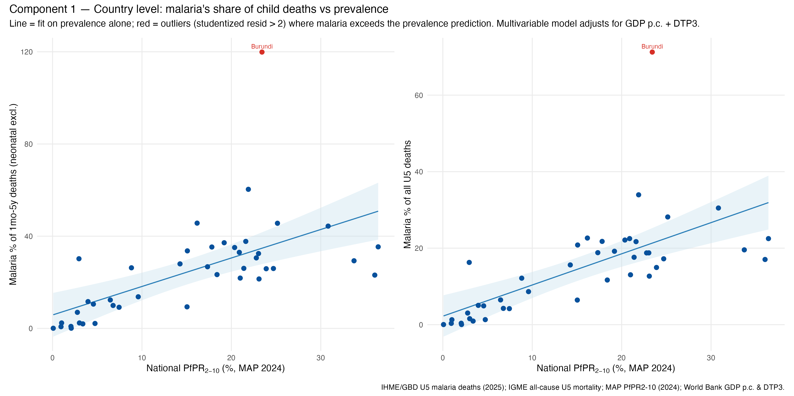

Tables: `results/component1_model_coefficients.csv`, `component1_outliers.csv`.

---

## Component 2 — DHS subnational + national

**Methods.** One observation per **survey-region** across all usable DHS/MIS surveys
(malaria biomarker + birth history). All-cause **U5MR** and **1mo–5y** mortality from the
birth histories via `DHS.rates::chmort`. Exposure = child malaria prevalence put on a common
footing: **microscopy-equivalent** (RDT→microscopy via the Component-3 factor where microscopy
is missing), then **age-standardised 0.5–5y → PfPR₂₋₁₀ (2–10y)** with
`malariaAtlas::convertPrevalence` (Smith et al. 2007 age–prevalence model). Two specifications:

1. **Primary — log-rate linear mixed model:**
   `log(mortality) ~ PfPR2-10 + DTP3 + log(GDP) + %urban + year + (1 + PfPR2-10 || country)`.
2. **Count — negative-binomial GAM (`mgcv`):** region under-5 deaths with a `log(exposure)`
   offset, a smooth `s(year_c)`, and country random intercept + slope.

Child stunting was evaluated as a further confounder but **excluded from the primary model**: five
MIS-type surveys (including Liberia's only survey) collected no anthropometry, so adding it dropped
~11% of survey-regions and one country while leaving the malaria coefficient essentially unchanged.

**Results** (600 survey-regions, 44 surveys, 23 countries). Higher child malaria prevalence
predicts higher child mortality, adjusted for all covariates:

| | LMM (log-rate) | GAM (nb count) |
|---|---|---|
| **U5MR**, per +10 PfPR₂₋₁₀ pts | **+7.0%** (95% CI +3.2, +10.9) | +6.9% (+3.5, +10.4) |
| **1mo–5y**, per +10 pts | **+11.3%** (+5.8, +17.0) | +11.0% (+5.8, +16.5) |

The effect is **positive in every country** (country random slopes; figure below) and covariates
behave as expected — DTP3 and % urban protective, a ~3%/yr secular decline, GDP ~null after the
others. **Sensitivity** restricting to mid-transmission regions (PfPR₂₋₁₀ 5–50%, 354 regions)
attenuates the effect (LMM: U5MR +6.2%, 1mo–5y +8.4%; GAM: +5.6% / +8.7%) — positive but
weaker/less precise over the narrower range.

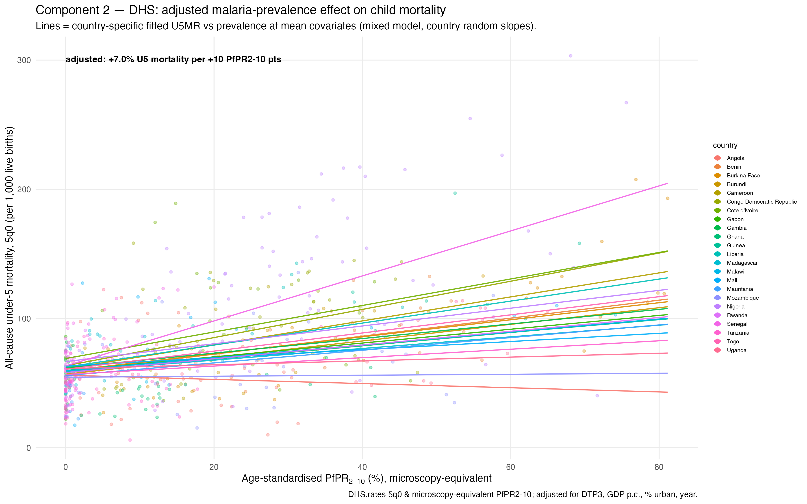

**Exposure-response shape.** Replacing linear prevalence with a low-df smooth `s(PfPR₂₋₁₀, k=4)`:
**U5MR is linear** across the range (edf = 1.0 — a constant proportional effect), while
**1mo–5y shows mild curvature** (edf ≈ 2.1 — a smooth, decelerating rise, steeper at low
prevalence). Removing neonatal deaths from the denominator uncovers the modest nonlinearity the
all-U5 relationship hides.

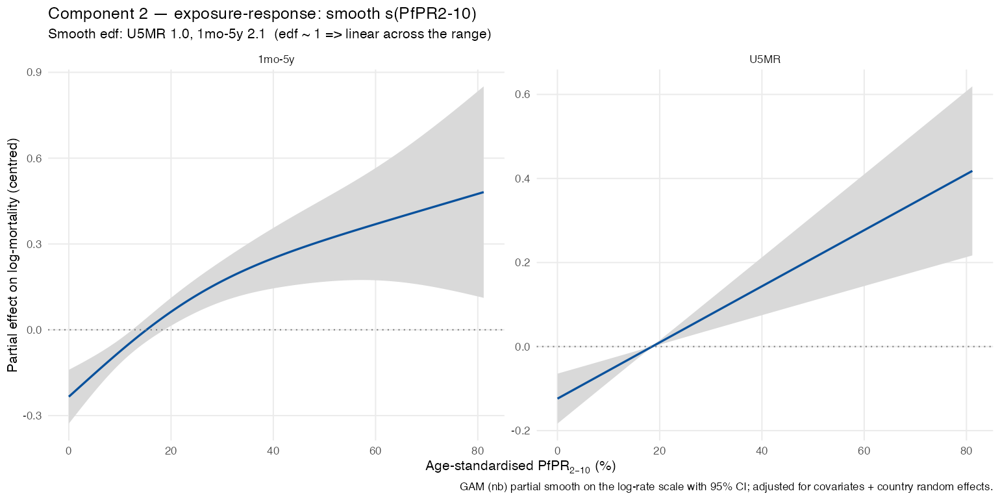

Tables: `results/component2_model_coefficients.csv`, `component2_count_model_coefficients.csv`
(`sample` = full / pfpr_5_50), `component2_country_slopes.csv`,
`component2_exposure_response_edf.csv`. Sensitivity figure: `component2_sensitivity_5to50.png`.

**Negative control — neonatal mortality.** Malaria kills post-neonatal children, not neonates, so a
genuine malaria signal should be **absent** in the neonatal window; a null there also argues the
prevalence–mortality gradient is not just general socio-economic confounding. Refitting the same model
by age window gives **all under-5 +7.0%** and **1mo–5y +11.3%**, but **neonatal −0.1% (95% CI −3.2 to
+3.1, p = 0.96)** per +10 PfPR₂₋₁₀ points (GAM: +0.3%, p = 0.81). The effect is age-specific in the
malaria-plausible direction, which strengthens the causal reading.

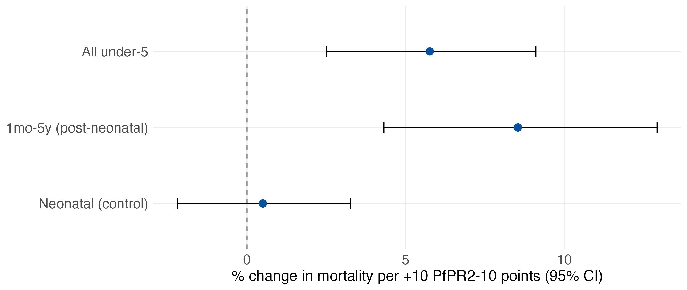

At the **raw-data** level the crude neonatal–prevalence trend is *weakly positive* — but this is
between-country confounding (poorer, higher-mortality countries have both higher prevalence and higher
neonatal mortality); the **covariate- and country-adjusted** effect is null. So adjustment removes the
(confounding-driven) neonatal signal while leaving the post-neonatal (malaria) signal intact:

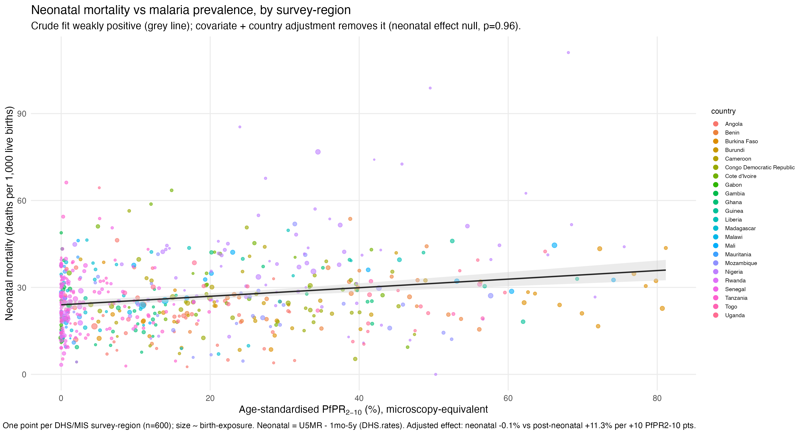

Tables: `results/component2_negative_control.csv`; figure `results/component2_neonatal_scatter.png`.

---

## Component 3 — RDT vs microscopy (supporting)

**Methods.** Across all DHS/MIS survey-regions with both tests, regress microscopy prevalence on
RDT prevalence → a consensus conversion factor, used by Component 2 to impute microscopy where
only RDT exists.

**Results.** RDTs over-detect (persistent HRP2 antigen), so microscopy runs lower:
**microscopy ≈ 0.74 × RDT** (Pearson r = 0.90, 431 survey-regions).

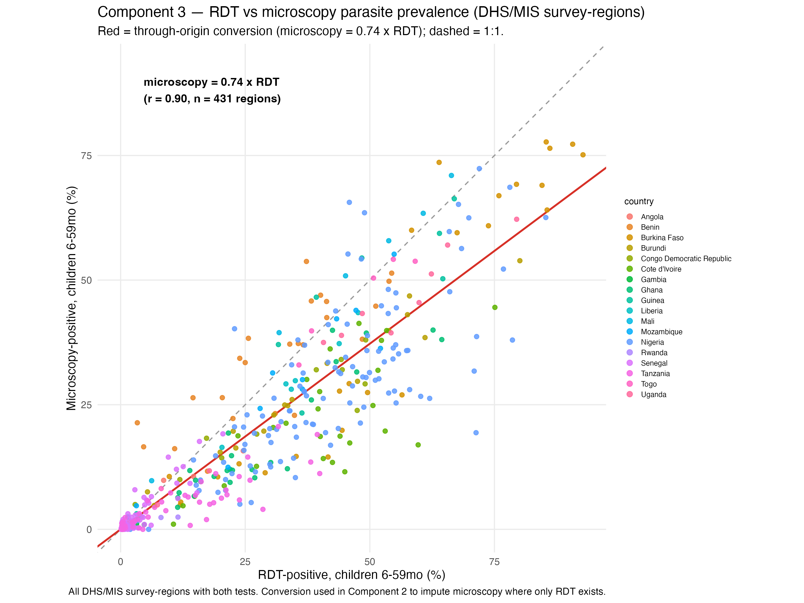

Table: `results/rdt_microscopy_conversion.csv`.

---

## Cross-component prediction — total child mortality, 10% → 30% PfPR₂₋₁₀

Holding covariates at their means and anchoring both models to the same baseline at 10% PfPR
(within each outcome), the predicted change in **total** all-cause child mortality as prevalence
rises from 10% to 30%:

| Outcome | baseline @10% | Component 1 (share, non-malaria fixed) | Component 2 (direct model) |
|---|---:|---:|---:|
| All under-5 (U5MR) | 64.3 / 1,000 | **+23.8%** → 79.6 | **+14.4%** → 73.6 |
| 1mo–5y (neonatal excl.) | 38.3 / 1,000 | **+48.3%** → 56.8 | **+23.8%** → 47.4 |

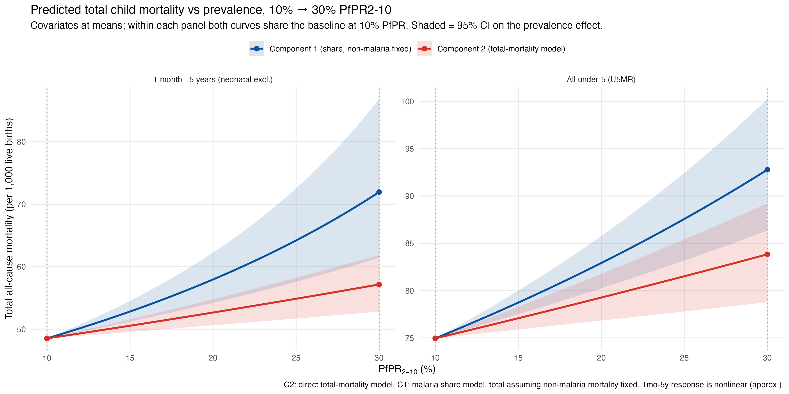

Component 2 (direct total-mortality model) gives the empirical net effect; Component 1 (malaria's
share, assuming non-malaria mortality is fixed) gives the upper "malaria-as-pure-addition" bound.
Effects are larger for 1mo–5y because the malaria-irrelevant neonatal floor is removed. The 95%
CIs (shaded) overlap, so the two independent routes are consistent. *(1mo–5y is nonlinear — see
the exposure-response above — so its log-linear prediction is an approximation over this span.)*

---

## Malaria-attributable fraction of child deaths

From the Component 2 log-rate models, the proportion of child deaths attributable to malaria at
prevalence *p* is **AF(*p*) = 1 − exp(−(η(*p*) − η(0)))** — the fraction that would be averted if
transmission fell to zero, covariates fixed. Because the model is multiplicative, **this fraction
depends only on *p*, not on the mortality level** *N*; malaria-attributable deaths per 1,000 =
*N* × AF(*p*). Shown for both outcomes as the **linear** closed form (LMM coefficient) and the
**spline** (low-df nb-GAM `s(PfPR, k=4)`); the neonatal-excluded denominator uses *N* = U5MR − NNMR.

| PfPR₂₋₁₀ | All under-5, linear | All under-5, spline | 1mo–5y, linear | 1mo–5y, spline |
|--:|--:|--:|--:|--:|
| 10% | 6.5% | 6.5% | 10.1% | 14.6% |
| 20% | 12.6% | 12.5% | 19.2% | 25.7% |
| 30% | 18.3% | 18.2% | 27.4% | 33.3% |
| 40% | 23.6% | 23.5% | 34.7% | 38.4% |
| 50% | 28.6% | 28.4% | 41.3% | 42.2% |

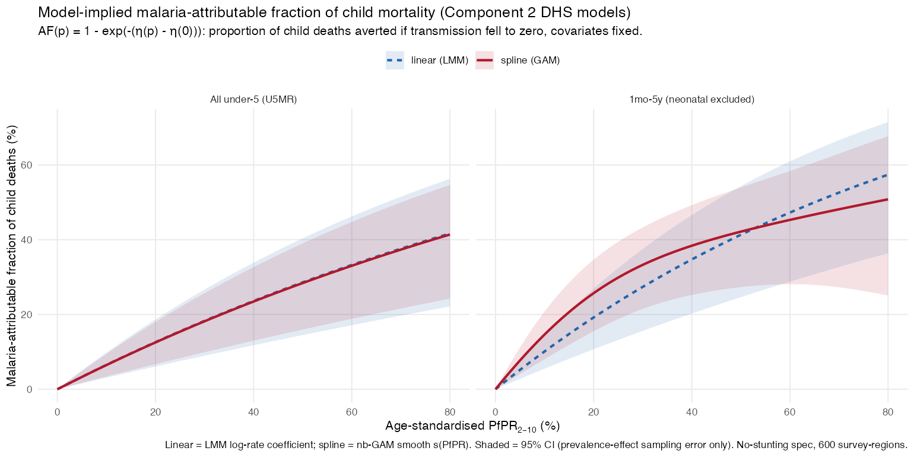

For **U5MR** the linear and spline curves coincide (exposure-response is linear, edf ≈ 1.0). For
**1mo–5y** the smooth (edf ≈ 2.1) rises a little faster than the linear form at low–mid prevalence
then flattens, the two converging near ~40% by 50% PfPR — a mild, decelerating nonlinearity rather
than the over-flexible wiggle a high-df spline produced. Removing neonatal deaths (largely
non-malarial) still roughly doubles malaria's share versus all-U5. These are
counterfactual (vs zero-transmission) fractions assuming the adjusted association is causal; the CIs
(shaded) reflect only the prevalence-effect sampling error. Table: `results/attributable_fraction.csv`.

---

## Comparing the two methods

Both components estimate the same quantity — malaria as a **% of child deaths** — so they can be
overlaid on shared axes. Component 1 is the country-level share (points = IHME ÷ IGME per country;
line = fitted `share ~ PfPR + log GDP + DTP3` at mean covariates); Component 2 is the DHS
attributable-fraction spline. Drawn over Component 1's national-prevalence range (to ~40%).

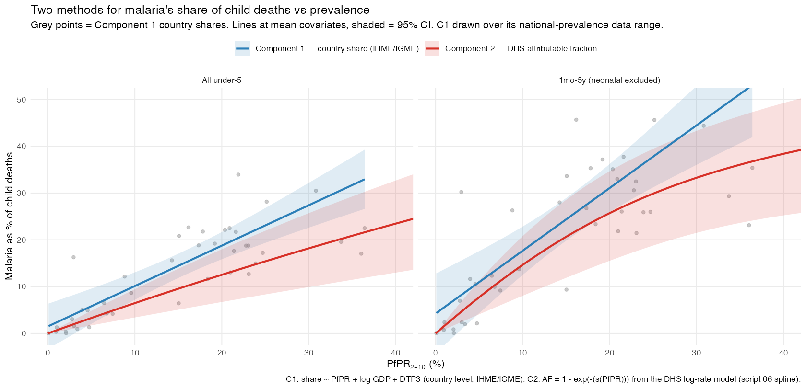

The routes **broadly agree** and their 95% bands overlap throughout. For **all under-5** the two
track the country cloud closely, Component 2 running slightly below Component 1. For **1mo–5y** both
rise more steeply once neonatal deaths are removed; they coincide at low–mid transmission and diverge
at the top of the range, where Component 1 extrapolates roughly linearly while Component 2 begins to
plateau. That two independent data sources (IHME/IGME country totals vs DHS survey mortality) and two
different models land on a similar prevalence–share relationship is the main cross-check of the work.

---

## National malaria-burden estimates (PfPR₂₋₁₀ > 10%)

Applying both methods to a common denominator — all-cause child deaths = mortality rate × live
births (IGME/WB) — gives the number of malaria-attributable child deaths per country. **Component 1**
multiplies by the fitted malaria *share* (`share ~ PfPR + log GDP + DTP3`); **Component 2** by the
attributable fraction `AF = 1 − exp(−β·PfPR/10)` from the DHS log-rate model. Both are shown for
**all under-5** and **1mo–5y (neonatal-excluded)**, with the outcome-matched coefficients. Only the
malaria coefficient carries uncertainty (prevalence, GDP, DTP3, births, rates fixed); because that
coefficient is shared across countries, a pooled-total CI is the total re-evaluated at the
coefficient's bounds. A national/subnational check for Nigeria and DR Congo (below) showed
aggregating admin-1 estimates moves the total by <1%, so national PfPR is the representative scale.

Malaria-attributable child deaths for the **25 countries** with national PfPR₂₋₁₀ > 10%
(point estimates; sorted by Component 2 all-U5). C1 = fitted share, C2 = attributable fraction:

| Country | PfPR | C1 (U5) | C2 (U5) | C1 (1mo–5y) | C2 (1mo–5y) | IHME |
|---|--:|--:|--:|--:|--:|--:|
| Nigeria | 24.7% | 178,352 | 133,962 | 189,730 | 134,093 | 150,493 |
| DR Congo | 36.0% | 125,535 | 86,371 | 146,432 | 94,214 | 68,300 |
| Niger | 17.3% | 26,496 | 13,657 | 31,259 | 14,716 | 23,329 |
| Uganda | 21.9% | 21,246 | 11,502 | 19,985 | 9,826 | 28,474 |
| Mozambique | 23.9% | 17,193 | 11,324 | 16,013 | 9,892 | 11,388 |
| Cameroon | 25.2% | 13,727 | 9,807 | 13,872 | 9,137 | 17,718 |
| Angola | 20.4% | 8,394 | 8,841 | 8,550 | 8,489 | 15,266 |
| Côte d'Ivoire | 21.6% | 11,184 | 8,806 | 10,665 | 7,695 | 14,113 |
| Chad | 15.0% | 10,901 | 8,232 | 12,325 | 8,704 | 5,498 |
| Mali | 17.8% | 13,424 | 7,988 | 13,846 | 7,533 | 15,377 |
| Benin | 36.4% | 10,138 | 7,854 | 10,176 | 7,388 | 8,123 |
| Burkina Faso | 20.9% | 13,717 | 7,254 | 15,672 | 7,529 | 12,439 |
| Guinea | 21.4% | 6,608 | 6,077 | 7,160 | 6,247 | 7,979 |
| South Sudan | 23.1% | 7,040 | 4,861 | 6,778 | 4,357 | 4,282 |
| Central African Rep. | 33.7% | 5,179 | 4,487 | 5,230 | 4,446 | 4,320 |
| Sierra Leone | 30.8% | 8,044 | 4,414 | 9,076 | 4,533 | 7,181 |
| Malawi | 19.2% | 8,494 | 3,991 | 7,334 | 3,145 | 6,316 |
| Ghana | 16.2% | 5,914 | 3,305 | 5,074 | 2,515 | 7,254 |
| Burundi | 23.4% | 7,093 | 3,207 | 6,937 | 2,887 | 15,659 |
| Zambia | 14.3% | 6,196 | 3,091 | 5,934 | 2,655 | 5,272 |
| Togo | 21.0% | 3,570 | 1,993 | 3,575 | 1,810 | 1,972 |
| Liberia | 15.1% | 2,656 | 1,432 | 2,774 | 1,363 | 3,088 |
| Congo-Brazzaville | 23.0% | 1,439 | 1,083 | 1,374 | 948 | 1,414 |
| Equatorial Guinea | 22.8% | 456 | 549 | 458 | 511 | 724 |
| Gabon | 18.4% | 118 | 262 | 96 | 200 | 262 |
| **TOTAL (25)** | — | **513,116** | **354,352** | **550,323** | **354,836** | **436,242** |

Pooled-total 95% CIs (coefficient-only): all-U5 — C1 [357,649–668,584], C2 [172,582–519,653];
1mo–5y — C1 [367,934–732,712], C2 [200,714–489,777]. All-cause denominators (2,292,071 U5;
1,507,890 post-neonatal) and every cell's CI are in `results/country_malaria_deaths_gt10.csv`.

The IHME reference (436k, all-U5) sits between the two model routes (C1 ~18% above, C2 ~19% below).
Component 2 is internally consistent across denominators (355k either way — the higher post-neonatal
fraction offsets the smaller base); Component 1's two share models are fit separately and differ by
~7%. Nigeria + DR Congo alone are ~60% of the burden. Per-country estimates (all columns, with CIs)
are in `results/country_malaria_deaths_gt10.csv`; the largest single-country divergences from IHME
are **Burundi** (IHME far higher than either model) and **Chad** (lower).

**National vs subnational (admin-1) check — all under-5:**

| | National | Subnational (Σ admin-1) |
|---|--:|--:|
| Nigeria — Component 1 | 178,352 | 178,350 |
| Nigeria — Component 2 | 133,962 | 133,488 |
| DR Congo — Component 1 | 125,535 | 125,535 |
| DR Congo — Component 2 | 86,371 | 85,696 |

Component 1 is unchanged (its share model is linear in prevalence); Component 2 is marginally lower
subnationally (the AF curve is concave, so disaggregating high/low-prevalence units loses a little via
Jensen's inequality) — but within-country prevalence heterogeneity is small, so the effect is <1%.
Scripts: `R/07_ng_drc_malaria_deaths.R` (`results/ng_drc_malaria_deaths.csv`),
`R/08_country_malaria_deaths.R` (`results/country_malaria_deaths_gt10.csv`).

---

## RCT triangulation — does the relationship hold in randomised trials?

As an external check, we asked whether the model-implied prevalence→mortality relationship holds in
**randomised** insecticide-treated-net (ITN) trials. Using the Pryce et al. (2018) Cochrane ITN
review, we took every sub-Saharan **cluster-RCT** that measured **both** a change in child parasite
prevalence and all-cause under-5 mortality, extracting the numbers from the **original publications**:
**D'Alessandro 1995** (Gambia, 5 zones), **Habluetzel 1997/99** (Burkina Faso), **Phillips-Howard
2003 / ter Kuile** (western Kenya) and **Nevill 1996 / Snow** (Kilifi). Binka 1996 measured no
parasite prevalence (excluded); Snow 1987 is individually randomised (excluded).

**Method.** Each arm's parasite prevalence is age-standardised to PfPR₂₋₁₀, and **Component 2**
predicts the mortality reduction from the observed prevalence reduction by evaluating its **nonlinear
spline at both the control and intervention prevalence levels**. (Component 1's linear share model is
unusable per-arm here — extrapolated to these prevalences it implies shares > 100%.)

| Trial (zone) | Baseline PfPR₂₋₁₀ | Prevalence reduction (pts) | Observed U5 ↓ | Component 2 predicted |
|---|--:|--:|--:|--:|
| D'Alessandro z1 | 37% | 9 | 62% | 7% |
| D'Alessandro z2 | 34% | 10 | 51% | 10% |
| D'Alessandro z3 | 26% | 10 | 51% | 11% |
| D'Alessandro z4 | 54% | 10 | 5% | 6% |
| D'Alessandro z5 | 46% | −27 (rose) | −20% | −16% |
| Habluetzel | 95% | 8 | 15% | 4% |
| Phillips-Howard | 77% | 14 | 15% | 7% |
| Nevill | 39% | 20 | 30% | 18% |

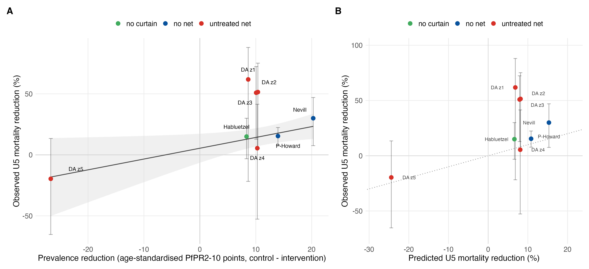

**Findings.** The trials show the expected **positive dose-response** — bigger prevalence reductions
go with bigger mortality reductions — at an inverse-variance-weighted **≈ 8.6% fewer U5 deaths per
10 PfPR₂₋₁₀ points removed**, close to Component 2's own **≈ 11.3% per 10 points**. Component 2
correctly predicts the **negative control** (D'Alessandro zone 5, where the programme failed:
prevalence *rose* and mortality *rose*) and the low-effect points (zone 4, Habluetzel, Phillips-Howard).
It **under-predicts** the largest observed reductions (D'Alessandro zones 1–3, Nevill), but those rest
on few deaths, infant-age or near-saturated prevalence, and their **95% CIs overlap** the model line.
The experimental evidence is thus broadly **consistent** with the observational Component 2 relationship.
Exploratory (8 heterogeneous points: curtains, an untreated-net comparator, spillover, infant-age;
D'Alessandro-zone CIs are Poisson, un-clustered). Data: `results/triangulation_rct_data.csv`; script
`R/10_triangulation_rct.R`.

---

## Trend over time — Component 2 vs WHO and IHME (2000–2024)

Applying the Component 2 model longitudinally: for each SSA country-year, malaria deaths =
**AF(PfPR₂₋₁₀) × all-cause child deaths**, with AF from the negative-binomial GAM (the attributable
fraction), all-cause deaths from IGME/World Bank (U5MR/NNMR × births), and national PfPR₂₋₁₀
pop-weighted from the **MAP annual surfaces (2000–2024)**. Summed across SSA and compared, on a
like-for-like **under-5** footing, with **WHO** (WMR 2025 African-region deaths × ~75% under-5 share)
and **IHME/GBD** (SSA under-5).

| Source | 2000 | 2024 | Change |
|---|--:|--:|--:|
| **Ours** — Component 2 GAM (SSA under-5) | 879k | 375k | **−57%** |
| WHO — African-region under-5 (WMR 2025) | 603k | 434k | −28% |
| IHME/GBD — SSA under-5 | 564k | 428k | −24% |

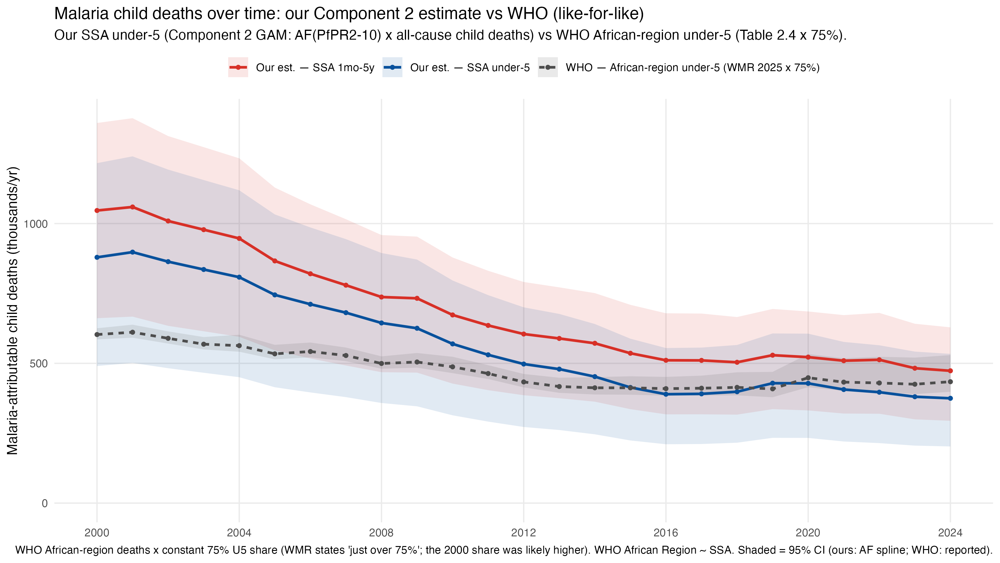

**WHO and IHME — two independent systems — agree closely** (both ≈560–600k in 2000, ≈430k in 2024,
declining ~25%). **Our Component 2 estimate is the outlier**: it starts ~50% higher and declines more
than twice as steeply (−57%), crossing the WHO/IHME lines around 2014–2016 and finishing slightly
below them. The divergence is structural — our estimate is prevalence-driven, so it inherits the large
early-2000s prevalence *and* the steep post-2000 falls in both prevalence and all-cause child
mortality. Our **2000 value is implausibly high** (it nearly equals WHO's *global, all-ages* total of
864k), so the AF applied at 2000's very high transmission + high baseline mortality over-predicts —
the main thing to scrutinise. (Our 1mo–5y variant runs ~10–15% above the all-U5 line.)

Uncertainty note: **our band is AF-spline uncertainty only** (not the all-cause death counts or MAP
prevalence, which we take as point values), whereas the WHO/IHME bands are their own reported 95% CIs
— so the bands are not like-for-like. Other caveats: the 75% U5 share is held constant (the 2000 share
was likely higher); WHO African Region and GBD "Sub-Saharan Africa" ≈ our SSA but are not identical.
Script `R/11_malaria_deaths_timeseries.R` (heavy MAP download; kept out of `run_all.R`); data
`results/malaria_deaths_timeseries_*.csv`, `who_wmr2025_{global,africa}_deaths.csv`,
`ihme_u5_deaths_ssa_timeseries.csv`.

---

## Caveats
- **Component 1 is ecological** (country-level); **Component 2** adjusts for the main confounders
  but is observational, and region-level U5MR from a single survey is noisy.
- MAP PfPR₂₋₁₀ is 2024 vs the 2025 IHME export (1-year offset).
- IHME (GBD) and WHO differ substantially on malaria mortality; Component 1's numerator is IHME.
- DHS prevalence is age-standardised to PfPR₂₋₁₀ via a model (Smith 2007), and RDT is converted to
  a microscopy footing; both are documented approximations.
