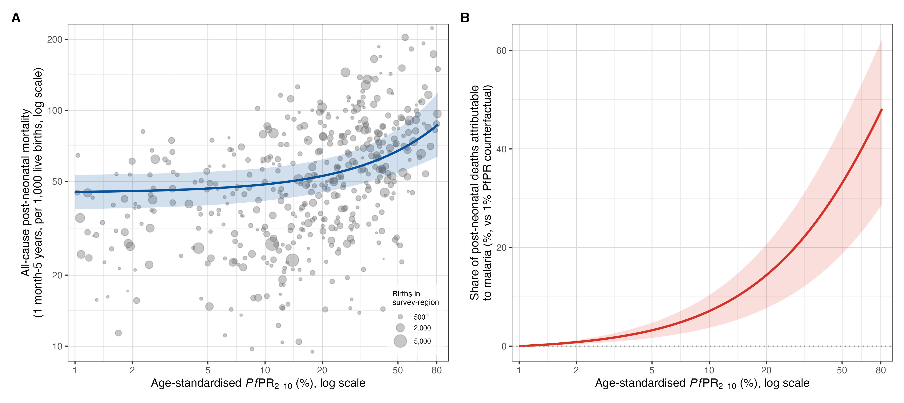

# Malaria prevalence and child mortality in Africa — results summary

Two complementary analyses relate *Plasmodium falciparum* parasite prevalence
(age-standardised PfPR₂₋₁₀) to all-cause child mortality, and apply the
relationship to estimate malaria-attributable child deaths by country and over
time. The primary outcome throughout is **post-neonatal under-5 mortality**
(1 month–5 years): malaria kills post-neonatal children but essentially no
neonates, so neonatal mortality serves as a negative control. All figures/tables
are reproduced by the `R/` scripts into `results/`.

Three results:

1. **Deconvolving the IHME model** — parasite prevalence explains the bulk of the
   between-country variation in malaria's share of child deaths.
2. **A direct survey analysis** — within-country DHS/MIS data reproduce the
   prevalence–mortality relationship, and a neonatal negative control argues that
   residual confounding is unlikely to explain it.
3. **Downstream estimates** — malaria-attributable child deaths by country today,
   and the trajectory since 2000, which falls far faster than WHO/IHME report.

---

## 1. Deconvolution of the IHME model (country level)

For 42 sub-Saharan African countries we computed malaria's **share of child
deaths** as GBD/IHME under-5 malaria deaths ÷ IGME all-cause child deaths, and
regressed this share on national PfPR₂₋₁₀ (MAP, 2024), adjusting for log GDP per
capita and DTP3 coverage (`R/02_component1_country.R`).

Parasite prevalence is by far the dominant explanator of how large a fraction of a
country's child deaths IHME attributes to malaria:

| Outcome (malaria's share of…) | PfPR slope (adjusted) | R² (PfPR only) | R² (+ GDP + DTP3) |
|---|---|---|---|
| post-neonatal deaths | +1.34 pp per PfPR point | 0.36 | 0.54 |
| all under-5 deaths | +0.86 pp per PfPR point | 0.43 | 0.59 |

Prevalence **alone** accounts for 36–43% of the cross-national variance; adding
GDP and DTP3 raises this only to 0.54–0.59 and barely changes the prevalence slope
(1.24→1.34 and 0.82→0.86 pp/point), i.e. the socioeconomic covariates add little
once prevalence is known. In effect, IHME's own country-level malaria fractions can
be approximated by a simple function of prevalence. One country, **Burundi**, is a
clear positive outlier — malaria a much higher share of child deaths than its
prevalence predicts (studentised residual > 2).

---

## 2. Direct DHS/MIS survey analysis

The country-level analysis is ecological. We therefore estimated the
prevalence–mortality relationship **within** countries, across **467 DHS/MIS
survey-regions in 22 countries** with prevalence of 1% or higher
(`R/04`, `R/06`, `R/12`). Region child mortality came from the birth histories
(DHS.rates synthetic-cohort method); region prevalence was converted to a
microscopy footing where needed (microscopy ≈ 0.74 × RDT) and age-standardised to
PfPR₂₋₁₀. The primary model is a negative-binomial GAM for the region death count,
**linear in PfPR₂₋₁₀** with mortality on the log scale, a log-exposure offset, a
smooth calendar-year term, and country random intercepts and prevalence slopes,
adjusted for DTP3, GDP per capita and urbanisation. This linear specification was
the best-fitting of four candidate forms (**SText 1**; the penalised prevalence
spline collapses to a straight line, edf = 1.0).

**Higher prevalence strongly predicts higher post-neonatal mortality:** each +10
PfPR₂₋₁₀ points was associated with a **+8.5% increase in post-neonatal mortality**
(95% CI +4.3 to +12.9; *p* < 0.001), an effect that was positive in every country.
The implied malaria-attributable fraction (relative to a 1% prevalence
counterfactual) rises from **≈7% of post-neonatal deaths at 10% prevalence** to
**≈one third (33%) at 50% prevalence** (and ≈48% at 80%).

### Residual confounding is unlikely: the neonatal negative control

If the gradient reflected general socioeconomic confounding rather than malaria, it
should also appear for **neonatal** mortality — a period in which malaria causes
almost no deaths. It does not. Refitting the identical model by age window:

| Age window | % change in mortality per +10 PfPR₂₋₁₀ pts (95% CI) | *p* |
|---|---|---|
| All under-5 | +5.8% (+2.5 to +9.1) | <0.001 |
| **Post-neonatal (1mo–5y)** | **+8.5% (+4.3 to +12.9)** | <0.001 |
| Neonatal (control) | +0.5% (−2.2 to +3.3) | 0.72 |

The prevalence effect is strong for post-neonatal mortality but **null for neonatal
mortality**, exactly as expected if the signal is malaria-specific. This is the
central argument against residual confounding: a general "poverty / health-system"
proxy would move neonatal mortality too. (At the crude level the neonatal trend is
weakly positive — between-country confounding — but adjustment removes it while
leaving the post-neonatal signal intact.)

### Triangulation with randomised trials

Across cluster-randomised insecticide-treated-net trials that measured both
prevalence and child mortality, the observed all-cause mortality reduction per unit
prevalence reduction (**≈8.6% per 10 PfPR₂₋₁₀ points removed**; inverse-variance
weighted) matches the survey model's own slope (**8.5%**) — the relationship holds
under randomisation, including a zone of the Gambia programme where the
intervention failed, prevalence rose, and child mortality rose (`R/10`).

---

## 3. Downstream estimates: deaths by country and over time

Applying the survey attributable fraction (referenced to a 1% counterfactual) to
national all-cause child deaths gives malaria-attributable deaths by country
(`R/08`) and over 2000–2024 (`R/11`).

### National estimates today (25 countries with PfPR₂₋₁₀ > 10%)

Malaria-attributable child deaths (thousands; point estimates), Method 2 vs the
IHME reference:

| Country | PfPR₂₋₁₀ | M2 post-neonatal | M2 all-U5 | IHME (U5) |
|---|--:|--:|--:|--:|
| Nigeria | 24.7% | 102.2 | 108.6 | 150.5 |
| DR Congo | 36.0% | 73.7 | 71.4 | 68.3 |
| Niger | 17.3% | 10.9 | 10.8 | 23.3 |
| Uganda | 21.9% | 7.4 | 9.3 | 28.5 |
| Mozambique | 23.9% | 7.5 | 9.2 | 11.4 |
| Cameroon | 25.2% | 7.0 | 8.0 | 17.7 |
| Angola | 20.4% | 6.4 | 7.1 | 15.3 |
| Côte d'Ivoire | 21.6% | 5.8 | 7.1 | 14.1 |
| Benin | 36.4% | 5.8 | 6.5 | 8.1 |
| Chad | 15.0% | 6.4 | 6.5 | 5.5 |
| Mali | 17.8% | 5.6 | 6.3 | 15.4 |
| Burkina Faso | 20.9% | 5.7 | 5.8 | 12.4 |
| Guinea | 21.4% | 4.7 | 4.9 | 8.0 |
| South Sudan | 23.1% | 3.3 | 3.9 | 4.3 |
| Central African Rep. | 33.7% | 3.5 | 3.7 | 4.3 |
| Sierra Leone | 30.8% | 3.5 | 3.6 | 7.2 |
| Malawi | 19.2% | 2.4 | 3.2 | 6.3 |
| Ghana | 16.2% | 1.9 | 2.6 | 7.3 |
| Burundi | 23.4% | 2.2 | 2.6 | 15.7 |
| Zambia | 14.3% | 1.9 | 2.4 | 5.3 |
| Togo | 21.0% | 1.4 | 1.6 | 2.0 |
| Liberia | 15.1% | 1.0 | 1.1 | 3.1 |
| Congo-Brazzaville | 23.0% | 0.7 | 0.9 | 1.4 |
| Equatorial Guinea | 22.8% | 0.4 | 0.4 | 0.7 |
| Gabon | 18.4% | 0.1 | 0.2 | 0.3 |
| **Total (25)** | — | **271** (147–383) | **288** (133–431) | **436** |

Applied to national prevalence in these high-burden countries, Method 2's total
(≈271–288k) sits **below** the summed IHME figure (436k): at today's lower
prevalences the direct approach attributes fewer deaths than the cause-of-death
model. Nigeria and DR Congo alone are ~60% of the burden. **Burundi** is the
largest single divergence (IHME 15.7k vs Method 2 ~2.5k) — the same country flagged
as the Method 1 outlier. (Intervals reflect the prevalence-coefficient sampling
error only, not uncertainty in prevalence surfaces or all-cause death counts; full
per-country CIs in `results/country_malaria_deaths_gt10.csv`.)

### The trajectory since 2000

The more consequential result is temporal. Because malaria control lowers
prevalence, a method that ties mortality to prevalence registers far more
"progress" than cause-of-death models anchored to slowly changing fractions.
Summed across sub-Saharan Africa (like-for-like, under-5):

| Series | 2000 | 2024 | Change |
|---|--:|--:|--:|
| **Ours (Method 2, all-U5)** | 734k | 303k | **−59%** |
| Ours (Method 2, post-neonatal) | 766k | 283k | −63% |
| WHO (African region, U5; WMR 2025) | 603k | 434k | −28% |
| IHME/GBD (SSA, U5) | 564k | 428k | −24% |

Our estimate starts **higher** than WHO/IHME in 2000 and declines **more than twice
as steeply**, crossing the WHO/IHME lines in the mid-2010s. WHO and IHME — two
independent systems — agree closely with each other, so the divergence is
structural (prevalence-based vs cause-of-death), not an artefact of one dataset. The
2000 level should be read cautiously (the direct approach over-attributes at the
very high transmission of that era), but the *steepness of decline* is the key
signal: **the reduction in malaria's contribution to child mortality since 2000 has
likely been considerably greater than headline figures suggest.**

---

## Methods notes

- **Primary Method-2 model:** linear-in-PfPR₂₋₁₀ negative-binomial GAM (log link),
  analysis sample prevalence 1% or higher (467 regions, 22 countries), attributable
  fraction referenced to a 1% prevalence counterfactual. Specification choice
  justified in **SText 1** (linear best-fitting; log-scale spline and power law are
  sensitivity analyses). Shared fit/AF helpers: `R/00_utils.R`
  (`fit_c2_primary`, `af_c2`).
- **Prevalence:** MAP PfPR₂₋₁₀ (2024 cross-section; 2000–2024 annual rasters for the
  time series), population-weighted with a gridded population surface. DHS
  microscopy/RDT prevalence age-standardised to PfPR₂₋₁₀ (Smith 2007).
- **Uncertainty bands** here reflect the prevalence-coefficient sampling error only;
  they are narrower than, and not comparable to, the WHO/IHME intervals.
- **Caveats:** Method 1 is ecological; Method 2 adjusts for the main confounders but
  is observational, and region-level mortality from a single survey is noisy. MAP
  PfPR₂₋₁₀ is 2024 vs the 2025 IHME export (1-year offset). Access-controlled inputs
  (DHS microdata, IHME/GBD export) are git-ignored under `data/`; code and derived
  result tables are tracked.
