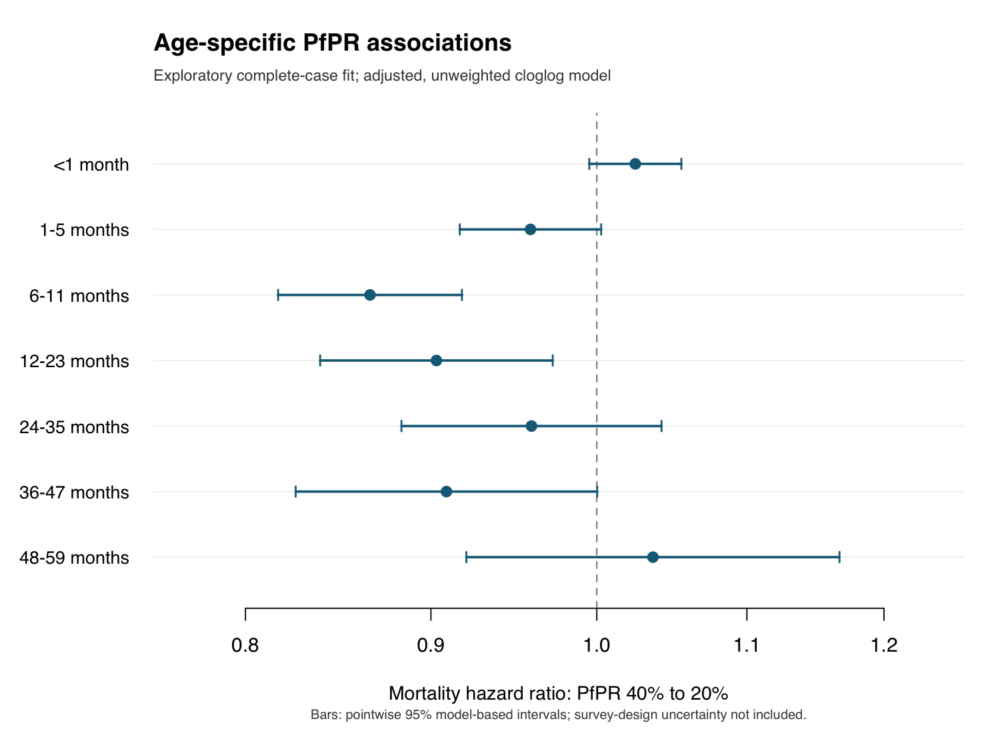

# Initial complete-case age-band model

Fitted 7 September 2026 using all **5,261,313 complete-case child-band records**, with **69,772 deaths**, from **33 countries, 102 surveys and 998 survey-specific regions**. This retains 82.75% of the records with PfPR and region available. No fitting subsample or missing-value imputation was used. Nigeria, Comoros and São Tomé and Príncipe contribute no complete cases because the selected HIV series is missing.

## Model

Joint binomial likelihood with complementary log–log link and an offset for the full predetermined band width. The seven age bands have separate intercepts, PfPR smooths, entry-time smooths and confounder coefficients. Survey, country-by-age and survey-specific region random intercepts are included.

Adjustment: sex, multiple birth, birth order, maternal age at birth, maternal education, wealth quintile, urban residence, log HIV prevalence, log GDP per capita, log health expenditure per capita and political stability. Vaccine coverage is excluded as requested. Wealth is categorical; the other continuous confounders have linear age-specific effects after standardization. The likelihood is **unweighted**. This is an exploratory model, not the final survey-design analysis.

## PfPR contrast

The table compares **40% to 20% PfPR**, holding other predictors fixed within each band. These are mortality **hazard ratios**, not ratios of band-death probabilities. Both exposure values lie within each band's marginal central 95% exposure range; this does not establish adequate joint confounder overlap.

| Completed months | Hazard ratio | Pointwise 95% model-based interval | Estimated hazard change |
|---|---:|---:|---:|
| <1 | 1.025 | 0.995–1.055 | +2.5% |
| 1–5 | 0.959 | 0.917–1.003 | −4.1% |
| 6–11 | 0.866 | 0.817–0.918 | −13.4% |
| 12–23 | 0.903 | 0.839–0.972 | −9.7% |
| 24–35 | 0.959 | 0.883–1.042 | −4.1% |
| 36–47 | 0.909 | 0.826–1.000 | −9.1% |
| 48–59 | 1.036 | 0.920–1.167 | +3.6% |

The unrounded upper limit for 36–47 months is **1.000243**, so that interval includes 1. The 40-to-20 contrast is one comparison along each nonlinear curve; it does not summarize the entire exposure-response relationship. No neonatal null constraint or monotonicity constraint was imposed.

## Numerical checks and limitations

- `bam` reported convergence and completed 14 iterations. Model rank is **1,499 / 1,499**; coefficient estimates and covariance entries are finite. The fit took about **252 seconds**, excluding dataset preparation and report generation.
- Seven PfPR and seven calendar-time smooths were fitted. The saved input and fitted response have the same number of rows. Prediction-matrix contrasts agreed with direct differences of predicted links.
- **PfPR spline size needs follow-up.** With k=5 (maximum smooth EDF 4), PfPR EDF is 3.72 at 12–23 months, 3.86 at 24–35, 3.56 at 36–47 and 3.54 at 48–59. The standard `k.check` produced a repeated PfPR k-index of 0.868, with simulated p-values 0.025–0.045. These factor-by entries share a pooled diagnostic and are not independent age-specific tests. A larger-basis sensitivity is needed.
- **Smoothing-parameter optimization needs follow-up.** Despite positive convergence flags, the smoothing-parameter Hessian has minimum eigenvalue −0.000755 (maximum 208.92), and the maximum absolute gradient is 0.00391. Several fitted smooths are almost linear. Assess stability to optimizer settings/starts and boundary smoothing parameters before treating inference as final.
- The installed mgcv reports that OpenMP is unavailable and ran single-threaded. This was the only captured fitting warning.
- Intervals use the fitted coefficient covariance conditional on smoothing parameters. They do not include survey-design, residual clustering, MAP estimation or missing-data uncertainty. Complete-case selection and provisional confounder specification further limit causal interpretation.

See [open analysis issues](../../../docs/OPEN_ANALYSIS_ISSUES.md) for the remaining source, geography, measurement, weighting and causal-inference questions.

## Saved outputs

- [Model code and run instructions](../../../R_cbh/analysis/README.md).
- [Exact contrast estimates](pfpr_40_to_20_contrasts.csv), [model summary](model_summary.txt), [basis checks](basis_checks.csv), [optimization diagnostics](optimization_diagnostics.csv).
- [Sample by age](sample_by_age_band.csv), [sample by country](sample_by_country.csv), [survey selection](selection.csv), [overlapping covariate missing counts](missing.csv).
- Private complete-case input: `data/derived_cbh/models/age_band_complete_case_v1/complete_case_dataset.rds`, list element `data`.
- Private fitted object: `data/derived_cbh/models/age_band_complete_case_v1/fit.rds`, list element `fit`. These RDS files remain under ignored `data/` because they contain row-level model data.

The specification, scaling parameters, source manifest signatures and R session information accompany the saved artifacts.
