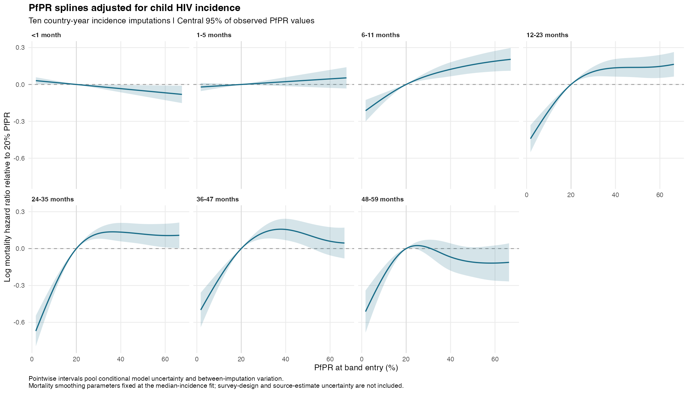

# Age-band mortality model using child HIV incidence

The HIV adjustment is now log child HIV incidence (ages 0–14; new infections per 1,000 uninfected population), replacing prevalence. Missing child rates for Nigeria and Comoros are predicted by the [incidence imputation model](../hiv_incidence/REPORT.md). The join uses band-entry year. Checks against every retained modelling row confirmed the join and verified that the fitted model contains incidence, not prevalence.

The analysis uses **5,885,022 child-band records and 82,415 deaths**, from **34 countries, 105 surveys and 1015 survey-specific regions**.

Nigeria contributes 737,012 records and Comoros 17,936. Liberia loses 131,239 formerly included records because its incidence series is unavailable, and São Tomé and Príncipe remains excluded. Compared with the historical prevalence complete-case fit, the net increase is 623,709 records and 12,643 deaths. A common-sample comparison is needed to isolate the effect of changing the HIV measure.

The seven bands, entry window, full-band eligibility, PfPR timing, cloglog likelihood, band-width offset, other confounders, random effects and unweighted likelihood retain the previous specification. Other covariates require complete cases and vaccines remain excluded. HIV effects are age-specific linear terms on the standardized log-incidence scale.

Calendar year now enters through **one shared cubic regression spline (k=6)** across all age bands. PfPR retains seven separate age-band splines (k=5). The previous incidence fit with separate time splines remains in [the v2 report](../age_band_hiv_incidence_v2/REPORT.md). The HIV imputation model is unchanged.

## Propagating incidence uncertainty

Ten coherent draws from the fitted external incidence model were joined to the same child-band records. Each country-year draw is shared by every corresponding DHS record. Mortality smoothing parameters and scaling were held fixed at the median-incidence fit, while regression coefficients were refitted. Pointwise intervals combine within-fit covariance and between-imputation variation with finite-imputation t quantiles. This is exploratory external-covariate uncertainty propagation, not full joint outcome-compatible imputation.

| Completed months | Mortality HR, PfPR 40% → 20% | Pooled 95% interval | Monte Carlo SE of log HR |
|---|---:|---:|---:|
| <1 | 1.035 | 1.004–1.066 | 0.0015 |
| 1-5 | 0.978 | 0.942–1.014 | 0.0007 |
| 6-11 | 0.884 | 0.835–0.936 | 0.0021 |
| 12-23 | 0.873 | 0.813–0.938 | 0.0044 |
| 24-35 | 0.875 | 0.811–0.943 | 0.0029 |
| 36-47 | 0.856 | 0.785–0.934 | 0.0014 |
| 48-59 | 1.071 | 0.958–1.196 | 0.0005 |

The largest Monte Carlo SE / total SE ratio across these contrasts is 0.121. Additional draws may be needed for precise final inference.

The curves show log hazard ratios relative to 20% PfPR over each age band's central 95% exposure range. The contrast and its uncertainty are zero at the reference by construction. These are adjusted model associations, not established causal effects.

## Numerical checks and remaining limits

The median-incidence mortality fit reported convergence in 21 iterations with rank 1496/1496. Coefficients and covariance are finite. Its smoothing-parameter Hessian has minimum eigenvalue -0.000235 (maximum 213.98) and maximum absolute gradient 0.005095. The negative eigenvalue leaves smoothing-optimization stability as an open check despite positive convergence flags.

PfPR k=5 and time k=6 remain the exploratory basis sizes. The saved factor-by basis diagnostics are pooled checks, not independent age-specific tests. The uncertainty refits condition on the median fit's smoothing parameters. Their intervals do not include survey-design, residual-clustering, MAP-estimation, source HIV-estimate or smoothing-parameter uncertainty. Changing prevalence to incidence also changes the confounding interpretation; see [open issues](../../../docs/OPEN_ANALYSIS_ISSUES.md).

## Saved artifacts

- Exact median-incidence analysis input: `data/derived_cbh/models/age_band_hiv_incidence_shared_time_v3/complete_case_dataset.rds`, element `data`.
- Private base fit and individual imputation fits: `data/derived_cbh/models/age_band_hiv_incidence_shared_time_v3/`.
- [Country sample counts](sample_by_country.csv), [incidence source/imputation usage](hiv_incidence_usage.csv).
- [Pooled contrasts](multiple_imputation/pooled_pfpr_40_to_20.csv), [pooled curves](multiple_imputation/pooled_pfpr_curves.csv), [individual-fit diagnostics](multiple_imputation/fit_diagnostics.csv).
- [Median-incidence contrasts](pfpr_40_to_20_contrasts.csv), [median-incidence splines](pfpr_splines_by_age.png), [optimization diagnostics](optimization_diagnostics.csv), [basis checks](basis_checks.csv).
- [Model and run instructions](../../../R_cbh/analysis/README.md). The legacy prevalence fit remains under `age_band_complete_case_v1/`.
