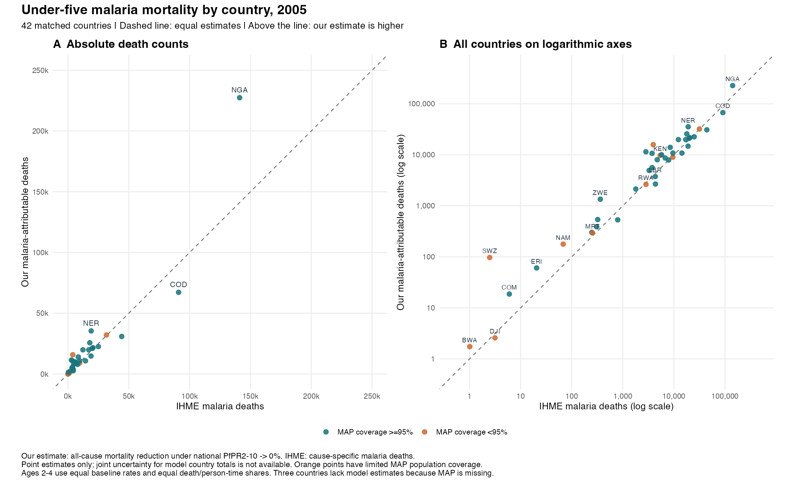
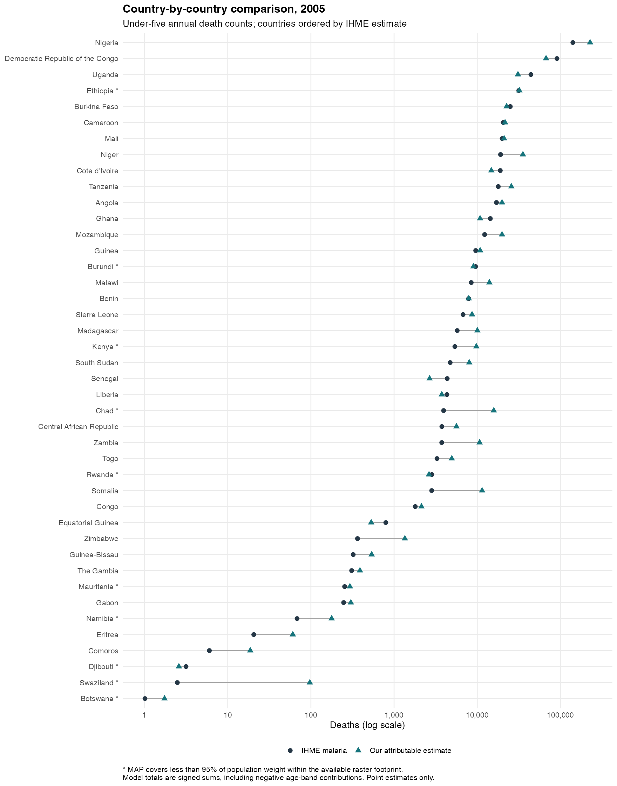

# Model versus IHME malaria mortality, 2005

The comparison matches 42 countries on ISO3, 2005, both sexes and under-five age. The x-axis uses IHME **malaria** deaths, not IHME all-cause deaths. All 42 matched counts are positive and appear on both the linear and logarithmic panels.

Our estimate is the signed reduction in all-cause mortality predicted under zero national PfPR. IHME reports cause-specific malaria deaths. These are related but different estimands: our fitted association can reflect indirect effects and residual confounding. They should not be interpreted as interchangeable measurements or as independent validation against observed deaths.

| Country | Our attributable deaths | IHME malaria deaths | Model / IHME |
|---|---:|---:|---:|
| Democratic Republic of the Congo | 67,203 | 90,901 | 0.74 |
| Nigeria | 227,425 | 141,102 | 1.61 |

Across the same 42 countries, our point estimates sum to 690,826 deaths versus 564,067 for IHME (ratio 1.22).

Cape Verde, Lesotho and São Tomé and Príncipe lack model estimates because usable MAP prevalence is missing. Lesotho also has no entry in this malaria export. These countries remain in the comparison CSV with missingness status; missing values are never replaced by zero. Partial MAP coverage is flagged in colour and with an asterisk on the labelled chart.

Both charts show point estimates only. IHME's source uncertainty bounds are retained in the CSV. The current pipeline does not provide joint country-total model intervals, and marginal age-band interval endpoints have not been summed. Ages 2-4 retain the authorized equal-rate/equal-person-time assumption; negative age-specific effects remain in model totals.

The malaria comparator is the existing `data/ihme_malaria_u5_deaths_by_age_country_year.csv` export. Our denominator uses the newer all-cause export dated 2026-09-09. Their precise IHME release/version alignment has not been verified. See the [burden report](REPORT.md) for exposure and inference limitations.

[Comparison data](model_vs_ihme_malaria_2005.csv)
