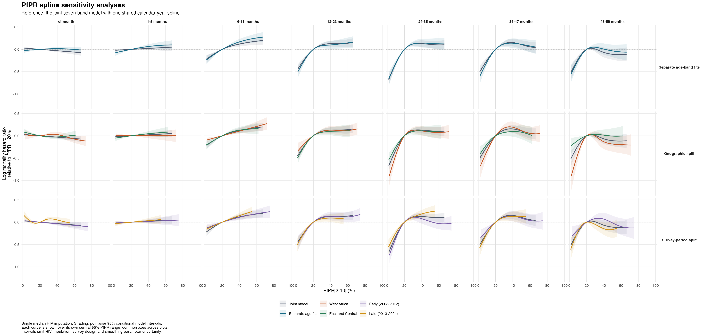

# PfPR spline sensitivity analyses

All comparisons use the same saved posterior-median HIV-incidence imputation and the same complete-case records within each subset. Other confounders, scaling, unweighted likelihood and band-width offset are unchanged. These are separate age, geography and period sensitivities, not a full crossed set of subgroup fits.

## Model changes

- **Separate age fits:** seven independent models. Each has one PfPR spline (k=5), one time spline (k=6), the existing confounders and survey/country/region random intercepts. Unlike the reference, time functions and all random-effect variances can differ by age. Country replaces country-by-age because each fit contains one age band.
- **Geography:** two joint seven-band fits, each retaining one shared time spline and the reference random-effect structure.
- **Period:** early surveys (year <= 2012) versus late surveys (year > 2012). The cutoff is the median metadata year across the 105 included surveys, with each survey counted once. All ties are assigned to early, and each survey stays intact.
- Smoothing parameters are re-estimated for every new fit. Cubic basis dimensions match the reference; knots adapt to each fitting sample.

## Geographic groups

Country assignments follow [UN M49](https://unstats.un.org/unsd/methodology/m49/overview/), accessed 9 September 2026. Central Africa means the UN Middle Africa grouping.

- West: BEN, BFA, CIV, GHA, GIN, GMB, MLI, MRT, NER, NGA, SEN, SLE, TGO.
- East and Central: AGO, BDI, CMR, COD, COG, COM, ETH, GAB, KEN, MDG, MOZ, MWI, RWA, TCD, TZA, UGA, ZMB, ZWE.
- Namibia, Eswatini and South Africa are excluded only from the geographic comparison; they remain in the reference, age and period fits.

## Spline comparisons

Curves are f_g(P) - f_g(20), the log mortality hazard ratio relative to 20% PfPR. This common reference removes arbitrary spline centering. Curves and ribbons are shown within each fit's central 95% exposure range, on identical axes. Tables include observed and central support flags; predictions outside observed support are not used in the plots. Ribbons are pointwise 95% conditional model intervals, not simultaneous bands.



Larger individual plots: [age](separate_age_splines.png), [geography](geography_splines.png), [period](period_splines.png). [Vector PDF](all_sensitivity_splines.pdf).

## Sample sizes and fitting diagnostics

| Fit | Child-band records | Deaths | Countries | Surveys | Fit seconds | Converged |
|---|---:|---:|---:|---:|---:|---|
| reference | 5,885,022 | 82,415 | 34 | 105 | 251.7 | TRUE |
| age_1 | 1,042,571 | 30,086 | 34 | 105 | 76 | TRUE |
| age_2 | 935,677 | 12,137 | 34 | 105 | 86.4 | TRUE |
| age_3 | 895,573 | 11,291 | 34 | 105 | 88 | TRUE |
| age_4 | 772,578 | 11,062 | 34 | 105 | 64.4 | TRUE |
| age_5 | 768,240 | 9,168 | 34 | 105 | 104.1 | TRUE |
| age_6 | 744,682 | 5,477 | 34 | 105 | 79.4 | TRUE |
| age_7 | 725,701 | 3,194 | 34 | 105 | 98.3 | TRUE |
| west | 2,798,853 | 43,900 | 13 | 45 | 172.8 | TRUE |
| east_central | 3,009,837 | 37,706 | 18 | 56 | 199.7 | TRUE |
| early | 2,377,016 | 40,799 | 30 | 53 | 166.7 | TRUE |
| late | 3,508,006 | 41,616 | 30 | 52 | 205.1 | TRUE |

## PfPR 40% to 20% hazard ratios

| Age (months) | Joint model | Separate age fits | West Africa | East and Central | Early (2003-2012) | Late (2013-2024) |
|---|---:|---:|---:|---:|---:|---:|
| <1 | 1.03 (1.00–1.06) | 0.98 (0.95–1.02) | 0.97 (0.91–1.04) | 1.03 (0.97–1.08) | 1.04 (1.00–1.08) | 0.95 (0.89–1.01) |
| 1-5 | 0.98 (0.94–1.02) | 0.94 (0.89–0.99) | 1.00 (0.95–1.06) | 0.95 (0.90–1.01) | 0.98 (0.94–1.03) | 0.97 (0.91–1.03) |
| 6-11 | 0.89 (0.84–0.94) | 0.84 (0.79–0.90) | 0.90 (0.85–0.95) | 0.88 (0.82–0.95) | 0.90 (0.84–0.95) | 0.86 (0.81–0.92) |
| 12-23 | 0.88 (0.82–0.94) | 0.91 (0.83–0.99) | 0.88 (0.81–0.96) | 0.91 (0.83–0.99) | 0.87 (0.79–0.96) | 0.91 (0.84–0.99) |
| 24-35 | 0.88 (0.82–0.95) | 0.87 (0.79–0.96) | 0.90 (0.81–0.99) | 0.89 (0.81–0.99) | 0.92 (0.83–1.03) | 0.83 (0.76–0.91) |
| 36-47 | 0.86 (0.79–0.94) | 0.87 (0.78–0.97) | 0.83 (0.73–0.94) | 0.91 (0.81–1.02) | 0.87 (0.77–0.98) | 0.88 (0.79–0.98) |
| 48-59 | 1.07 (0.96–1.20) | 0.99 (0.88–1.13) | 1.14 (0.97–1.35) | 0.99 (0.87–1.12) | 0.93 (0.81–1.08) | 1.16 (1.01–1.33) |

Values are HR (pointwise 95% interval). * denotes a contrast outside that fit's central 95% exposure range; see CSV for observed-range flags.

## Interpretation and limitations

- Separate age fits change time adjustment and variance pooling as well as separating the data; differences cannot be attributed only to removing shared PfPR information (the reference already has separate age-specific PfPR curves).
- Geographic and period differences can reflect country/sample composition, exposure support and residual confounding as well as effect heterogeneity. Period is survey year, not the child's exposure year; retrospective exposure-year windows can overlap across period groups.
- A single HIV imputation is held fixed. Intervals omit imputation, survey-design, residual-clustering, MAP and smoothing-parameter uncertainty. No survey weights are used.
- Comparisons with the reference use overlapping data. Ribbon overlap and the descriptive curve-distance measures are not formal tests of differences.
- All fits report convergence and finite coefficients/covariance. 2 fits (including the reference if applicable) have a negative smoothing-Hessian eigenvalue below -1e-8; see diagnostics. Smoothing stability remains an exploratory limitation.

## Reproduction and files

Run from the project root:

```sh
Rscript R_cbh/sensitivity/01_fit.R
Rscript R_cbh/sensitivity/02_report.R
```

Private fits remain under the ignored data/derived_cbh/models directory. Outputs here contain aggregate statistics only.

- `survey_groups.csv`: exact survey-year and geographic assignments.
- `pfpr_curves.csv`, `pfpr_support.csv`: predictions, intervals and exposure support.
- `pfpr_40_to_20_contrasts.csv`: numerical comparisons.
- `curve_differences_from_reference.csv`: descriptive RMS and maximum absolute log-HR differences, evaluated on the common central exposure range at 0.5 percentage-point spacing.
- `fit_diagnostics.csv`, `sample_by_fit_age.csv`, `*_smooth_summary.csv`: fit checks, samples and smooth EDFs.
- `*_formula.txt`, `specification.txt`, `scaling.csv`, `code_provenance.csv`: reproducible specifications.
