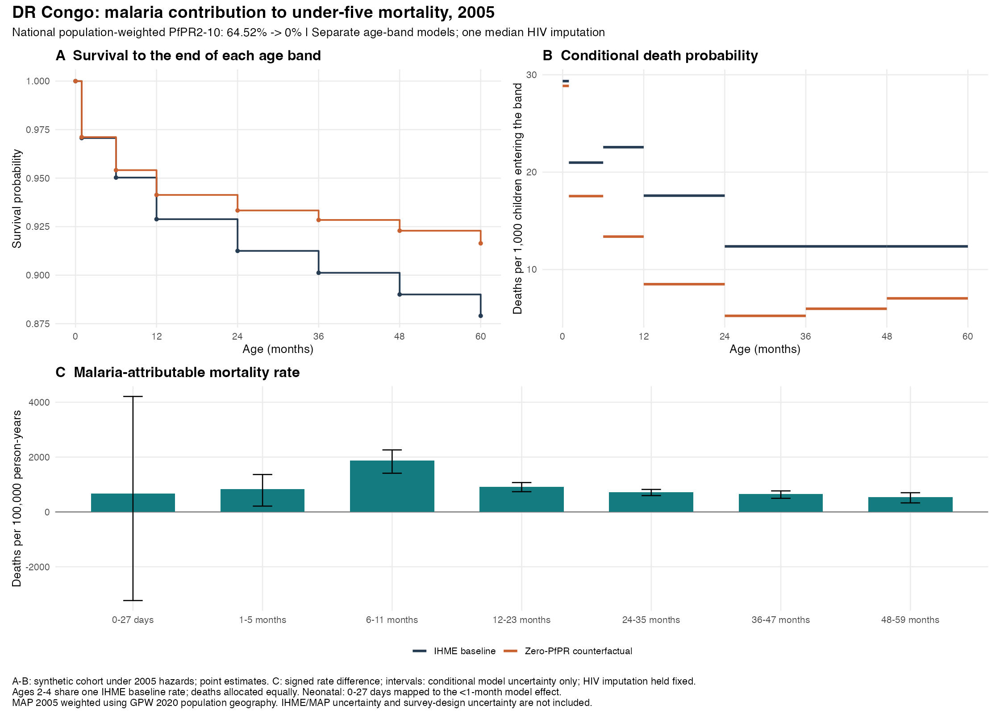

# National malaria-attributable mortality, 2005

**Mortality model:** Separate age-band models; one median HIV imputation (result ID: `age_band_separate_v1`).

Estimates are available for **42 of 45 countries** in the new IHME export. Countries without usable MAP coverage remain missing: Cape Verde, Lesotho, Sao Tome and Principe.

**Exposure coverage:** 10 estimated countries have MAP covering less than 95% of population weight within the raster footprint. Their estimates apply the covered-area mean to the whole country and should be treated as provisional. Swaziland/Eswatini has only 2.7% coverage; its value is especially poorly representative. Missing pixels are not assumed malaria-free. DR Congo has 96.8% coverage. The 95% threshold is a reporting flag, not an exclusion rule.

Each country's 2005 national PfPR2-10 is evaluated on each fitted age-specific spline. The zero-PfPR hazard ratio is exp[f_g(0)-f_g(P_country)]. Counterfactual mortality rate = IHME rate x HR; attributable rate = IHME rate x (1-HR). Death counts use the same fraction and fixed annual person-time. No adjustment is made to other covariates, calendar year, or country random effects in this contrast: those terms cancel in the current additive model.

The seven PfPR effects come from seven separately fitted age-band models, each with its own calendar-year spline, confounder coefficients and random-effect variances. The saved posterior-median child HIV-incidence imputation is held fixed. Age-band intervals use the within-fit coefficient covariance and normal 95% limits on the log-HR scale; HIV-imputation uncertainty is not included. Bounds condition on IHME and MAP point estimates, fitted smoothing parameters, and the age allocation. They do not include source-estimate, survey-design or residual-clustering uncertainty. National total death counts are point estimates; marginal age-band interval endpoints are not summed into total intervals. Separate fitting does not imply independent sampling errors across age bands.

## Source handling and assumptions

- The selected IHME export is the file dated 2026-09-09 10-58-22. Only All causes / Deaths / Both sexes / 2005 is used. Six disjoint source age groups are checked against Under 1 and Under 5 totals; those aggregates are never counted twice. Original rate/count lower and upper bounds are retained in the source output.
- Early and late neonatal deaths are added. Their combined annual rate is total deaths divided by the sum of their implied person-years, not the sum or simple mean of rates. The IHME 0-27-day group uses the model's <1-completed-month PfPR effect, an explicit boundary approximation.
- As authorized, ages 24-35, 36-47 and 48-59 months each use the IHME 2-4-year mortality rate and one-third of its deaths/person-time. Each then receives its own fitted PfPR contrast. These three baseline age estimates are assumed, not separately observed in IHME.
- National exposure is calculated from local 2005 MAP rasters and country polygons, using GPW 2020 density x grid-cell area x polygon overlap as weights. The earlier extraction used density alone. Both values are saved for comparison. This uses fixed all-age 2020 population geography, not a 2005 age-specific population surface. Coverage is conditional on the available raster footprint; missing MAP is never set to zero.
- The national-mean PfPR scenario is the requested approximation; the nonlinear response evaluated at a country mean does not equal a subnational burden aggregation. The fitted PfPR curves are transported to countries outside the mortality fitting sample.
- Negative attributable effects are retained. They mean the fitted association predicts higher mortality at zero PfPR, not protective malaria established by evidence. Zero-PfPR support flags and central-range flags are exported; the model's extrapolation, causal transport and smoothing-stability limitations remain relevant.

## DR Congo

National PfPR: **64.52%**. IHME under-five deaths: **291,364**. Signed model-attributable deaths: **89,694** (**30.8%**), holding the annual population exposure fixed.

All rates below are per 100,000 person-years. Age-band intervals reflect conditional model uncertainty only; HIV imputation held fixed.

| Age | IHME rate | Zero-PfPR rate | Attributable rate (95% interval) | Attributable annual deaths |
|---|---:|---:|---:|---:|
| 0-27 days | 39285.9 | 38616.9 | 669.0 (-3232.4 to 4212.3) | 1260 |
| 1-5 months | 5008.6 | 4180.1 | 828.5 (212.7 to 1365.2) | 8408 |
| 6-11 months | 4564.6 | 2694.4 | 1870.2 (1411.6 to 2262.1) | 21503 |
| 12-23 months | 1774.4 | 853.2 | 921.3 (738.0 to 1072.2) | 20340 |
| 24-35 months | 1245.6 | 525.9 | 719.7 (595.8 to 819.9) | 14423 |
| 36-47 months | 1245.6 | 599.1 | 646.5 (495.6 to 767.0) | 12956 |
| 48-59 months | 1245.6 | 706.5 | 539.1 (329.8 to 700.6) | 10804 |

The survival and probability panels describe a synthetic cohort exposed to the 2005 mortality schedule. They use q=1-exp(-H), with IHME neonatal hazards integrated separately over 7 and 21 days, followed by ages 28 days to 6 months, 6-12 months, and annual age intervals. This explicitly handles the source neonatal boundary. The survival product is checked numerically. Neither these probabilities nor their differences are used as annual death-count fractions.

## Outputs

- [All country/age estimates](country_age_attributable_2005.csv)
- [Country totals](country_totals_2005.csv)
- [National prevalence and coverage](national_pfpr_2005.csv)
- [IHME original 2005 rows](ihme_source_2005.csv) and [disjoint age inputs](ihme_disjoint_age_inputs.csv)
- [Individual-fit contrasts](individual_log_hazard_contrasts.csv), [PfPR support](model_pfpr_support.csv)
- [DRC period life table](drc_period_life_table_2005.csv), [provenance](provenance.csv)
