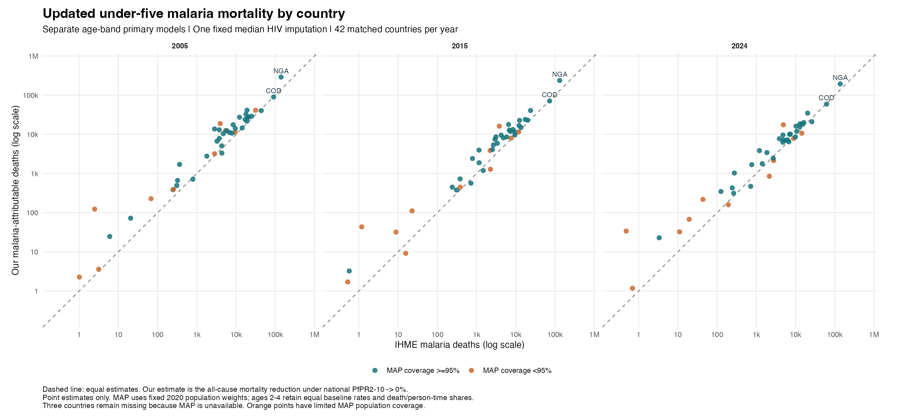

# Country mortality estimates after selecting separate age-band models

Updated estimates for 2005, 2015 and 2024 use the seven existing separate age-band models and the fixed posterior-median child HIV-incidence imputation. The earlier joint-model results remain available in their original directory.

| Year | Matched countries | Separate-age attributable deaths | Previous joint estimate | IHME malaria deaths | Separate / IHME |
|---|---:|---:|---:|---:|---:|
| 2005 | 42 | 885,823 | 690,826 | 564,067 | 1.57 |
| 2015 | 42 | 637,701 | 509,214 | 416,122 | 1.53 |
| 2024 | 42 | 545,150 | 433,510 | 428,147 | 1.27 |

Both estimates use the same IHME all-cause inputs, national PfPR values, population weights and age allocation; these were checked numerically for every country and year. The previous joint estimates also pooled ten HIV-imputation fits, whereas the new estimates use one fixed median imputation. The change column therefore does not isolate model structure from HIV-imputation treatment.

Our estimate is the signed reduction in all-cause deaths under zero national PfPR; IHME reports cause-specific malaria deaths. These are different estimands. Zero-PfPR extrapolation, transport to countries outside the fitting sample and incomplete MAP coverage remain limitations. Missing values are never replaced with zero, and negative age-band contributions are retained.

Country totals are point estimates. Age-band intervals in the year-specific tables use within-fit covariance conditional on the fixed HIV imputation and fitted smoothing parameters. They exclude HIV-imputation, survey-design, residual-clustering, source and allocation uncertainty. Separate fits do not imply independent sampling errors across age bands; no country-total interval is constructed by summing marginal interval endpoints.

## Files

- [All 135 country-year rows, including explicit missing estimates](country_estimates_2005_2015_2024.csv)
- [Year totals](year_summary.csv)
- **2005:** [country totals](../country_burden_2005/country_totals_2005.csv), [age-band rates and counts](../country_burden_2005/country_age_attributable_2005.csv), [all-country plot](../country_burden_2005/model_vs_ihme_malaria_by_country_2005.png), [report](../country_burden_2005/REPORT.md).
- **2015:** [country totals](../country_burden_2015/country_totals_2015.csv), [age-band rates and counts](../country_burden_2015/country_age_attributable_2015.csv), [all-country plot](../country_burden_2015/model_vs_ihme_malaria_by_country_2015.png), [report](../country_burden_2015/REPORT.md).
- **2024:** [country totals](../country_burden_2024/country_totals_2024.csv), [age-band rates and counts](../country_burden_2024/country_age_attributable_2024.csv), [all-country plot](../country_burden_2024/model_vs_ihme_malaria_by_country_2024.png), [report](../country_burden_2024/REPORT.md).

Reproduce with the three annual burden stages using `--year=2005`, `--year=2015` and `--year=2024` (default `--model=separate`), followed by `Rscript R_cbh/burden/04_summarize_primary_update.R`. No mortality model is refitted by these scripts.
