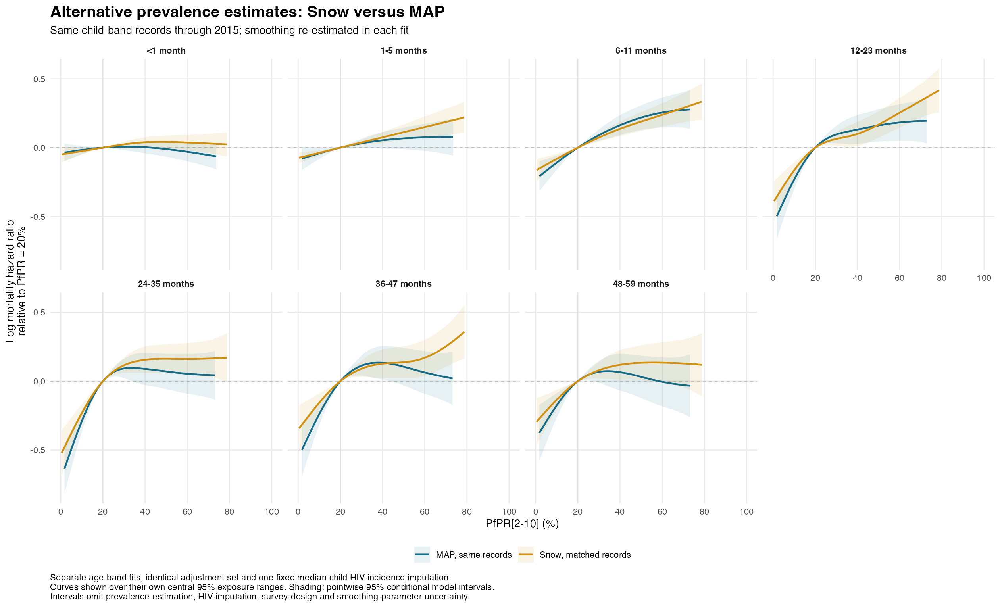

# Snow annual prevalence sensitivity, 2000–2015

The alternative analysis includes 3,429,310 child-band records and 55,257 deaths from 69 surveys in 31 countries.

## Exposure and eligibility

Use the posterior **mean** PfPR2–10 from the annual re-fit of the Snow survey database, not the published five-year Snow estimates. These are microscopy-equivalent percentages at a reference diagnostic/location/seasonal profile. Script 51 intersects each survey's DHS region polygons with Snow polygons in the same country, and weights intersection pieces by GPW 2020 population density × cell area × exact polygon overlap. The population weights remain fixed over time.

Exclude surveys with metadata years after 2015 and individual interviews after December 2015. Require each full potential band to finish by the end of 2015.
Exposure is joined by survey boundary version, validated region key and **band-entry calendar year**, exactly within 2000–2015. The `year` column in script 51 is the survey year; `period` is the annual exposure year. No 2015 carry-forward or temporal interpolation is used. Existing five-year retrospective eligibility and complete-potential-band rules are retained.

Exclude regions with less than 50% population coverage, following script 51's explicit threshold. Missing exposures are never replaced by zero. `selection.csv` separates time exclusions, missing Snow exposure, inadequate coverage and incomplete confounders. Existing unavailable dataset shards are listed separately.

## Model and comparison

Seven separate binomial complementary-log-log `mgcv::bam` models use the same PfPR cubic spline (k=5), one calendar-time spline per fit (k=6), full-band-years offset, confounders and survey/country/region random intercepts as the primary separate-age analysis. Smoothing parameters and coefficients are re-estimated. Sex, multiple birth, birth order, maternal age/education, wealth, urban residence, log child HIV incidence, log GDP, log health spending and political stability are included; vaccines are excluded. The saved full-sample covariate scaling and posterior-median child HIV imputation are held fixed. The likelihood remains unweighted.

Snow models use all eligible Snow records. 3,428,544 of those records have MAP for the matched comparison; a separate matched Snow fit is added only if this differs from the Snow sample.
MAP is refitted on exactly the same records as its Snow comparator. Original full-period MAP curves provide context but also differ in period and sample composition. Curve differences are descriptive; no independence is assumed between fits of overlapping records.

## Hazard ratio for reducing PfPR from 40% to 20%

| Age (completed months) | Snow, matched | MAP, matched | MAP, full period |
|---|---:|---:|---:|
| <1 | 0.96 (0.93–1.00) | 1.00 (0.95–1.04) | 0.98 (0.95–1.02) |
| 1-5 | 0.93 (0.89–0.96) | 0.95 (0.89–1.01) | 0.94 (0.89–0.99) |
| 6-11 | 0.87 (0.83–0.92) | 0.85 (0.79–0.91) | 0.84 (0.79–0.90) |
| 12-23 | 0.91 (0.83–0.99) | 0.88 (0.79–0.97) | 0.91 (0.83–0.99) |
| 24-35 | 0.86 (0.78–0.94) | 0.91 (0.81–1.03) | 0.87 (0.79–0.96) |
| 36-47 | 0.88 (0.79–0.98) | 0.87 (0.77–0.99) | 0.87 (0.78–0.97) |
| 48-59 | 0.89 (0.80–0.99) | 0.94 (0.82–1.07) | 0.99 (0.88–1.13) |

Intervals are pointwise 95% conditional model intervals. An asterisk flags contrasts outside that fit's central 95% exposure range. See the curves and support table; the single 40-to-20 contrast does not summarize all shape differences.

## Validation and limitations

All fits passed convergence, full-rank, finite coefficient/covariance and unchanged row-count checks. Prediction-matrix contrasts match direct link predictions, and both contrast and uncertainty are zero at the 20% reference. `fit_diagnostics.csv` records warnings, smoothing Hessians, gradients and fitting times; convergence alone does not establish adequate confounding control or causal identification.
All selected fits have positive smoothing Hessians. For map_matched_age_5, a tighter-tolerance restart changed the central-support log-hazard-ratio curve by at most 0.026208; the 40-to-20 HR was 0.891503 versus 0.914398, and the restarted minimum Hessian eigenvalue was 0.712327. Original fits are preserved. Tighter restarts selected on convergence, positive Hessian, reduced gradient and improved fREML: map_matched_age_5. These selected fits supply the reported comparison curves; see smoothing_stability.csv and selected_fit_manifest.csv.

The extraction audit checks the source CSV against its saved posterior draws and recomputes every region mean from weighted draws. It also checks country membership, unique annual keys, fractional-cell population weighting and absence of post-2015 carry-forward.

The Snow input README reports sparse polygon-year observations, no transmission-limits mask and weak information in 2014–2015. Source MCMC diagnostics include maximum R-hat 1.0595, eight parameters above 1.05 and 697 maximum-tree-depth events. The exposure fit is supplied by the user and is not refitted here. Its uncertainty is not propagated into mortality estimates; the CSV alone cannot yield regional posterior quantiles, which script 51 now leaves missing. The independent-polygon SD is a benchmark, not a guaranteed lower bound.

Conditional mortality intervals also omit HIV-imputation, survey-design and smoothing-parameter uncertainty. Partial spatial coverage, fixed 2020 population weights and retrospective assignment to residence at interview remain limitations.

## Outputs

- [Curve comparison with full-period MAP](snow_map_full_period_splines.png)
- [Selected fitted curves](pfpr_curves_selected.csv), [40-to-20 contrasts](pfpr_40_to_20_contrasts.csv), [support](pfpr_support.csv)
- [Selection](selection.csv), [country sample](sample_by_country.csv), [age-band sample](sample_by_age_band.csv)
- [Region-year join audit](region_year_join_audit.csv), [selected-fit diagnostics](fit_diagnostics_selected.csv), [curve differences](curve_differences.csv)
- [Saved-fit input checks](saved_fit_input_checks.csv); extraction checks are recorded in `extraction_validation.txt` and `aggregation_checks.csv`.
- Exact model data and fits remain under the ignored `data/derived_cbh/models/` directory.
