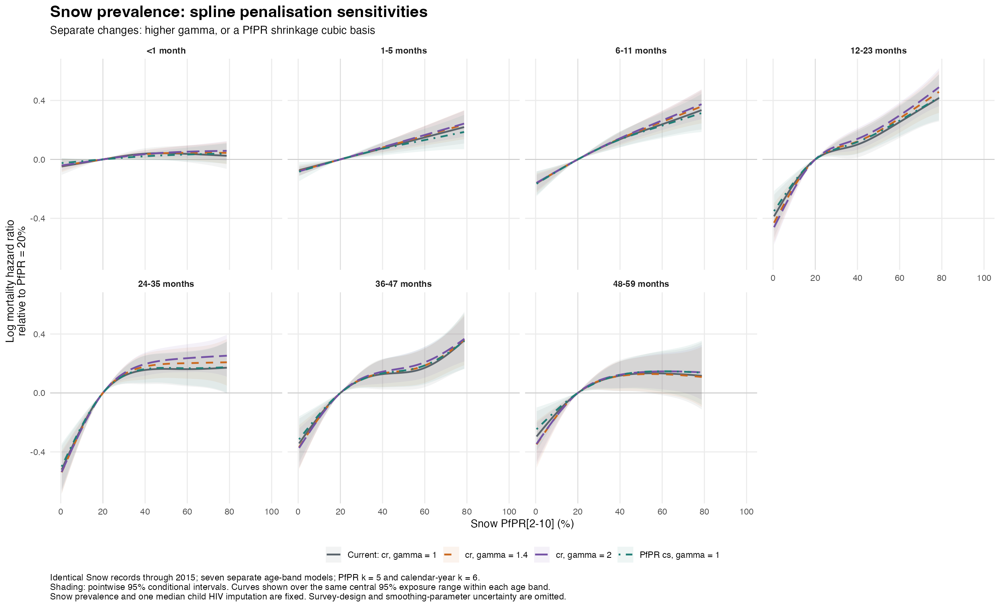

# Snow-only spline penalisation sensitivities

All analyses use the same 3,429,310 child-band records and 55,257 deaths from 69 surveys in 31 countries as the full Snow analysis. Surveys and individual interviews after 2015 remain excluded. No MAP estimates or MAP-matched sample restriction enter these fits.

| Series | PfPR basis | Gamma | Calendar-year basis |
|---|---|---:|---|
| Current reference | cr, k=5 | 1 | cr, k=6 |
| Higher gamma | cr, k=5 | 1.4 | cr, k=6 |
| Higher gamma | cr, k=5 | 2 | cr, k=6 |
| PfPR shrinkage | cs, k=5 | 1 | cr, k=6 |

These sensitivities change gamma or the PfPR basis separately. Each age band retains its own time function, confounder coefficients and survey/country/region random intercepts. The unweighted binomial cloglog likelihood, band-width offset, covariates and their scaling, and fixed median child HIV-incidence imputation are unchanged. The exact PfPR and calendar-year knots from each reference model are reused.

Increasing gamma changes smoothing selection across the model, including time and random effects. The cs analysis changes only the PfPR basis: it penalises the otherwise unpenalised linear component as well as curvature, allowing the entire effect to shrink toward zero. Neither change enforces monotonicity. select=FALSE is retained in all fits.

The overall age-specific curve shapes are similar across specifications. Higher gamma generally makes modest changes; it does not remove the curvature in older age bands. The cs fit attenuates the neonatal curve, while the older-age patterns persist. The tables below quantify these descriptive differences.

With gamma=2, curvature persists at ages 12–47 months. The estimated 40% to 20% hazard ratios move from 0.904 to 0.870 at 12–23 months and from 0.856 to 0.822 at 24–35 months. Thus the additional smoothing does not necessarily attenuate the estimated association: calendar-year and random-effect smoothing are also re-estimated.

## PfPR effective degrees of freedom

| Completed months | Reference | Gamma 1.4 | Gamma 2 | cs |
|---|---:|---:|---:|---:|
| <1 | 2.10 | 1.76 | 1.59 | 1.01 |
| 1-5 | 1.00 | 1.00 | 1.00 | 1.49 |
| 6-11 | 1.84 | 1.64 | 1.51 | 1.92 |
| 12-23 | 3.38 | 3.35 | 3.29 | 3.08 |
| 24-35 | 3.43 | 3.35 | 3.23 | 3.26 |
| 36-47 | 3.07 | 3.00 | 2.86 | 2.77 |
| 48-59 | 2.57 | 2.72 | 2.57 | 2.13 |

For cr, EDF near one is approximately linear; cs may shrink below one. More penalisation need not lower every individual term's EDF when all parameters are re-estimated.

## Hazard ratios for 40% to 20% PfPR

| Completed months | Reference | Gamma 1.4 | Gamma 2 | cs |
|---|---:|---:|---:|---:|
| <1 | 0.962 (0.927–0.998) | 0.966 (0.937–0.994) | 0.965 (0.941–0.989) | 0.979 (0.954–1.004) |
| 1-5 | 0.928 (0.893–0.964) | 0.923 (0.892–0.954) | 0.921 (0.893–0.949) | 0.931 (0.890–0.973) |
| 6-11 | 0.873 (0.828–0.920) | 0.869 (0.831–0.908) | 0.866 (0.834–0.900) | 0.874 (0.827–0.922) |
| 12-23 | 0.904 (0.829–0.987) | 0.885 (0.817–0.960) | 0.870 (0.809–0.936) | 0.888 (0.819–0.963) |
| 24-35 | 0.856 (0.777–0.942) | 0.836 (0.766–0.913) | 0.822 (0.760–0.889) | 0.850 (0.775–0.933) |
| 36-47 | 0.880 (0.794–0.976) | 0.875 (0.797–0.960) | 0.866 (0.798–0.939) | 0.875 (0.796–0.963) |
| 48-59 | 0.889 (0.799–0.989) | 0.891 (0.806–0.985) | 0.884 (0.808–0.967) | 0.885 (0.807–0.971) |

Intervals are pointwise 95% conditional model intervals. Exposure support flags are in the contrast CSV. Differences between fits are descriptive: the same children appear in each analysis, and covariance between model estimates is not estimated.

## Validation

Twenty-one sensitivity fits are compared with seven saved Snow reference fits. All selected fits converged with full rank and finite coefficients/covariances. Every stored outcome, predictor and offset was checked against the reference model frame. Basis classes and original knot locations were verified. Prediction-matrix contrasts match direct link predictions, with zero contrast and uncertainty at 20% PfPR.
All selected smoothing Hessians are positive.
Numerically flagged new fits receive a tighter-tolerance restart with the same gamma and basis; a restart is selected only on convergence, Hessian, gradient and fREML criteria within the same specification. Original attempts are retained. The selected-file manifest records the exact fitted objects. fREML criteria are not used to rank the different gamma/basis specifications.

These intervals condition on Snow point estimates, the HIV imputation and smoothing parameters. They omit source prevalence uncertainty, survey design and residual within-child dependence; source-model limitations from the original Snow report continue to apply.

## Files

- [Gamma 1, 1.4 and 2 comparison](gamma2_splines.png)
- [Gamma comparison](gamma14_splines.png) · [cs comparison](cs_splines.png)
- [Curves](pfpr_curves.csv) · [EDF](pfpr_edf.csv) · [40-to-20 contrasts](pfpr_40_to_20_contrasts.csv) · [Curve differences](curve_differences.csv)
- [Diagnostics](fit_diagnostics.csv) · [Selected-fit manifest](fit_manifest.csv) · [Smooth summaries](smooth_summaries.csv)
- Add gamma=2 with R_cbh/snow/06_fit_penalties.R --gamma2 and R_cbh/snow/07_report_penalties.R --gamma2. Existing gamma=1.4 and cs outputs are retained in the parent directory.
- Reproduce with R_cbh/snow/06_fit_penalties.R followed by R_cbh/snow/07_report_penalties.R. Private fits remain under data/derived_cbh/models/age_band_snow_2000_2015_v1/penalty_sensitivity/.
