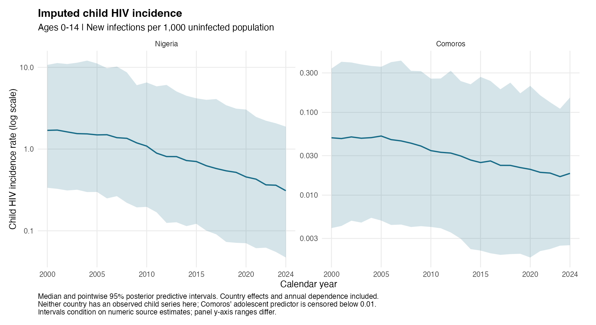
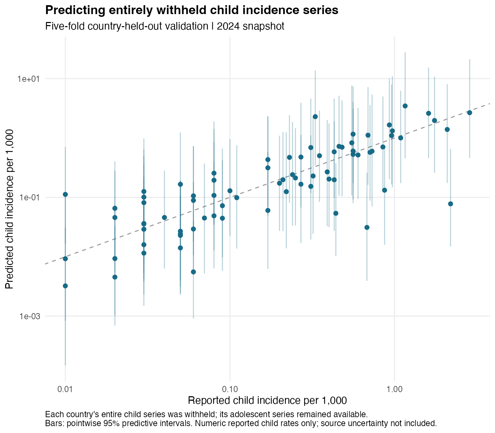

# Child HIV incidence imputation

Fitted from the existing UNICEF / UNAIDS 2025 workbook using both-sex rates per 1,000 uninfected population. The joint model includes 3,468 adolescent country-years and 2,121 child country-years, across 139 countries; 85 countries contribute child observations. Numeric child rates are preserved, `<0.01` is treated as left censoring, and missing child trajectories are predicted.

The child equation separates between-country and within-country adolescent associations. Child and adolescent equations have separate calendar-year spline terms, regional/country effects and AR(1) residuals. See the [model and run instructions](../../../R_cbh/hiv/README.md).

Main fit: four chains, 1,000 post-warmup draws each; maximum nonconstant-quantity R-hat 1.0042, minimum effective sample size 901, 0 divergences and 0 maximum-treedepth hits.

## Countries without child series

Nigeria's numeric adolescent trajectory and Comoros' censored adolescent series inform their predicted child rates. Liberia and São Tomé and Príncipe have no usable adolescent incidence series in this workbook and remain missing. Predictions include country-effect and temporally correlated residual uncertainty.

## Country-held-out validation

Five folds withhold each country's entire child series, including censored child values; adolescent observations remain available. The table gives country-weighted log-scale error and pointwise interval coverage for numeric reported child rates. Countries with only censored child values cannot contribute to these numeric-error metrics; censoring predictions are reported separately.

| Group | Countries with numeric child rates | Log RMSE | 95% interval coverage |
|---|---:|---:|---:|
| All countries | 83 | 0.940 | 94.9% |
| East Asia and Pacific |  9 | 1.470 | 80.1% |
| Eastern and Southern Africa | 22 | 0.635 | 99.8% |
| Eastern Europe and Central Asia |  5 | 0.891 | 100.0% |
| Latin America and Caribbean | 18 | 1.270 | 87.2% |
| Middle East and North Africa |  6 | 0.872 | 100.0% |
| South Asia |  1 | 1.852 | 92.0% |
| West and Central Africa | 20 | 0.437 | 100.0% |
| Western Europe |  2 | 0.324 | 100.0% |

Validation measures prediction of published estimated rates, not independently observed infections. Pointwise coverage below 95% indicates undercoverage in that group. The transport assumption for entirely unobserved countries remains an assumption, particularly for countries with only censored adolescent information.

## Downstream use and limits

The active mortality input uses `log_hiv_incidence`, joined by country and band-entry year. It replaces prevalence; adolescent incidence does not enter the mortality formula. Two hundred coherent country-year trajectories are saved, and ten are used for exploratory uncertainty propagation through the age-band mortality model. The median-incidence fit is reported separately from the pooled refits.

Published source lower/upper estimates are retained but not included in the likelihood. Intervals condition on numeric source rates. Mortality propagation also conditions on fixed smoothing parameters and omits survey-design uncertainty; it is not joint outcome-compatible imputation. Ten imputations have Monte Carlo uncertainty, reported with the pooled contrasts.

- [Fitted incidence panel](child_incidence_country_year.csv)
- [Validation predictions](country_held_out_predictions.csv), [metrics](validation_metrics.csv), [censored-rate validation](validation_censored.csv)
- [Parameter estimates](model_parameters.csv), [main diagnostics](fit_diagnostics.csv), [all nonconstant-quantity diagnostics](full_parameter_diagnostics.csv)
- [Incidence-adjusted mortality results](../age_band_hiv_incidence_v2/REPORT.md)
