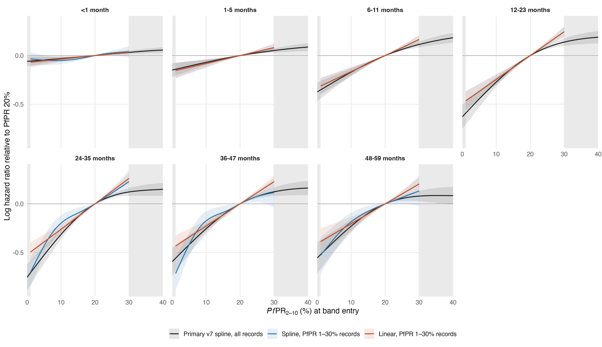

# Linear PfPR[2–10] on the 1–30% range

Records restricted to band entries with PfPR 1–30%: 4,747,846 of the 7,607,122 v7 child-band records (62%) and 54,552 of 103,987 deaths (52%), in 129 surveys, 36 countries and 926 survey-regions. Each age band is fitted twice on these records with the v7 primary specification (17 covariates, `s(calendar_year)` on the primary reference knots, survey, country and survey-region random intercepts, `offset(log(band_years))`, gamma = 2): **linear**, with `pfpr_pct` as a linear term, and **spline**, with `s(pfpr_pct, cr, k = 5)` on knots equally spaced over 1–30%. Fitted by bam (fREML) on the collapsed survey-region × entry-month cells, whose binomial likelihood equals the child-level likelihood; covariates keep the v7 scaling. The primary curves are the v7 fits to all records.

All 14 fits converged with positive-definite smoothing Hessians.

## Slope: hazard ratio per 10-point increase in PfPR

For the splines, the average slope from 1% to 30% (the 30%→1% log hazard ratio × 10/29).

| Age (months) | Linear, 1–30% | Spline, 1–30% (average) | Primary v7 (average over 1–30%) |
|---|---:|---:|---:|
| <1 | 1.04 (1.01–1.07) | 1.03 (1.00–1.06) | 1.03 (1.01–1.05) |
| 1-5 | 1.08 (1.04–1.13) | 1.08 (1.04–1.13) | 1.07 (1.04–1.10) |
| 6-11 | 1.18 (1.13–1.23) | 1.18 (1.13–1.23) | 1.17 (1.13–1.22) |
| 12-23 | 1.28 (1.21–1.34) | 1.28 (1.21–1.34) | 1.29 (1.23–1.34) |
| 24-35 | 1.30 (1.23–1.37) | 1.38 (1.29–1.47) | 1.33 (1.27–1.39) |
| 36-47 | 1.26 (1.19–1.33) | 1.33 (1.24–1.43) | 1.27 (1.21–1.33) |
| 48-59 | 1.23 (1.14–1.32) | 1.26 (1.16–1.36) | 1.23 (1.16–1.30) |

## Hazard ratios across the range (95% intervals conditional on smoothing parameters)

Equal-width steps show where the splines depart from linearity; the linear model gives the same hazard ratio for every 10-point step.

| Age (months) | Contrast | Linear, 1–30% | Spline, 1–30% | Primary v7 |
|---|---|---:|---:|---:|
| <1 | 30% to 20% | 0.96 (0.94–0.99) | 0.96 (0.91–1.02) | 0.97 (0.95–0.98) |
| 1-5 | 30% to 20% | 0.92 (0.89–0.96) | 0.92 (0.89–0.96) | 0.95 (0.93–0.97) |
| 6-11 | 30% to 20% | 0.85 (0.81–0.89) | 0.85 (0.81–0.89) | 0.89 (0.87–0.92) |
| 12-23 | 30% to 20% | 0.78 (0.74–0.82) | 0.78 (0.74–0.82) | 0.87 (0.84–0.90) |
| 24-35 | 30% to 20% | 0.77 (0.73–0.81) | 0.80 (0.71–0.89) | 0.89 (0.85–0.92) |
| 36-47 | 30% to 20% | 0.80 (0.75–0.84) | 0.89 (0.76–1.04) | 0.88 (0.85–0.92) |
| 48-59 | 30% to 20% | 0.82 (0.76–0.87) | 0.88 (0.75–1.02) | 0.92 (0.88–0.97) |
| <1 | 20% to 10% | 0.96 (0.94–0.99) | 0.95 (0.92–0.99) | 0.97 (0.95–0.99) |
| 1-5 | 20% to 10% | 0.92 (0.89–0.96) | 0.92 (0.89–0.96) | 0.93 (0.91–0.96) |
| 6-11 | 20% to 10% | 0.85 (0.81–0.89) | 0.85 (0.81–0.89) | 0.84 (0.81–0.88) |
| 12-23 | 20% to 10% | 0.78 (0.74–0.82) | 0.78 (0.74–0.82) | 0.76 (0.73–0.80) |
| 24-35 | 20% to 10% | 0.77 (0.73–0.81) | 0.82 (0.76–0.89) | 0.73 (0.69–0.77) |
| 36-47 | 20% to 10% | 0.80 (0.75–0.84) | 0.84 (0.76–0.93) | 0.77 (0.73–0.82) |
| 48-59 | 20% to 10% | 0.82 (0.76–0.87) | 0.83 (0.76–0.91) | 0.80 (0.75–0.85) |
| <1 | 10% to 1% | 0.97 (0.94–0.99) | 1.02 (0.96–1.07) | 0.97 (0.95–1.00) |
| 1-5 | 10% to 1% | 0.93 (0.90–0.96) | 0.93 (0.90–0.96) | 0.93 (0.90–0.97) |
| 6-11 | 10% to 1% | 0.86 (0.83–0.90) | 0.86 (0.83–0.90) | 0.83 (0.79–0.88) |
| 12-23 | 10% to 1% | 0.80 (0.77–0.84) | 0.80 (0.77–0.84) | 0.73 (0.68–0.78) |
| 24-35 | 10% to 1% | 0.79 (0.76–0.83) | 0.60 (0.52–0.70) | 0.67 (0.62–0.73) |
| 36-47 | 10% to 1% | 0.81 (0.77–0.86) | 0.58 (0.49–0.69) | 0.74 (0.68–0.80) |
| 48-59 | 10% to 1% | 0.83 (0.78–0.89) | 0.71 (0.61–0.83) | 0.75 (0.68–0.82) |
| <1 | 30% to 1% | 0.90 (0.83–0.98) | 0.93 (0.85–1.01) | 0.91 (0.86–0.97) |
| 1-5 | 30% to 1% | 0.79 (0.70–0.89) | 0.79 (0.70–0.89) | 0.82 (0.76–0.89) |
| 6-11 | 30% to 1% | 0.62 (0.55–0.70) | 0.62 (0.55–0.70) | 0.63 (0.57–0.69) |
| 12-23 | 30% to 1% | 0.49 (0.42–0.57) | 0.49 (0.42–0.57) | 0.48 (0.43–0.55) |
| 24-35 | 30% to 1% | 0.47 (0.40–0.54) | 0.39 (0.33–0.47) | 0.44 (0.38–0.50) |
| 36-47 | 30% to 1% | 0.52 (0.44–0.61) | 0.44 (0.35–0.54) | 0.51 (0.44–0.58) |
| 48-59 | 30% to 1% | 0.55 (0.45–0.68) | 0.52 (0.41–0.65) | 0.55 (0.47–0.64) |

## Fit on the 1–30% records: linear against spline

| Age (months) | Spline PfPR EDF | ΔAIC (linear − spline) | Δ log-likelihood | Linear term p | Spline term p |
|---|---:|---:|---:|---:|---:|
| <1 | 2.18 | -7.5 | 1.5 | 0.011 | 0.018 |
| 1-5 | 1.00 | -0.0 | -0.0 | <1e-04 | <1e-04 |
| 6-11 | 1.00 | -0.0 | -0.0 | <1e-04 | <1e-04 |
| 12-23 | 1.00 | -0.0 | -0.0 | <1e-04 | <1e-04 |
| 24-35 | 2.93 | 6.0 | -5.7 | <1e-04 | <1e-04 |
| 36-47 | 2.93 | 3.4 | -9.1 | <1e-04 | <1e-04 |
| 48-59 | 2.03 | -0.3 | -2.6 | <1e-04 | <1e-04 |

AIC is mgcv's conditional AIC with the corrected degrees of freedom (lower is better); the log-likelihood is the binomial kernel. A spline EDF near 1 means the penalised spline is itself close to linear.

## Burden across the 42 countries

The linear model's attributable deaths use 1 − exp(−βP) with national PfPR P, so the log hazard is extrapolated linearly below 1% (to the 0% reference) and above 30%.

Attributable fraction at PfPR 20% (primary → linear): <1 5.8% → 7.0%; 1-5 13.8% → 15.0%; 6-11 31.1% → 28.1%; 12-23 46.7% → 38.7%; 24-35 53.0% → 40.7%; 36-47 44.8% → 36.6%; 48-59 42.6% → 33.5%.

| Year | Primary v7 | Linear, 1–30% | IHME | UN IGME |
|---|---:|---:|---:|---:|
| 2000 | 1,170,371 | 1,377,911 | 563,657 | 724,276 |
| 2015 | 725,613 | 687,201 | 416,122 | 416,815 |
| 2024 | 620,072 | 573,244 | 428,147 | 440,123 |

2024: linear 1.34 × IHME and 1.30 × UN IGME (primary 1.45 and 1.41). Rate change 2000–2015 -65.5% and 2015–2024 -25.5% (primary -57.1% and -23.6%).

With a 1% counterfactual floor (deaths attributable to PfPR above 1%, as in `reference_floor_dhsmics_map_gamma2_v1`), which removes the extrapolated 0–1% segment from both models:

| Year | Primary v7 | Linear, 1–30% |
|---|---:|---:|
| 2000 | 1,124,878 | 1,348,519 |
| 2015 | 690,972 | 660,581 |
| 2024 | 589,119 | 549,041 |

2024 deaths by national PfPR of the country:

| National PfPR | Countries | Primary v7 | Linear, 1–30% | IHME |
|---|---:|---:|---:|---:|
| <1% | 2 | 38 | 28 | 12 |
| 1–30% | 36 | 520,941 | 465,131 | 348,935 |
| >30% | 4 | 99,093 | 108,085 | 79,201 |

2024 deaths by age band:

| Age (months) | Primary v7 | Linear, 1–30% |
|---|---:|---:|
| <1 | 49,853 | 59,706 |
| 1-5 | 54,235 | 61,221 |
| 6-11 | 104,436 | 99,106 |
| 12-23 | 143,183 | 125,118 |
| 24-35 | 100,992 | 83,308 |
| 36-47 | 86,365 | 75,408 |
| 48-59 | 81,009 | 69,377 |

Files: `selection_by_age.csv`, `fit_diagnostics.csv`, `fit_comparison.csv`, `smooth_summaries.csv`, `contrasts.csv`, `slope_per_10_points.csv`, `attributable_fraction_by_age.csv`, `pfpr_curves.csv`, `year_totals.csv`, `country_year_burden.csv`, `burden_2024_by_national_pfpr.csv`, `CAPTION.md`. Reproduce: `Rscript R_cbh/sensitivity/linear_pfpr_1_30/01_fit.R` then `02_report.R`.
