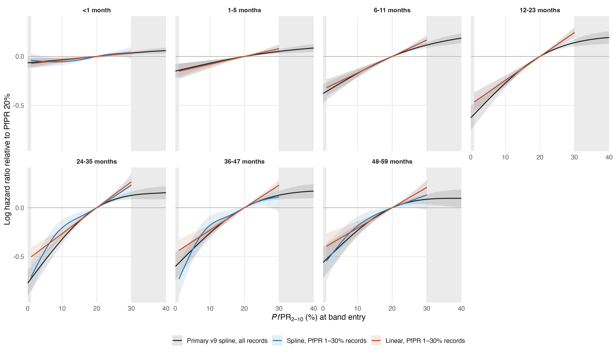

# Linear PfPR[2–10] on the 1–30% range

Records restricted to band entries with PfPR 1–30%: 4,760,130 of the 7,621,617 v9 child-band records (62%) and 54,680 of 104,143 deaths (53%), in 129 surveys, 36 countries and 928 survey-regions. Each age band is fitted twice on these records with the v9 primary specification (17 covariates, `s(calendar_year)` on the primary reference knots, survey, country and survey-region random intercepts, `offset(log(band_years))`, gamma = 2): **linear**, with `pfpr_pct` as a linear term, and **spline**, with `s(pfpr_pct, cr, k = 5)` on knots equally spaced over 1–30%. Fitted by bam (fREML) on the collapsed survey-region × entry-month cells, whose binomial likelihood equals the child-level likelihood; covariates keep the v9 scaling. The primary curves are the v9 fits to all records.

All 14 fits converged with positive-definite smoothing Hessians.

## Slope: hazard ratio per 10-point increase in PfPR

For the splines, the average slope from 1% to 30% (the 30%→1% log hazard ratio × 10/29).

| Age (months) | Linear, 1–30% | Spline, 1–30% (average) | Primary v9 (average over 1–30%) |
|---|---:|---:|---:|
| <1 | 1.04 (1.01–1.07) | 1.03 (1.00–1.06) | 1.03 (1.01–1.05) |
| 1-5 | 1.08 (1.04–1.13) | 1.08 (1.04–1.13) | 1.07 (1.04–1.10) |
| 6-11 | 1.18 (1.13–1.24) | 1.18 (1.13–1.24) | 1.18 (1.14–1.22) |
| 12-23 | 1.28 (1.21–1.35) | 1.28 (1.21–1.35) | 1.29 (1.23–1.34) |
| 24-35 | 1.30 (1.24–1.37) | 1.38 (1.30–1.47) | 1.34 (1.28–1.40) |
| 36-47 | 1.26 (1.19–1.33) | 1.34 (1.24–1.44) | 1.27 (1.21–1.33) |
| 48-59 | 1.23 (1.15–1.32) | 1.26 (1.17–1.37) | 1.23 (1.17–1.30) |

## Hazard ratios across the range (95% intervals conditional on smoothing parameters)

Equal-width steps show where the splines depart from linearity; the linear model gives the same hazard ratio for every 10-point step.

| Age (months) | Contrast | Linear, 1–30% | Spline, 1–30% | Primary v9 |
|---|---|---:|---:|---:|
| <1 | 30% to 20% | 0.96 (0.94–0.99) | 0.96 (0.91–1.02) | 0.97 (0.95–0.98) |
| 1-5 | 30% to 20% | 0.92 (0.89–0.96) | 0.92 (0.89–0.96) | 0.95 (0.93–0.97) |
| 6-11 | 30% to 20% | 0.84 (0.81–0.88) | 0.84 (0.81–0.88) | 0.89 (0.86–0.92) |
| 12-23 | 30% to 20% | 0.78 (0.74–0.82) | 0.78 (0.74–0.82) | 0.87 (0.84–0.90) |
| 24-35 | 30% to 20% | 0.77 (0.73–0.81) | 0.79 (0.71–0.89) | 0.88 (0.85–0.92) |
| 36-47 | 30% to 20% | 0.79 (0.75–0.84) | 0.89 (0.77–1.04) | 0.88 (0.84–0.92) |
| 48-59 | 30% to 20% | 0.81 (0.76–0.87) | 0.88 (0.75–1.03) | 0.92 (0.87–0.97) |
| <1 | 20% to 10% | 0.96 (0.94–0.99) | 0.95 (0.91–0.98) | 0.97 (0.95–0.99) |
| 1-5 | 20% to 10% | 0.92 (0.89–0.96) | 0.92 (0.89–0.96) | 0.93 (0.91–0.96) |
| 6-11 | 20% to 10% | 0.84 (0.81–0.88) | 0.84 (0.81–0.88) | 0.84 (0.81–0.87) |
| 12-23 | 20% to 10% | 0.78 (0.74–0.82) | 0.78 (0.74–0.82) | 0.76 (0.73–0.80) |
| 24-35 | 20% to 10% | 0.77 (0.73–0.81) | 0.81 (0.75–0.88) | 0.72 (0.69–0.76) |
| 36-47 | 20% to 10% | 0.79 (0.75–0.84) | 0.83 (0.76–0.92) | 0.77 (0.73–0.81) |
| 48-59 | 20% to 10% | 0.81 (0.76–0.87) | 0.83 (0.76–0.91) | 0.79 (0.75–0.84) |
| <1 | 10% to 1% | 0.97 (0.94–0.99) | 1.01 (0.96–1.07) | 0.97 (0.95–1.00) |
| 1-5 | 10% to 1% | 0.93 (0.90–0.97) | 0.93 (0.90–0.97) | 0.93 (0.90–0.97) |
| 6-11 | 10% to 1% | 0.86 (0.83–0.89) | 0.86 (0.83–0.89) | 0.83 (0.79–0.88) |
| 12-23 | 10% to 1% | 0.80 (0.77–0.84) | 0.80 (0.77–0.84) | 0.73 (0.68–0.78) |
| 24-35 | 10% to 1% | 0.79 (0.75–0.83) | 0.60 (0.52–0.70) | 0.67 (0.62–0.72) |
| 36-47 | 10% to 1% | 0.81 (0.77–0.86) | 0.58 (0.48–0.69) | 0.74 (0.68–0.80) |
| 48-59 | 10% to 1% | 0.83 (0.78–0.88) | 0.70 (0.59–0.82) | 0.75 (0.68–0.82) |
| <1 | 30% to 1% | 0.89 (0.83–0.97) | 0.92 (0.85–1.01) | 0.91 (0.86–0.96) |
| 1-5 | 30% to 1% | 0.79 (0.70–0.89) | 0.79 (0.70–0.89) | 0.82 (0.76–0.89) |
| 6-11 | 30% to 1% | 0.61 (0.54–0.70) | 0.61 (0.54–0.70) | 0.62 (0.56–0.69) |
| 12-23 | 30% to 1% | 0.49 (0.42–0.57) | 0.49 (0.42–0.57) | 0.48 (0.43–0.54) |
| 24-35 | 30% to 1% | 0.46 (0.40–0.54) | 0.39 (0.33–0.47) | 0.43 (0.38–0.49) |
| 36-47 | 30% to 1% | 0.51 (0.43–0.61) | 0.43 (0.35–0.53) | 0.50 (0.43–0.57) |
| 48-59 | 30% to 1% | 0.55 (0.45–0.67) | 0.51 (0.40–0.64) | 0.54 (0.46–0.64) |

## Fit on the 1–30% records: linear against spline

| Age (months) | Spline PfPR EDF | ΔAIC (linear − spline) | Δ log-likelihood | Linear term p | Spline term p |
|---|---:|---:|---:|---:|---:|
| <1 | 2.21 | -7.8 | 1.1 | 0.00690 | 0.01316 |
| 1-5 | 1.00 | -0.0 | 0.0 | 0.00014 | 0.00014 |
| 6-11 | 1.00 | -0.0 | 0.0 | < 1e-04 | < 1e-04 |
| 12-23 | 1.00 | -0.0 | -0.0 | < 1e-04 | < 1e-04 |
| 24-35 | 2.91 | 5.9 | -5.7 | < 1e-04 | < 1e-04 |
| 36-47 | 2.94 | 12.6 | -11.4 | < 1e-04 | < 1e-04 |
| 48-59 | 2.08 | 0.0 | -2.5 | < 1e-04 | < 1e-04 |

AIC is mgcv's conditional AIC with the corrected degrees of freedom (lower is better); the log-likelihood is the binomial kernel. A spline EDF near 1 means the penalised spline is itself close to linear.

## Burden across the 42 countries

The linear model's attributable deaths use 1 − exp(−βP) with national PfPR P, so the log hazard is extrapolated linearly below 1% (to the 0% reference) and above 30%.

Attributable fraction at PfPR 20% (primary → linear): <1 6.3% → 7.4%; 1-5 13.9% → 14.7%; 6-11 31.6% → 28.6%; 12-23 46.6% → 38.7%; 24-35 53.8% → 41.1%; 36-47 45.2% → 36.9%; 48-59 42.8% → 34.0%.

| Year | Primary v9 | Linear, 1–30% | IHME | UN IGME |
|---|---:|---:|---:|---:|
| 2000 | 1,185,329 | 1,390,641 | 563,657 | 724,276 |
| 2015 | 736,151 | 695,355 | 416,122 | 416,815 |
| 2024 | 629,136 | 580,248 | 428,147 | 440,123 |

2024: linear 1.36 × IHME and 1.32 × UN IGME (primary 1.47 and 1.43). Rate change 2000–2015 -65.4% and 2015–2024 -25.4% (primary -57.0% and -23.6%).

With a 1% counterfactual floor (deaths attributable to PfPR above 1%, as in `reference_floor_dhsmics_map_gamma2_v2`), which removes the extrapolated 0–1% segment from both models:

| Year | Primary v9 | Linear, 1–30% |
|---|---:|---:|
| 2000 | 1,139,590 | 1,361,014 |
| 2015 | 701,174 | 668,439 |
| 2024 | 597,853 | 555,765 |

2024 deaths by national PfPR of the country:

| National PfPR | Countries | Primary v9 | Linear, 1–30% | IHME |
|---|---:|---:|---:|---:|
| <1% | 2 | 38 | 28 | 12 |
| 1–30% | 36 | 528,498 | 470,976 | 348,935 |
| >30% | 4 | 100,599 | 109,244 | 79,201 |

2024 deaths by age band:

| Age (months) | Primary v9 | Linear, 1–30% |
|---|---:|---:|
| <1 | 54,402 | 63,443 |
| 1-5 | 54,330 | 60,229 |
| 6-11 | 105,813 | 100,861 |
| 12-23 | 143,205 | 125,221 |
| 24-35 | 102,563 | 84,201 |
| 36-47 | 87,170 | 76,029 |
| 48-59 | 81,654 | 70,265 |

Files: `selection_by_age.csv`, `fit_diagnostics.csv`, `fit_comparison.csv`, `smooth_summaries.csv`, `contrasts.csv`, `slope_per_10_points.csv`, `attributable_fraction_by_age.csv`, `pfpr_curves.csv`, `year_totals.csv`, `country_year_burden.csv`, `burden_2024_by_national_pfpr.csv`, `CAPTION.md`. Reproduce: `Rscript R_cbh/sensitivity/linear_pfpr_1_30/01_fit.R` then `02_report.R`.
