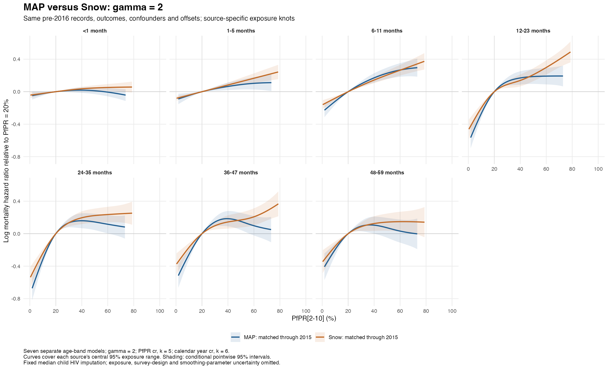

# MAP versus Snow, gamma=2

The primary exposure-source comparison uses identical child-band records through 2015. MAP and Snow fits retain the same outcomes, confounders, covariate scaling, offsets and median child HIV-incidence imputation. PfPR differs by source; each source retains its original exposure knot locations. All fits use cr (PfPR k=5, calendar-year k=6), gamma=2, unweighted binomial cloglog likelihood and separately estimated age-band coefficients and random effects.

The full-period MAP models used for the previous burden analysis are also refitted at gamma=2. The existing full-sample Snow gamma=2 fits are reused. Comparing those two available samples combines exposure-source and sample/period differences.

| Series | Child-band records | Deaths |
|---|---:|---:|
| MAP: matched through 2015 | 3,428,544 | 55,254 |
| Snow: matched through 2015 | 3,428,544 | 55,254 |
| MAP: full fitting period | 5,885,022 | 82,415 |
| Snow: full sample through 2015 | 3,429,310 | 55,257 |

In the matched comparison, the Snow curves have lower effective degrees of freedom in every age band. MAP generally rises more sharply at low prevalence and more often flattens or turns down at high prevalence, especially at older ages. At 20% PfPR, the estimated contrast to zero gives a lower attributable fraction with Snow in every band. Differences over 40% to 20% are less uniform, illustrating why the entire curve matters for the national mortality calculation.

## Effective degrees of freedom

| Completed months | MAP matched | Snow matched | MAP full | Snow full |
|---|---:|---:|---:|---:|
| <1 | 2.10 | 1.60 | 2.28 | 1.59 |
| 1-5 | 1.76 | 1.00 | 1.98 | 1.00 |
| 6-11 | 2.30 | 1.52 | 2.59 | 1.51 |
| 12-23 | 3.39 | 3.29 | 3.53 | 3.29 |
| 24-35 | 3.50 | 3.23 | 3.61 | 3.23 |
| 36-47 | 3.16 | 2.86 | 3.40 | 2.86 |
| 48-59 | 2.81 | 2.56 | 3.39 | 2.57 |

## Hazard ratio for PfPR 40% to 20%

| Completed months | MAP matched | Snow matched | MAP full | Snow full |
|---|---:|---:|---:|---:|
| <1 | 0.981 (0.949–1.015) | 0.965 (0.941–0.989) | 0.965 (0.936–0.995) | 0.965 (0.941–0.989) |
| 1-5 | 0.937 (0.895–0.981) | 0.921 (0.893–0.949) | 0.926 (0.889–0.965) | 0.921 (0.893–0.949) |
| 6-11 | 0.843 (0.797–0.892) | 0.866 (0.834–0.900) | 0.837 (0.795–0.882) | 0.866 (0.834–0.900) |
| 12-23 | 0.844 (0.778–0.917) | 0.871 (0.809–0.937) | 0.872 (0.813–0.936) | 0.870 (0.809–0.936) |
| 24-35 | 0.853 (0.778–0.935) | 0.822 (0.760–0.889) | 0.843 (0.779–0.911) | 0.822 (0.760–0.889) |
| 36-47 | 0.831 (0.757–0.914) | 0.866 (0.798–0.939) | 0.823 (0.756–0.895) | 0.866 (0.798–0.939) |
| 48-59 | 0.900 (0.810–1.000) | 0.883 (0.807–0.966) | 0.955 (0.863–1.058) | 0.884 (0.808–0.967) |

Intervals are conditional pointwise 95% intervals. Between-fit differences are descriptive; sampling covariance between fits is not estimated. A 40-to-20 comparison need not rank curves the same way as a current-to-zero burden comparison.

## Attributable fraction at 20% PfPR relative to zero

This contrast is closer to the national burden estimand. It depends on the low-exposure part of the spline, and may extrapolate to zero outside observed support; flags and conditional intervals are in the CSV.

| Completed months | MAP matched | Snow matched | MAP full | Snow full |
|---|---:|---:|---:|---:|
| <1 | 5.2% | 4.2% | 3.2% | 4.1% |
| 1-5 | 9.4% | 7.9% | 10.1% | 7.9% |
| 6-11 | 22.2% | 15.0% | 25.4% | 15.0% |
| 12-23 | 46.9% | 37.7% | 46.8% | 37.7% |
| 24-35 | 52.9% | 42.3% | 55.2% | 42.3% |
| 36-47 | 43.7% | 31.8% | 49.9% | 31.8% |
| 48-59 | 36.5% | 29.8% | 49.5% | 29.8% |

## Checks and limitations

All selected fits converged, have full rank and finite coefficients/covariance, and reproduce the stored input records. Paired MAP/Snow nuisance inputs are identical, checked over every record. Compact PfPR contrasts and variances match full prediction-matrix calculations at zero and nonzero exposures. Original knot locations are verified. Model hashes and numerical diagnostics are saved.
All selected smoothing Hessians are positive.
Gamma changes smoothing selection throughout each model. A tighter-tolerance restart is selected only if it improves numerical diagnostics within the same specification. No fREML comparison is used to select between exposure sources.

Snow is available only through 2015. Any later mortality scenario using these curves requires transport over time and an explicitly specified external exposure. Zero PfPR can lie outside observed exposure support. Fixed Snow/MAP exposures and a single HIV imputation omit their uncertainty; survey design and residual within-child dependence are also omitted.

- [Full-sample curve comparison](full_sample_pfpr_splines.png) · [All curves](all_pfpr_splines.png)
- [Burden comparison for 2005, 2015 and 2024](burden/REPORT.md)
- [EDF](pfpr_edf.csv) · [40-to-20 contrasts](pfpr_40_to_20_contrasts.csv) · [20-to-zero contrasts](pfpr_20_to_zero_contrasts.csv) · [Diagnostics](fit_diagnostics.csv) · [Fit manifest](fit_manifest.csv)
- Reproduce: Rscript R_cbh/snow/08_fit_map_comparison_gamma2.R; Rscript R_cbh/snow/09_report_map_comparison_gamma2.R.
