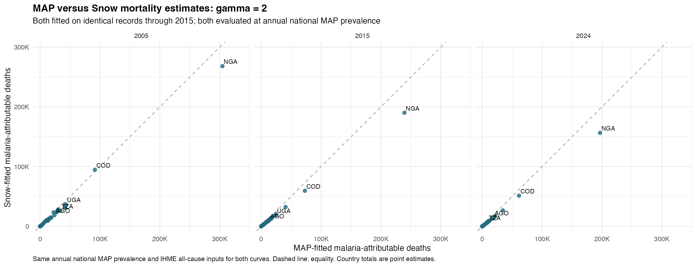

# MAP versus Snow: mortality comparison at gamma=2

Both sets of fitted curves are evaluated at the SAME national population-weighted MAP PfPR in 2005, 2015 and 2024. This holds the scenario exposure fixed and compares fitted relationships. Snow has no 2024 prevalence estimate: the Snow-fitted 2024 result is a transport scenario using MAP exposure, not a source-specific Snow estimate. Applying a Snow-fitted relationship to MAP exposure also assumes the two prevalence scales can be used interchangeably for this scenario.

The observed IHME all-cause rates and death counts remain fixed. For country c and age g, HR = exp[f_g(0)-f_g(P_c)], counterfactual mortality = IHME mortality × HR, and malaria-attributable mortality = IHME mortality × (1−HR). This is a calibrated attributable-mortality calculation, not an independent prediction of baseline all-cause mortality.

## Full available fitting samples

MAP full uses the previous primary model's full fitting sample at gamma=2; Snow full uses its sample through 2015. Their difference includes both exposure source and fitting sample/period. The previous MAP gamma=1 totals are included to show the smoothing update.

| Year | Countries | Previous MAP gamma 1 | MAP full gamma 2 | Snow full gamma 2 | Snow vs MAP | IHME malaria |
|---|---:|---:|---:|---:|---:|---:|
| 2005 | 42 | 885,823 | 973,148 | 800,524 | -17.7% | 564,067 |
| 2015 | 42 | 637,701 | 694,534 | 518,943 | -25.3% | 416,122 |
| 2024 | 42 | 545,150 | 592,353 | 439,132 | -25.9% | 428,147 |

## Same-record exposure-source comparison

MAP and Snow are fitted on identical child-band records through 2015, with matching outcomes, confounders and offsets. This is the cleaner comparison of fitted exposure relationships. Source-specific original PfPR knots are retained; all other basis choices and gamma=2 are the same.

| Year | MAP matched gamma 2 | Snow matched gamma 2 | Snow vs MAP |
|---|---:|---:|---:|
| 2005 | 917,750 | 801,153 | -12.7% |
| 2015 | 651,306 | 519,505 | -20.2% |
| 2024 | 555,621 | 439,631 | -20.9% |

Snow gives lower totals even after matching the fitting records, so the difference is not solely explained by the shorter fitting period. In the matched comparison, Snow estimates are lower in 40 of 42 countries in 2005 and all 42 in 2015 and 2024. With full available samples, Snow is lower in all 42 countries in each year. Increasing full-period MAP gamma from 1 to 2 raises the aggregate estimates by approximately 9–10%.

## DRC example

| Year | MAP full | Snow full | MAP matched | Snow matched |
|---|---:|---:|---:|---:|
| 2005 | 97,924 | 94,686 | 91,543 | 94,712 |
| 2015 | 78,165 | 59,489 | 73,090 | 59,544 |
| 2024 | 65,442 | 51,289 | 61,414 | 51,337 |

## Interpretation and checks

The national PfPR values and IHME inputs are reused from the reviewed earlier calculations and checked against their saved tables. Population weighting remains GPW 2020 density × cell area with fractional country overlap. The IHME 2–4 rate is shared across the three model bands, and deaths/person-time are split equally. Every new age-band calculation satisfies observed = counterfactual + attributable deaths/rates. Matched model frames and compact spline predictions are verified in the fitting stage.

All 45 countries remain in the CSVs; estimates are missing for Cape Verde, Lesotho, Sao Tome and Principe because national MAP exposure is unavailable. Summaries use the same 42 countries in all series. Missing values are not replaced by zero; negative attributable estimates are retained.

Age-band intervals use within-model covariance, conditional on fitted smoothing parameters, fixed HIV imputation, prevalence and IHME baselines. Cross-age and cross-model sampling covariance is unavailable, so country-total intervals and significance tests of between-model differences are not constructed. Source, survey-design, residual within-child, temporal-transport and IHME allocation uncertainty are omitted. Zero-PfPR and current-exposure support flags accompany every age-band estimate; incomplete geographic coverage remains relevant. IHME malaria deaths and the modeled reduction in all-cause deaths are different estimands, and export release alignment remains unverified.

- [Every country's comparison and changes](country_comparisons.csv) · [Country totals and counterfactuals](country_totals.csv)
- [Age-band attributable rates, counts, intervals and support flags](country_age_estimates.csv)
- [All-country figure](country_deaths_all_years.png) · [Full-sample scatter](full_sample_country_comparison.png) · [Year totals](year_summary.csv)
- [Spline comparison and model specification](../REPORT.md)
- Reproduce after fitting: Rscript R_cbh/snow/10_compare_burden_gamma2.R --exposure=map.
