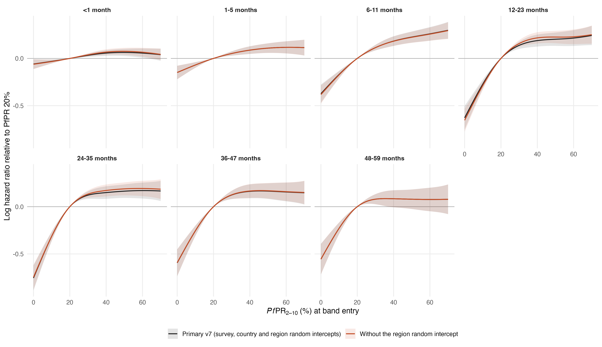

# Primary model without the survey-region random intercept

Same prepared v7 sample (7,607,122 child-band records, 103,987 deaths), formula, reference knots, gamma = 2 and bam settings as `primary_map_regional17_dhsmics_gamma2_v7`, with `s(region, bs = "re")` removed; survey and country random intercepts kept. All seven fits converged; the 1-5 month fit first stopped with a non-positive-definite smoothing Hessian (PfPR smooth penalised to a straight line, fREML 1.3 worse) and was replaced by the strict restart under the primary rule ([restarts](restarts.csv)).

## Hazard ratios (95% intervals conditional on smoothing parameters)

| Age (months) | Contrast | v7 | Without region RE |
|---|---|---:|---:|
| <1 | 40% to 20% | 0.94 (0.92–0.97) | 0.94 (0.91–0.96) |
| 1-5 | 40% to 20% | 0.92 (0.88–0.95) | 0.92 (0.88–0.95) |
| 6-11 | 40% to 20% | 0.83 (0.79–0.88) | 0.83 (0.79–0.88) |
| 12-23 | 40% to 20% | 0.83 (0.78–0.88) | 0.80 (0.76–0.85) |
| 24-35 | 40% to 20% | 0.86 (0.81–0.92) | 0.84 (0.79–0.90) |
| 36-47 | 40% to 20% | 0.85 (0.79–0.91) | 0.85 (0.79–0.91) |
| 48-59 | 40% to 20% | 0.92 (0.84–1.01) | 0.92 (0.84–1.01) |
| <1 | 20% to 0% | 0.94 (0.90–0.99) | 0.94 (0.89–0.99) |
| 1-5 | 20% to 0% | 0.86 (0.80–0.93) | 0.86 (0.80–0.93) |
| 6-11 | 20% to 0% | 0.69 (0.63–0.76) | 0.68 (0.62–0.75) |
| 12-23 | 20% to 0% | 0.53 (0.47–0.60) | 0.52 (0.46–0.59) |
| 24-35 | 20% to 0% | 0.47 (0.41–0.54) | 0.47 (0.42–0.54) |
| 36-47 | 20% to 0% | 0.55 (0.48–0.64) | 0.55 (0.48–0.64) |
| 48-59 | 20% to 0% | 0.57 (0.49–0.67) | 0.57 (0.49–0.67) |

Largest absolute change: 0.023 in the 40%→20% hazard ratio and 0.014 in the 20%→0% hazard ratio.

Attributable fraction at PfPR 20% (v7 → without region RE): 
<1 5.8% → 6.0%; 1-5 13.8% → 13.8%; 6-11 31.1% → 31.8%; 12-23 46.7% → 48.0%; 24-35 53.0% → 52.6%; 36-47 44.8% → 44.7%; 48-59 42.6% → 42.6%

## Burden across the 42 countries

| Year | v7 | Without region RE | IHME | UN IGME |
|---|---:|---:|---:|---:|
| 2000 | 1,170,371 | 1,192,891 | 563,657 | 724,276 |
| 2015 | 725,613 | 736,781 | 416,122 | 416,815 |
| 2024 | 620,072 | 628,785 | 428,147 | 440,123 |

2024: 1.47 × IHME and 1.43 × UN IGME without the region random intercept (v7 1.45 and 1.41). Rate change 2000–2015 -57.2% and 2015–2024 -23.7% (v7 -57.1% and -23.6%).

## Effective degrees of freedom

| Term | Age (months) | v7 | Without region RE |
|---|---|---:|---:|
| s(pfpr_pct) | <1 | 2.33 | 2.58 |
| s(pfpr_pct) | 1-5 | 2.28 | 2.28 |
| s(pfpr_pct) | 6-11 | 2.97 | 3.02 |
| s(pfpr_pct) | 12-23 | 3.51 | 3.56 |
| s(pfpr_pct) | 24-35 | 3.66 | 3.65 |
| s(pfpr_pct) | 36-47 | 3.33 | 3.32 |
| s(pfpr_pct) | 48-59 | 3.20 | 3.20 |
| s(calendar_year) | <1 | 1.51 | 1.42 |
| s(calendar_year) | 1-5 | 2.98 | 2.98 |
| s(calendar_year) | 6-11 | 2.30 | 2.28 |
| s(calendar_year) | 12-23 | 2.94 | 2.91 |
| s(calendar_year) | 24-35 | 1.00 | 1.00 |
| s(calendar_year) | 36-47 | 1.00 | 1.00 |
| s(calendar_year) | 48-59 | 1.00 | 1.00 |
| s(survey) | <1 | 56.15 | 63.89 |
| s(survey) | 1-5 | 26.03 | 26.03 |
| s(survey) | 6-11 | 37.83 | 39.79 |
| s(survey) | 12-23 | 45.98 | 52.06 |
| s(survey) | 24-35 | 27.31 | 32.95 |
| s(survey) | 36-47 | 5.56 | 6.60 |
| s(survey) | 48-59 | 12.18 | 12.18 |
| s(country) | <1 | 23.92 | 24.32 |
| s(country) | 1-5 | 27.09 | 27.09 |
| s(country) | 6-11 | 26.61 | 26.61 |
| s(country) | 12-23 | 26.66 | 26.50 |
| s(country) | 24-35 | 25.52 | 25.36 |
| s(country) | 36-47 | 22.25 | 22.22 |
| s(country) | 48-59 | 14.38 | 14.38 |
| s(region) | <1 | 160.95 | – |
| s(region) | 1-5 | 0.08 | – |
| s(region) | 6-11 | 26.07 | – |
| s(region) | 12-23 | 97.12 | – |
| s(region) | 24-35 | 48.67 | – |
| s(region) | 36-47 | 7.57 | – |
| s(region) | 48-59 | 0.00 | – |

## Fit statistics

| Age (months) | ΔAIC (without − v7) | ΔfREML (without − v7) |
|---|---:|---:|
| <1 | 383.8 | 10.98 |
| 1-5 | -0.1 | -0.00 |
| 6-11 | 43.7 | 0.39 |
| 12-23 | 234.1 | 9.00 |
| 24-35 | 98.1 | 2.95 |
| 36-47 | 8.0 | 0.07 |
| 48-59 | 0.0 | 0.00 |

AIC is mgcv's conditional AIC; fREML is the restricted likelihood criterion minimised by bam (lower is better for both). Both models share the fixed effects, so the fREML difference compares the random-effect structures directly.

Files: `comparison_contrasts.csv`, `attributable_fraction_by_age.csv`, `comparison_pfpr_curves.csv`, `comparison_edf.csv`, `comparison_fit_statistics.csv`, `year_totals.csv`, `country_year_burden.csv`. Reproduce: `Rscript R_cbh/sensitivity/no_region_re/01_fit.R` then `02_report.R`.
