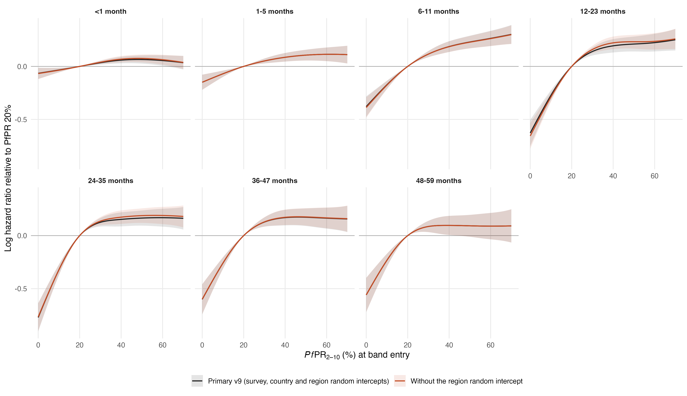

# Primary model without the survey-region random intercept

Same prepared v9 sample (7,621,617 child-band records, 104,143 deaths), formula, reference knots, gamma = 2 and bam settings as `primary_map_regional17_dhsmics_gamma2_v9`, with `s(region, bs = "re")` removed; survey and country random intercepts kept. All seven fits converged; the 1-5 month fit first stopped with a non-positive-definite smoothing Hessian (PfPR smooth penalised to a straight line, fREML 1.3 worse) and was replaced by the strict restart under the primary rule ([restarts](restarts.csv)).

## Hazard ratios (95% intervals conditional on smoothing parameters)

| Age (months) | Contrast | v9 | Without region RE |
|---|---|---:|---:|
| <1 | 40% to 20% | 0.94 (0.91–0.97) | 0.93 (0.91–0.96) |
| 1-5 | 40% to 20% | 0.92 (0.88–0.96) | 0.92 (0.88–0.96) |
| 6-11 | 40% to 20% | 0.83 (0.79–0.87) | 0.83 (0.79–0.87) |
| 12-23 | 40% to 20% | 0.82 (0.77–0.88) | 0.80 (0.75–0.85) |
| 24-35 | 40% to 20% | 0.86 (0.80–0.92) | 0.84 (0.79–0.90) |
| 36-47 | 40% to 20% | 0.84 (0.78–0.91) | 0.84 (0.78–0.90) |
| 48-59 | 40% to 20% | 0.91 (0.83–0.99) | 0.91 (0.83–0.99) |
| <1 | 20% to 0% | 0.94 (0.89–0.99) | 0.93 (0.89–0.99) |
| 1-5 | 20% to 0% | 0.86 (0.80–0.92) | 0.86 (0.80–0.92) |
| 6-11 | 20% to 0% | 0.68 (0.62–0.75) | 0.68 (0.62–0.75) |
| 12-23 | 20% to 0% | 0.53 (0.47–0.60) | 0.52 (0.46–0.59) |
| 24-35 | 20% to 0% | 0.46 (0.40–0.53) | 0.46 (0.41–0.53) |
| 36-47 | 20% to 0% | 0.55 (0.48–0.63) | 0.55 (0.48–0.63) |
| 48-59 | 20% to 0% | 0.57 (0.49–0.67) | 0.57 (0.49–0.67) |

Largest absolute change: 0.023 in the 40%→20% hazard ratio and 0.015 in the 20%→0% hazard ratio.

Attributable fraction at PfPR 20% (v9 → without region RE): 
<1 6.3% → 6.5%; 1-5 13.9% → 13.9%; 6-11 31.6% → 32.2%; 12-23 46.6% → 48.1%; 24-35 53.8% → 53.5%; 36-47 45.2% → 45.1%; 48-59 42.8% → 42.8%

## Burden across the 42 countries

| Year | v9 | Without region RE | IHME | UN IGME |
|---|---:|---:|---:|---:|
| 2000 | 1,185,329 | 1,207,257 | 563,657 | 724,276 |
| 2015 | 736,151 | 747,358 | 416,122 | 416,815 |
| 2024 | 629,136 | 637,984 | 428,147 | 440,123 |

2024: 1.49 × IHME and 1.45 × UN IGME without the region random intercept (v9 1.47 and 1.43). Rate change 2000–2015 -57.1% and 2015–2024 -23.7% (v9 -57.0% and -23.6%).

## Effective degrees of freedom

| Term | Age (months) | v9 | Without region RE |
|---|---|---:|---:|
| s(pfpr_pct) | <1 | 2.40 | 2.62 |
| s(pfpr_pct) | 1-5 | 2.28 | 2.29 |
| s(pfpr_pct) | 6-11 | 2.99 | 3.03 |
| s(pfpr_pct) | 12-23 | 3.50 | 3.56 |
| s(pfpr_pct) | 24-35 | 3.67 | 3.66 |
| s(pfpr_pct) | 36-47 | 3.33 | 3.32 |
| s(pfpr_pct) | 48-59 | 3.18 | 3.18 |
| s(calendar_year) | <1 | 1.38 | 1.28 |
| s(calendar_year) | 1-5 | 2.88 | 2.88 |
| s(calendar_year) | 6-11 | 2.32 | 2.31 |
| s(calendar_year) | 12-23 | 2.95 | 2.92 |
| s(calendar_year) | 24-35 | 1.00 | 1.00 |
| s(calendar_year) | 36-47 | 1.00 | 1.00 |
| s(calendar_year) | 48-59 | 1.00 | 1.00 |
| s(survey) | <1 | 56.16 | 63.87 |
| s(survey) | 1-5 | 28.43 | 28.45 |
| s(survey) | 6-11 | 37.86 | 39.74 |
| s(survey) | 12-23 | 43.93 | 50.43 |
| s(survey) | 24-35 | 28.61 | 33.92 |
| s(survey) | 36-47 | 5.29 | 6.17 |
| s(survey) | 48-59 | 12.25 | 12.25 |
| s(country) | <1 | 23.98 | 24.25 |
| s(country) | 1-5 | 26.65 | 26.65 |
| s(country) | 6-11 | 26.47 | 26.47 |
| s(country) | 12-23 | 26.74 | 26.47 |
| s(country) | 24-35 | 25.27 | 25.13 |
| s(country) | 36-47 | 22.24 | 22.21 |
| s(country) | 48-59 | 14.41 | 14.41 |
| s(region) | <1 | 160.26 | – |
| s(region) | 1-5 | 0.29 | – |
| s(region) | 6-11 | 25.02 | – |
| s(region) | 12-23 | 96.57 | – |
| s(region) | 24-35 | 48.44 | – |
| s(region) | 36-47 | 6.83 | – |
| s(region) | 48-59 | 0.00 | – |

## Fit statistics

| Age (months) | ΔAIC (without − v9) | ΔfREML (without − v9) |
|---|---:|---:|
| <1 | 383.4 | 10.97 |
| 1-5 | -1.0 | -0.00 |
| 6-11 | 41.7 | 0.36 |
| 12-23 | 231.9 | 8.87 |
| 24-35 | 98.0 | 2.86 |
| 36-47 | 6.8 | 0.06 |
| 48-59 | 0.0 | 0.00 |

AIC is mgcv's conditional AIC; fREML is the restricted likelihood criterion minimised by bam (lower is better for both). Both models share the fixed effects, so the fREML difference compares the random-effect structures directly.

Files: `comparison_contrasts.csv`, `attributable_fraction_by_age.csv`, `comparison_pfpr_curves.csv`, `comparison_edf.csv`, `comparison_fit_statistics.csv`, `year_totals.csv`, `country_year_burden.csv`. Reproduce: `Rscript R_cbh/sensitivity/no_region_re/01_fit.R` then `02_report.R`.
