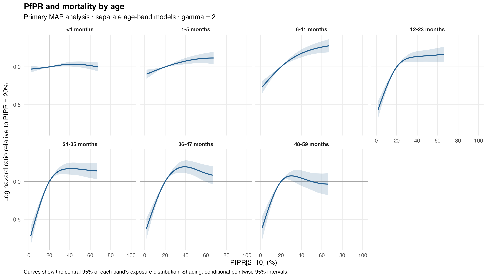
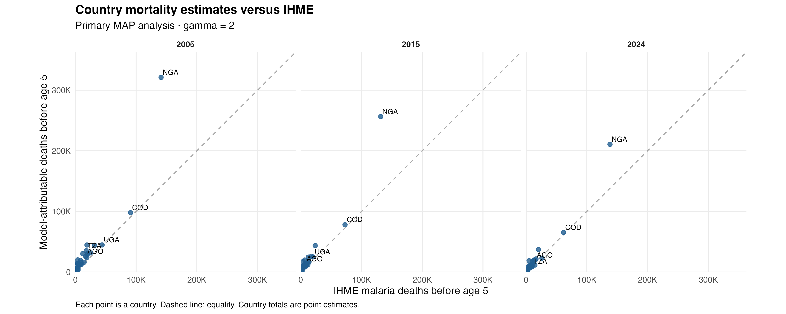

# Primary MAP analysis rerun

Seven age-band models were freshly fitted at gamma=2 using 1,817,912 children, 5,885,022 child-band records and 82,415 deaths (105 surveys; 34 countries). Dataset preparation, HIV imputation and national exposure/IHME input preparation were not rerun.

The unweighted binomial complementary-log-log model uses a fixed log band-width offset; separate cr PfPR (k=5) and calendar-year (k=6) splines, the saved scaled confounders, and survey/country/region random intercepts in each age band. Reference knot locations, sample selection and posterior-median child HIV incidence are unchanged. See [formula](model_formula.txt), [knots](../../../R_cbh/primary/reference_knots.csv) and [analysis plan](../../../docs/ANALYSIS_PLAN.md).

| Completed months | Records | Deaths | PfPR EDF | HR: 40% to 20% (95% interval) | Fit seconds |
|---|---:|---:|---:|---:|---:|
| <1 | 1,042,571 | 30,086 | 2.28 | 0.965 (0.936–0.995) | 26.8 |
| 1-5 | 935,677 | 12,137 | 1.98 | 0.926 (0.889–0.965) | 39.3 |
| 6-11 | 895,573 | 11,291 | 2.59 | 0.837 (0.795–0.882) | 31.1 |
| 12-23 | 772,578 | 11,062 | 3.53 | 0.872 (0.813–0.936) | 27.3 |
| 24-35 | 768,240 | 9,168 | 3.61 | 0.843 (0.779–0.911) | 35.7 |
| 36-47 | 744,682 | 5,477 | 3.40 | 0.823 (0.756–0.895) | 31.6 |
| 48-59 | 725,701 | 3,194 | 3.39 | 0.955 (0.863–1.058) | 35.8 |

[40% to 20% figure](pfpr_40_to_20.png) · [All curve estimates](pfpr_curves.csv) · [Attributable-fraction anchors](pfpr_attributable_fraction_anchors.csv)

## National mortality

For each age band, HR = exp[f_g(0) − f_g(P_country)]. The IHME all-cause rate/count is multiplied by HR for the counterfactual and by (1 − HR) for the attributable contribution. National MAP prevalence and IHME inputs are held at the existing values for each year. Ages 2–4 share the IHME rate and split deaths/person-time equally; early/late neonatal inputs share the <1-month model effect.

| Year | Countries | Attributable deaths | IHME malaria deaths |
|---|---:|---:|---:|
| 2005 | 42 | 973,148 | 564,067 |
| 2015 | 42 | 694,534 | 416,122 |
| 2024 | 42 | 592,353 | 428,147 |

[Every country's figure](burden/country_deaths_all_years.png) · [Country totals](burden/country_totals.csv) · [Age-band rates and deaths](burden/country_age_estimates.csv) · [Age contributions](burden/deaths_by_age.png) · [DRC survival](burden/drc_survival.png)

All 45 countries remain in the tables; Cape Verde, Lesotho and São Tomé and Príncipe lack national MAP estimates. Totals use the same 42 estimable countries. Missing estimates are not zero; negative attributable estimates are retained. National prevalence uses the saved GPW 2020 population weights in each scenario year. Evaluating a nonlinear spline at national mean prevalence differs from averaging local attributable effects.

## Verification and limits

All seven fits converged, had full coefficient rank, finite covariance and positive smoothing-Hessian eigenvalues. Every outcome, predictor and offset was checked against the prepared sample. Compact spline estimates and variances were checked against full model predictions. Total selected fitting time: 3.8 minutes. This mgcv build does not support OpenMP, so its recorded nthreads warning means computation used one thread.

Against the previous MAP gamma=2 run, the maximum absolute change in a curve log-hazard ratio was 4.55e-13, and the largest country/year change was 1.65e-08 deaths. [Curve comparison](comparison_with_previous_curves.csv) · [Country comparison](burden/comparison_with_previous_primary.csv).

Band intervals condition on smoothing parameters, one HIV imputation, exposure and IHME baselines. Country totals have no confidence intervals because cross-age sampling covariance is not estimated. Design, within-child dependence, HIV/exposure uncertainty, transport assumptions and IHME allocation uncertainty remain unresolved. The inherited regional MAP extraction issues documented in the [code audit](../../../docs/CODE_AUDIT.md) were not altered by this rerun. Country-held-out validation and gamma=2 structure/geography/period sensitivity fits remain separate planned analyses.

Model-attributable all-cause reductions and IHME cause-specific malaria counts are different estimands; agreement is descriptive. Zero/current exposure support flags accompany all age-band national estimates. The DRC survival curves describe a synthetic cohort, not additional annual death counts.

[Residual figure](outcome_residuals_by_pfpr.png) · [Fitted outcome checks](fitted_outcome_checks.csv) · [Grouped checks](grouped_outcome_checks.csv) · [Fit diagnostics](fit_diagnostics.csv) · [Fit manifest](fit_manifest.csv) · [Fit inputs/provenance](fit_input_provenance.csv) · [Burden provenance](burden/provenance.csv) · [Software versions](session_info.txt)

Reproduce the primary analysis, without data setup: `Rscript run_all.R --primary`. This forces fresh fitting. To regenerate aggregates/figures from verified current fits, use `Rscript R_cbh/primary/run.R --report-only`.
