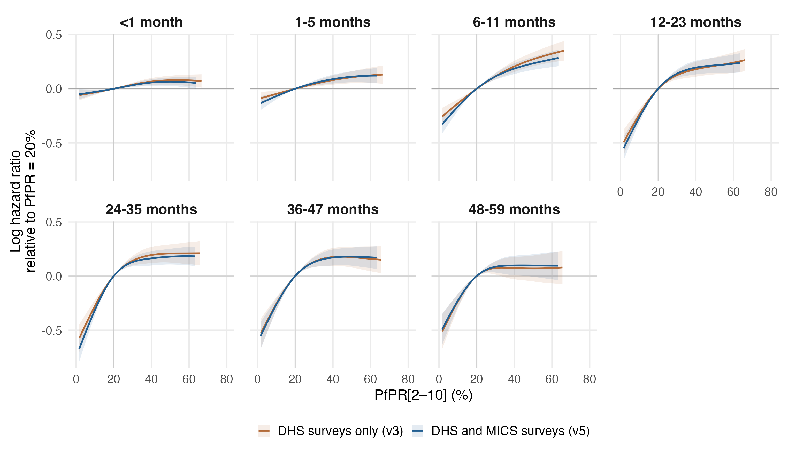
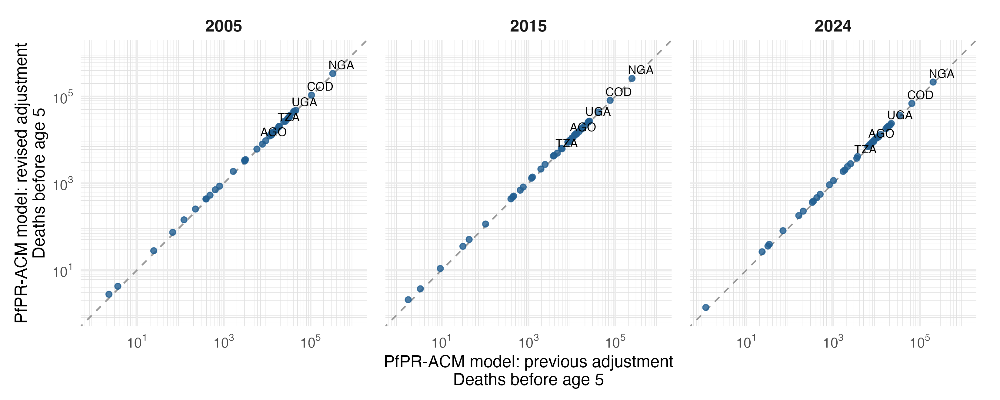

# Primary PfPR-ACM model: DHS and MICS surveys

Seven separate MAP age-band models, gamma=2, with the same 17-variable specification as `primary_map_regional17_gamma2_v3`, fitted to the DHS complete-case sample plus every MICS survey with a complete birth history that passes the same complete-case selection. All seven converged, have finite covariance and full rank, and pass the positive smoothing-Hessian and exact fitted-input checks.

## What changed

MICS birth histories were converted to the DHS Births Recode layout (R_mics/07_make_recodes.R) and passed through the same child age-band builder, with annual regional MAP PfPR extracted by the DHS method on DHS boundary polygons (new admin-1 polygons for Guinea-Bissau and the Central African Republic). All 13 regional covariates were computed from the MICS microdata (R_mics/09_regional_covariates.R); Guinea 2016, Comoros 2022 and Chad 2019 use the national WUENIC DTP3 and measles estimates because their recall doses are unusable. Complete-case selection then keeps only MICS surveys with anthropometry and complete national series, as for DHS. The DHS part reproduces the previous sample exactly.

MAP band-entry exposure, fixed median child HIV incidence imputation, age bands, full-band offset, unweighted binomial/cloglog likelihood, reference spline knots, cr basis dimensions and gamma=2 are held fixed. Confounders are re-scaled on the enlarged sample.

| Sample | DHS only | DHS and MICS | Change |
|---|---:|---:|---:|
| Child-band records | 5,465,305 | 7,498,459 | 2,033,154 |
| Children | 1,686,004 | 2,292,089 | 606,085 |
| Deaths | 75,726 | 102,282 | 26,556 |
| Survey-regions | 916 | 1,211 | 295 |
| Surveys | 95 | 132 | 37 |
| Countries | 34 | 36 | 2 |

The combined sample contains the DHS sample entirely. Differences reflect the added MICS records and the rescaling of confounders on the larger sample; MICS covariate definitions differ from DHS in documented ways (education level converted to years, facility delivery for the last birth in two years).

## PfPR effects

Curves are log hazard ratios relative to PfPR=20%; each is displayed over its own central 95% exposure range. Shading is a conditional 95% interval. The full 0–100% curves and support flags remain in comparison_pfpr_curves.csv. Intervals condition on smoothing parameters, exposure, one HIV imputation and other filled covariates. Overlapping-sample estimates are dependent; no formal test or interval for the difference between iterations is implied.

For PfPR 40% to 20%, the largest absolute change in the point-estimate HR is 0.026, at 24-35 months (0.824 previously; 0.850 revised).

For PfPR 20% to zero, the predicted mortality reductions at 12-23, 24-35, 36-47 months change from 42.2%, 47.1%, 44.5% to 45.6%, 52.7%, 45.7%, respectively.

### PfPR 40% to 20%

| Age (months) | Previous HR (95% interval) | Revised HR (95% interval) |
|---|---:|---:|
| <1 | 0.936 (0.906–0.966) | 0.944 (0.916–0.973) |
| 1-5 | 0.924 (0.886–0.963) | 0.915 (0.879–0.953) |
| 6-11 | 0.814 (0.773–0.857) | 0.830 (0.790–0.873) |
| 12-23 | 0.835 (0.780–0.895) | 0.823 (0.772–0.876) |
| 24-35 | 0.824 (0.765–0.887) | 0.850 (0.795–0.908) |
| 36-47 | 0.839 (0.773–0.912) | 0.843 (0.783–0.908) |
| 48-59 | 0.929 (0.838–1.030) | 0.907 (0.829–0.993) |

### PfPR 20% to 0%

| Age (months) | Previous HR (95% interval) | Revised HR (95% interval) |
|---|---:|---:|
| <1 | 0.938 (0.889–0.990) | 0.947 (0.899–0.997) |
| 1-5 | 0.908 (0.851–0.970) | 0.864 (0.805–0.928) |
| 6-11 | 0.755 (0.689–0.826) | 0.696 (0.632–0.765) |
| 12-23 | 0.578 (0.507–0.659) | 0.544 (0.480–0.616) |
| 24-35 | 0.529 (0.458–0.610) | 0.473 (0.415–0.540) |
| 36-47 | 0.555 (0.475–0.648) | 0.543 (0.471–0.625) |
| 48-59 | 0.564 (0.470–0.676) | 0.579 (0.493–0.679) |

Zero PfPR is just below observed support in every band; the 20% to 0% contrasts involve extrapolation. HR below one indicates lower mortality at the lower prevalence. Conditional intervals are calculated from the joint covariance of both evaluation points.

## National attributable mortality

The same population-weighted national MAP values and IHME all-cause baselines are used in both iterations, for the same 42 estimable countries. These are predicted all-cause reductions under zero PfPR. Country-age contributions remain signed, with missing countries retained in source tables; marginal age-specific intervals are not summed into total intervals.

| Year | Previous deaths | Revised deaths | Change |
|---|---:|---:|---:|
| 2005 | 973,935 | 1,027,003 | +5.4% |
| 2015 | 665,559 | 716,520 | +7.7% |
| 2024 | 565,616 | 611,440 | +8.1% |

Country and age-specific changes are in burden/comparison_country_totals.csv and burden/comparison_deaths_by_age.csv. Identical national PfPR and IHME baselines were verified. The existing equal-person-time assumption for the IHME 2–4-year group is retained.

## Reproduction and output scope

Run `Rscript R_cbh/primary/run_regional.R` for fresh fits, `--resume` to reuse only verified fit caches, or `--report-only` to recalculate effects, diagnostics and comparisons from the saved fits. No raw-source extraction, HIV refitting, supplementary fitting, manuscript editing or TeX generation is performed.

The comparator is the DHS-only primary in results/cbh/primary_map_regional17_gamma2_v3, preserved unchanged.

Numerical checks and provenance: fit_diagnostics.csv, fit_manifest.csv, fit_input_provenance.csv, fitted_outcome_checks.csv, comparison_edf.csv, and comparison_provenance.csv. In-sample outcome checks are not external validation or survey influence analyses.
