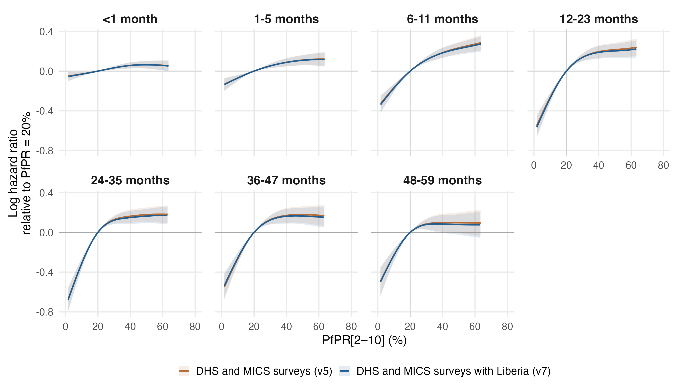
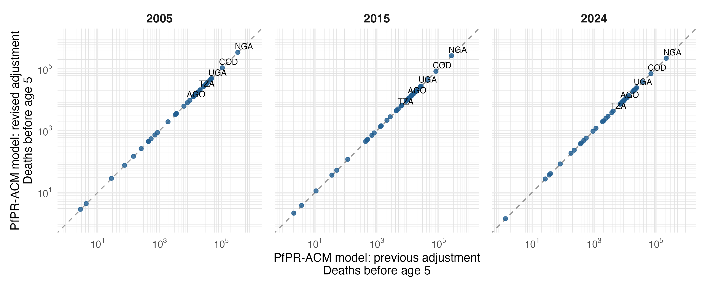

# Primary PfPR-ACM model: DHS and MICS surveys, with Liberia

Seven separate MAP age-band models, gamma=2, with the same 17-variable specification and sample rules as `primary_map_regional17_dhsmics_gamma2_v5`, now including Liberia. All seven converged, have finite covariance and full rank, and pass the positive smoothing-Hessian and exact fitted-input checks.

## What changed

Liberia had no child HIV incidence series in the UNAIDS/UNICEF workbook, so its surveys failed complete-case selection. Its child rate is now derived from the UNAIDS new HIV infections among children aged 0-14 published on AIDSinfo (epidemiological estimates 2026), divided by IHME-implied under-5 person-years less children aged 0-4 living with HIV; this reproduces the workbook's published child rates (median derived/published 0.99 across 761 country-years; [check](../hiv_incidence/liberia_aidsinfo/REPORT.md)). Liberia's 2007, 2013 and 2019-20 DHS enter; its 2009 MIS still lacks anthropometry. Every other country's HIV value is unchanged.

MAP band-entry exposure, age bands, full-band offset, unweighted binomial/cloglog likelihood, reference spline knots, cr basis dimensions and gamma=2 are held fixed. Confounders are re-scaled on the enlarged sample.

| Sample | DHS and MICS (v5) | With Liberia (v7) | Change |
|---|---:|---:|---:|
| Child-band records | 7,498,459 | 7,607,122 | 108,663 |
| Children | 2,292,089 | 2,325,130 | 33,041 |
| Deaths | 102,282 | 103,987 | 1,705 |
| Survey-regions | 1,211 | 1,227 | 16 |
| Surveys | 132 | 135 | 3 |
| Countries | 36 | 37 | 1 |

The v7 sample contains the v5 sample entirely. Differences reflect the added Liberia records and the rescaling of confounders on the larger sample.

## PfPR effects

Curves are log hazard ratios relative to PfPR=20%; each is displayed over its own central 95% exposure range. Shading is a conditional 95% interval. The full 0–100% curves and support flags remain in comparison_pfpr_curves.csv. Intervals condition on smoothing parameters, exposure, one HIV imputation and other filled covariates. Overlapping-sample estimates are dependent; no formal test or interval for the difference between iterations is implied.

For PfPR 40% to 20%, the largest absolute change in the point-estimate HR is 0.012, at 48-59 months (0.907 previously; 0.919 revised).

For PfPR 20% to zero, the predicted mortality reductions at 12-23, 24-35, 36-47 months change from 45.6%, 52.7%, 45.7% to 46.7%, 53.0%, 44.8%, respectively.

### PfPR 40% to 20%

| Age (months) | Previous HR (95% interval) | Revised HR (95% interval) |
|---|---:|---:|
| <1 | 0.944 (0.916–0.973) | 0.945 (0.917–0.974) |
| 1-5 | 0.915 (0.879–0.953) | 0.916 (0.880–0.954) |
| 6-11 | 0.830 (0.790–0.873) | 0.833 (0.791–0.876) |
| 12-23 | 0.823 (0.772–0.876) | 0.828 (0.777–0.882) |
| 24-35 | 0.850 (0.795–0.908) | 0.861 (0.806–0.920) |
| 36-47 | 0.843 (0.783–0.908) | 0.850 (0.790–0.915) |
| 48-59 | 0.907 (0.829–0.993) | 0.919 (0.840–1.006) |

### PfPR 20% to 0%

| Age (months) | Previous HR (95% interval) | Revised HR (95% interval) |
|---|---:|---:|
| <1 | 0.947 (0.899–0.997) | 0.942 (0.895–0.992) |
| 1-5 | 0.864 (0.805–0.928) | 0.862 (0.802–0.925) |
| 6-11 | 0.696 (0.632–0.765) | 0.689 (0.625–0.758) |
| 12-23 | 0.544 (0.480–0.616) | 0.533 (0.471–0.605) |
| 24-35 | 0.473 (0.415–0.540) | 0.470 (0.412–0.537) |
| 36-47 | 0.543 (0.471–0.625) | 0.552 (0.479–0.636) |
| 48-59 | 0.579 (0.493–0.679) | 0.574 (0.488–0.675) |

Zero PfPR is just below observed support in every band; the 20% to 0% contrasts involve extrapolation. HR below one indicates lower mortality at the lower prevalence. Conditional intervals are calculated from the joint covariance of both evaluation points.

## National attributable mortality

The same population-weighted national MAP values and IHME all-cause baselines are used in both iterations, for the same 42 estimable countries. These are predicted all-cause reductions under zero PfPR. Country-age contributions remain signed, with missing countries retained in source tables; marginal age-specific intervals are not summed into total intervals.

| Year | Previous deaths | Revised deaths | Change |
|---|---:|---:|---:|
| 2005 | 1,027,003 | 1,031,985 | +0.5% |
| 2015 | 716,520 | 725,613 | +1.3% |
| 2024 | 611,440 | 620,072 | +1.4% |

Country and age-specific changes are in burden/comparison_country_totals.csv and burden/comparison_deaths_by_age.csv. Identical national PfPR and IHME baselines were verified. The existing equal-person-time assumption for the IHME 2–4-year group is retained.

## Reproduction and output scope

Run `Rscript R_cbh/primary/run_regional.R` for fresh fits, `--resume` to reuse only verified fit caches, or `--report-only` to recalculate effects, diagnostics and comparisons from the saved fits. No raw-source extraction, HIV refitting, supplementary fitting, manuscript editing or TeX generation is performed.

The comparator is the DHS-only primary in results/cbh/primary_map_regional17_dhsmics_gamma2_v5, preserved unchanged.

Numerical checks and provenance: fit_diagnostics.csv, fit_manifest.csv, fit_input_provenance.csv, fitted_outcome_checks.csv, comparison_edf.csv, and comparison_provenance.csv. In-sample outcome checks are not external validation or survey influence analyses.
