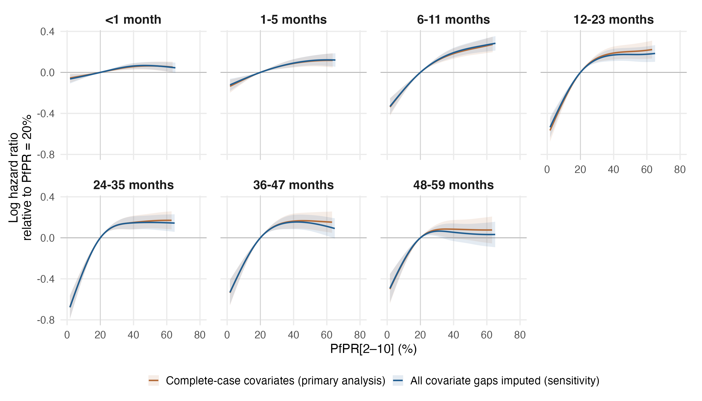

# Imputed-covariate sensitivity on the DHS and MICS sample (v8)

The 17-covariate primary specification refitted after imputing every remaining covariate gap, so that all MAP-eligible DHS and MICS records are retained. Reference: the complete-case DHS+MICS primary `primary_map_regional17_dhsmics_gamma2_v7`. This version: `primary_map_regional17_dhsmics_imputed_gamma2_v8`. The DHS-only counterpart is `primary_map_regional17_imputed_gamma2_v4`.

## Sample

| Measure | Complete case (v7) | Imputed (v8) |
|---|---:|---:|
| Child-band records | 7,607,122 | 8,797,963 |
| Distinct children | 2,325,130 | 2,656,472 |
| Deaths |   103,987 |   123,419 |
| Survey-regions |     1,227 |     1,457 |
| Surveys |       135 |       166 |
| Countries |        37 |        40 |

Records whose values were imputed (point version): regional covariates 795,848; political stability 247,862 (2001 interpolation and South Sudan before independence); GDP 33,840 (South Sudan 2005–2007); health expenditure 260,385; child HIV incidence without an adolescent series 33,665. The extended HIV panel also changes censored and imputed incidence values in other countries, so the comparison mixes the covariate imputation with that panel change, as for v4 against v3.

## Figure

Sensitivity of the fitted PfPR–mortality relationship to the treatment of missing covariates. Log mortality hazard ratios relative to PfPR[2–10] = 20% by completed-month age band, with pointwise 95% conditional intervals shaded, from the PfPR-ACM model fitted to the complete-case primary sample (7,607,122 child–age-band records, 103,987 deaths, 135 surveys in 37 countries) and to every MAP-eligible record after imputing all remaining covariate gaps (8,797,963 records, 123,419 deaths, 166 surveys in 40 countries, including all five Malaria Indicator Surveys and all 46 MICS surveys with complete birth histories outside Lesotho). Whole-survey gaps in the regional indicators (wasting, stunting, facility delivery, electricity and the wealth score) were imputed by chained equations at the survey-region level (predictive mean matching, 10 imputations, point value their mean); the missing 2001 World Governance Indicators round by linear interpolation; health expenditure for Zimbabwe 2000–2009, Somalia 2000–2012, South Sudan before 2017 and all countries in 2024, and South Sudan's GDP before 2008 and political stability before independence, from generalised additive models on the observed national panel; child HIV incidence for São Tomé and Príncipe from the incidence model with a latent adolescent series, and Liberia's from UNAIDS counts of new infections among children. Observed values were never replaced. The specification, reference knots, basis dimensions and gamma = 2 are those of the primary analysis; covariates were re-standardised on the enlarged sample. Each curve is drawn over the central 95% of its own exposure distribution. Hazard ratios for PfPR 40% to 20% are 0.94, 0.92, 0.83, 0.83, 0.86, 0.85, 0.92 (complete case) and 0.94, 0.91, 0.82, 0.84, 0.86, 0.86, 0.95 (imputed) for the seven bands from youngest to oldest. Refitting the imputed version in each of the 10 imputed datasets and pooling with Rubin's rules changed these hazard ratios by at most 0.001; the between-imputation share of interval variance was at most 2.6%. The two samples are nested, so the comparison is descriptive.

## Hazard ratios

Pointwise conditional 95% intervals; the samples are nested, so compare descriptively.

### PfPR 40% to 20%

| Age (months) | Complete-case covariates, DHS and MICS (v7) | Imputed covariates, DHS and MICS (v8) |
|---|---:|---:|
| <1 | 0.94 (0.92–0.97) | 0.94 (0.91–0.97) |
| 1-5 | 0.92 (0.88–0.95) | 0.91 (0.88–0.95) |
| 6-11 | 0.83 (0.79–0.88) | 0.82 (0.79–0.86) |
| 12-23 | 0.83 (0.78–0.88) | 0.84 (0.79–0.90) |
| 24-35 | 0.86 (0.81–0.92) | 0.86 (0.81–0.92) |
| 36-47 | 0.85 (0.79–0.91) | 0.86 (0.80–0.92) |
| 48-59 | 0.92 (0.84–1.01) | 0.95 (0.87–1.03) |

### PfPR 20% to 0%

| Age (months) | Complete-case covariates, DHS and MICS (v7) | Imputed covariates, DHS and MICS (v8) |
|---|---:|---:|
| <1 | 0.94 (0.90–0.99) | 0.93 (0.89–0.98) |
| 1-5 | 0.86 (0.80–0.93) | 0.87 (0.82–0.93) |
| 6-11 | 0.69 (0.63–0.76) | 0.69 (0.63–0.76) |
| 12-23 | 0.53 (0.47–0.60) | 0.55 (0.49–0.62) |
| 24-35 | 0.47 (0.41–0.54) | 0.47 (0.41–0.53) |
| 36-47 | 0.55 (0.48–0.64) | 0.55 (0.48–0.63) |
| 48-59 | 0.57 (0.49–0.67) | 0.58 (0.49–0.67) |

Largest absolute change in the 40% to 20% hazard ratio between v7 and v8: 0.028. Multiple-imputation check (10 imputed datasets, fixed smoothing parameters, Rubin's rules): largest change from the point fit 0.001; between-imputation share of variance at most 2.6% ([report](multiple_imputation/REPORT.md)).

## Fits

All seven fits converged with full rank, finite coefficients and covariances and positive smoothing-Hessian eigenvalues; 0 used the tighter-tolerance restart. Fitted model columns were checked against the input rows. Total fitting time 16 minutes.

Imputation audits: [regional](../covariate_imputation_dhsmics_v6/REGIONAL_IMPUTATION.md) and [national](../covariate_imputation_dhsmics_v6/NATIONAL_IMPUTATION.md). Per-survey imputed-record counts: [imputation_record_counts_by_survey.csv](imputation_record_counts_by_survey.csv).

Reproduce, from the project root: `Rscript R_cbh/sensitivity/imputation_dhsmics/0N_*.R` for N = 1 to 6 in order (fits and the multiple-imputation refits are long; run them detached). Only aggregate tables and figures are published; prepared data and fitted objects stay under the ignored data directory. The primary analysis and manuscript files are unchanged.
