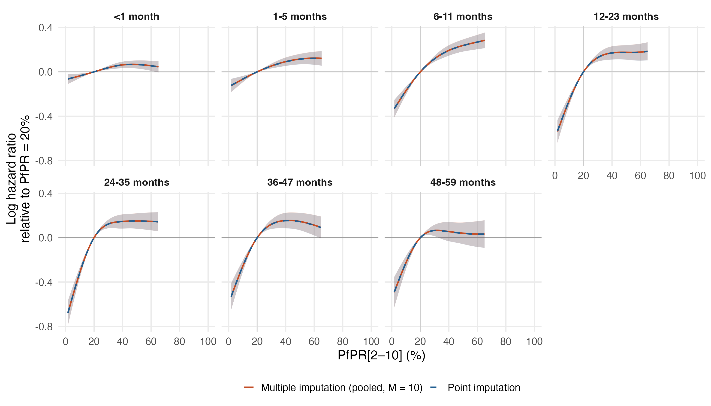

# Multiple-imputation check: imputed-covariate sensitivity, DHS and MICS

The point fit in `primary_map_regional17_dhsmics_imputed_gamma2_v8` uses one imputed dataset (mean of the mice imputations, GAM fitted means and posterior-median HIV incidence). This check refits all seven age-band models in each of 10 imputed datasets with the smoothing parameters fixed at the point fit, and pools the PfPR log hazard ratios with Rubin's rules (within-imputation variance from the conditional covariance, between-imputation variance across the 10 fits; Barnard–Rubin degrees of freedom).

Varied components per imputation: the mice imputations of the regional covariates; the GAM draws of health expenditure (Zimbabwe, Somalia, South Sudan, 2024), GDP and political stability (South Sudan before independence); and one posterior draw of the child HIV incidence series for every country-year whose value is imputed or censored (São Tomé and Príncipe among them; Liberia's rate is derived from UNAIDS counts and held fixed). Observed values never change. Records affected:

- regional covariates (any):   795,848 records
- health expenditure:   260,385 records
- GDP per capita:    33,840 records
- political stability (model fill):    57,509 records
- child HIV incidence (imputed or censored series): 1,152,154 records

### PfPR 40% to 20%

| Age (months) | Point imputation HR (95% interval) | Pooled MI HR (95% interval) | Between-imputation share of variance |
|---|---:|---:|---:|
| <1 | 0.94 (0.91–0.97) | 0.94 (0.91–0.97) | 0.7% |
| 1-5 | 0.91 (0.88–0.95) | 0.91 (0.88–0.95) | 2.4% |
| 6-11 | 0.82 (0.79–0.86) | 0.82 (0.79–0.86) | 2.0% |
| 12-23 | 0.84 (0.79–0.90) | 0.84 (0.79–0.89) | 0.7% |
| 24-35 | 0.86 (0.81–0.92) | 0.86 (0.81–0.92) | 1.6% |
| 36-47 | 0.86 (0.80–0.92) | 0.86 (0.80–0.92) | 0.6% |
| 48-59 | 0.95 (0.87–1.03) | 0.95 (0.87–1.03) | 0.9% |

### PfPR 20% to 0%

| Age (months) | Point imputation HR (95% interval) | Pooled MI HR (95% interval) | Between-imputation share of variance |
|---|---:|---:|---:|
| <1 | 0.93 (0.89–0.98) | 0.93 (0.89–0.98) | 0.8% |
| 1-5 | 0.87 (0.82–0.93) | 0.87 (0.82–0.93) | 2.3% |
| 6-11 | 0.69 (0.63–0.76) | 0.69 (0.63–0.76) | 2.6% |
| 12-23 | 0.55 (0.49–0.62) | 0.55 (0.49–0.62) | 1.5% |
| 24-35 | 0.47 (0.41–0.53) | 0.47 (0.41–0.53) | 1.7% |
| 36-47 | 0.55 (0.48–0.63) | 0.55 (0.48–0.63) | 0.8% |
| 48-59 | 0.58 (0.49–0.67) | 0.58 (0.49–0.67) | 1.1% |

The between-imputation share is (1 + 1/M) B / T. A small share means the covariate imputation adds little to the sampling uncertainty already in the point fit. Smoothing parameters are fixed, so smoothing uncertainty is not part of either interval. Survey design and exposure uncertainty remain unpropagated.

Reproduce: `Rscript R_cbh/sensitivity/imputation_dhsmics/05_propagate.R` after scripts 01–04 in the same folder.
