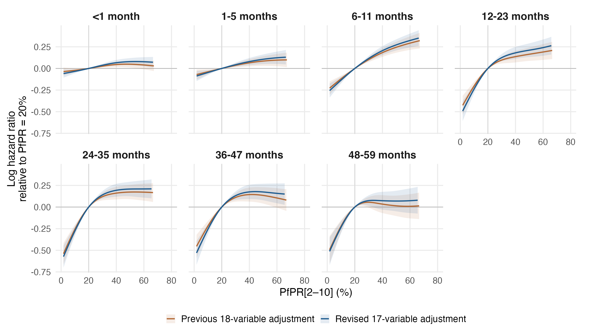
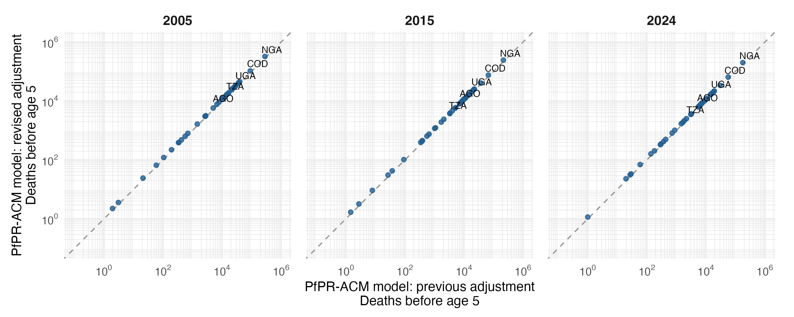

# Primary PfPR-ACM model: revised regional adjustment

Seven separate MAP age-band models, gamma=2, fitted with the revised 17-variable specification. All seven converged, have finite covariance and full rank, and pass the positive smoothing-Hessian and exact fitted-input checks. The saved PfPR components reproduce full model prediction contrasts and variances.

## What changed

The previous fitted benchmark used 18 regional/annual covariates. The new model uses 13 survey-region summaries and four national annual covariates: sex, multiple births and birth order are removed; maternal age at each birth is replaced with age at first birth; wasting and stunting are added. Urban percentage, DTP3/measles coverage, facility delivery, short birth interval, water, sanitation and electricity are included. Hib3, PCV, rotavirus and exclusive breastfeeding are excluded. Regional gaps use the declared UNICEF and within-survey available-region fallback; whole-survey gaps remain excluded.

MAP band-entry exposure, fixed median child HIV incidence imputation, age bands, full-band offset, unweighted binomial/cloglog likelihood, reference spline knots, cr basis dimensions and gamma=2 are held fixed. Confounders are scaled on the new selected sample. Each age has its own time spline, covariate coefficients and random effects.

| Sample | Previous | Revised | Change |
|---|---:|---:|---:|
| Child-band records | 5,680,117 | 5,465,305 | -214,812 |
| Children | 1,755,838 | 1,686,004 | -69,834 |
| Deaths | 78,634 | 75,726 | -2,908 |
| Survey-regions | 973 | 916 | -57 |
| Surveys | 100 | 95 | -5 |
| Countries | 34 | 34 | 0 |

The availability audit confirms that the samples share 5,465,305 child-band records. The revision loses 214,812 previous records and recovers none. Differences therefore combine changes in adjustment definitions, added covariates, imputation and sample selection. They do not isolate any one of these changes; that would require additional fits on a common sample.

## PfPR effects

Curves are log hazard ratios relative to PfPR=20%; each is displayed over its own central 95% exposure range. Shading is a conditional 95% interval. The full 0–100% curves and support flags remain in comparison_pfpr_curves.csv. Intervals condition on smoothing parameters, exposure, one HIV imputation and other filled covariates. Overlapping-sample estimates are dependent; no formal test or interval for the difference between iterations is implied.

For PfPR 40% to 20%, the largest absolute change in the point-estimate HR is 0.037, at 12-23 months (0.872 previously; 0.835 revised).

For PfPR 20% to zero, the predicted mortality reductions at 12-23, 24-35, 36-47 months change from 37.9%, 45.2%, 39.7% to 42.2%, 47.1%, 44.5%, respectively.

### PfPR 40% to 20%

| Age (months) | Previous HR (95% interval) | Revised HR (95% interval) |
|---|---:|---:|
| <1 | 0.956 (0.926–0.986) | 0.936 (0.906–0.966) |
| 1-5 | 0.937 (0.899–0.977) | 0.924 (0.886–0.963) |
| 6-11 | 0.833 (0.792–0.875) | 0.814 (0.773–0.857) |
| 12-23 | 0.872 (0.816–0.933) | 0.835 (0.780–0.895) |
| 24-35 | 0.851 (0.791–0.916) | 0.824 (0.765–0.887) |
| 36-47 | 0.866 (0.798–0.939) | 0.839 (0.773–0.912) |
| 48-59 | 0.967 (0.872–1.072) | 0.929 (0.838–1.030) |

### PfPR 20% to 0%

| Age (months) | Previous HR (95% interval) | Revised HR (95% interval) |
|---|---:|---:|
| <1 | 0.961 (0.914–1.012) | 0.938 (0.889–0.990) |
| 1-5 | 0.926 (0.868–0.988) | 0.908 (0.851–0.970) |
| 6-11 | 0.779 (0.714–0.849) | 0.755 (0.689–0.826) |
| 12-23 | 0.621 (0.548–0.704) | 0.578 (0.507–0.659) |
| 24-35 | 0.548 (0.476–0.631) | 0.529 (0.458–0.610) |
| 36-47 | 0.603 (0.519–0.701) | 0.555 (0.475–0.648) |
| 48-59 | 0.575 (0.480–0.688) | 0.564 (0.470–0.676) |

Zero PfPR is just below observed support in every band; the 20% to 0% contrasts involve extrapolation. HR below one indicates lower mortality at the lower prevalence. Conditional intervals are calculated from the joint covariance of both evaluation points.

## National attributable mortality

The same population-weighted national MAP values and IHME all-cause baselines are used in both iterations, for the same 42 estimable countries. These are predicted all-cause reductions under zero PfPR. Country-age contributions remain signed, with missing countries retained in source tables; marginal age-specific intervals are not summed into total intervals.

| Year | Previous deaths | Revised deaths | Change |
|---|---:|---:|---:|
| 2005 | 854,154 | 973,935 | +14.0% |
| 2015 | 589,807 | 665,559 | +12.8% |
| 2024 | 501,065 | 565,616 | +12.9% |

Country and age-specific changes are in burden/comparison_country_totals.csv and burden/comparison_deaths_by_age.csv. Identical national PfPR and IHME baselines were verified. The existing equal-person-time assumption for the IHME 2–4-year group is retained.

## Reproduction and output scope

Run `Rscript R_cbh/primary/run_regional.R` for fresh fits, `--resume` to reuse only verified fit caches, or `--report-only` to recalculate effects, diagnostics and comparisons from the saved fits. No raw-source extraction, HIV refitting, supplementary fitting, manuscript editing or TeX generation is performed.

The previous 18-variable fits are preserved in primary_map_regional18_gamma2_v2. Current primary reporting, including annual 2000–2024 comparisons and Nigerian state estimates, is indexed in RESULTS.md and paper_figures/CAPTIONS.md. Subgroup and exposure sensitivity fits remain historical until separately refitted; they are outside this reporting refresh.

Numerical checks and provenance: fit_diagnostics.csv, fit_manifest.csv, fit_input_provenance.csv, fitted_outcome_checks.csv, comparison_edf.csv, and comparison_provenance.csv. In-sample outcome checks are not external validation or survey influence analyses.
