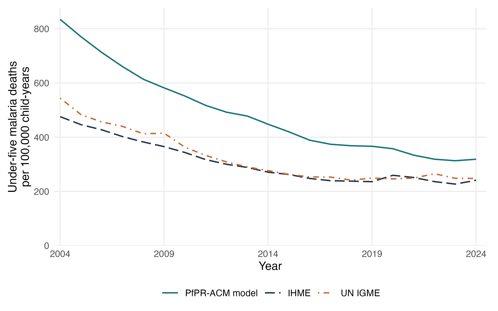

# Figure 5: annual under-five malaria mortality

All required inputs are available for 2000–2024. The comparison contains the same 42 countries in all 25 years (1,050 country-years per source). This is the national burden coverage, not only the 34 countries contributing DHS surveys to model fitting.

## Input audit

- Primary model: seven verified saved MAP gamma=2 fits; no refitting required.
- MAP: all 25 rasters readable; national means recalculated using population density × cell area, not the legacy density-only country CSV.
- IHME all-cause: all required disjoint age counts and rates, 2000–2024, export dated 9 September 2026.
- IHME malaria: direct under-five, both-sex national counts and rates, export dated 3 September 2026, filtered to 2000–2024.
- UN IGME: direct under-five malaria deaths for every included country-year in the CA-CODE 2026 portal release. The previously cached WHO all-age African Region series multiplied by 0.75 is not used.

## Calculation and checks

For country c, year t and age band g: D_model(c,t,g) = D_allcause(c,t,g) × {1 − exp[f_g(0) − f_g(P_c,t)]}. Sum over ages and countries. For each source s: rate_s(t) = 100,000 × sum_c D_s(c,t) / sum_c PY_U5(c,t). Here PY_U5 = D_allcause,U5 / (rate_allcause,U5 / 100,000). Keep this same denominator for all sources.

Disjoint age deaths reproduce the all-cause under-five totals (maximum relative error 1.78e-15). The sum of age-implied person-years differs from the directly reported under-five implied denominator by at most 0.1009%; we use the direct under-five denominator for the pooled rate.

IHME malaria and all-cause count/rate pairs imply denominators differing by at most 0.2140% where the malaria rate is positive. Native IHME malaria rates and the differences are retained in denominator_audit.csv; the Figure 5 IHME rates are recomputed using the common all-cause denominator. Zero malaria count/rate pairs cannot identify population and are not used to infer it.

All 126 existing country estimates for 2005, 2015 and 2024 are reproduced; maximum absolute death-count difference 4.37e-10.

The exports identify the data suite as GBD but do not state an unambiguous release or estimation/forecast version. Precise release alignment remains unverified; date and denominator differences are documented rather than assumed away. UN IGME uses a separate cause-of-death model and mortality envelope. National exposure is transported beyond the DHS fitting countries, and MAP population coverage and extrapolation flags are retained in the country/age CSVs. Fixed 2020 spatial weights do not describe changes in within-country population geography over time.

Point estimates only: no cross-country or cross-age joint uncertainty has been supplied. Do not sum marginal bounds. Source uncertainty, HIV imputation uncertainty, exposure error and survey design are not propagated.

## Annual totals

Rates are deaths per 100,000 under-five child-years.

| Year | PfPR-ACM model deaths | Rate | IHME deaths | Rate | UN IGME deaths | Rate |
|---|---:|---:|---:|---:|---:|---:|
| 2000 | 1,104,990 | 1006.1 | 563,657 | 513.2 | 724,276 | 659.5 |
| 2001 | 1,103,256 | 977.2 | 579,322 | 513.1 | 715,788 | 634.0 |
| 2002 | 1,078,175 | 928.9 | 584,006 | 503.2 | 701,894 | 604.7 |
| 2003 | 1,052,805 | 881.9 | 587,812 | 492.4 | 685,954 | 574.6 |
| 2004 | 1,025,420 | 834.8 | 584,453 | 475.8 | 668,525 | 544.3 |
| 2005 | 973,935 | 770.8 | 564,067 | 446.4 | 610,848 | 483.5 |
| 2006 | 925,639 | 712.7 | 554,938 | 427.3 | 592,624 | 456.3 |
| 2007 | 881,139 | 660.5 | 536,695 | 402.3 | 586,803 | 439.9 |
| 2008 | 840,458 | 613.9 | 523,509 | 382.4 | 564,897 | 412.6 |
| 2009 | 816,780 | 582.0 | 512,614 | 365.3 | 582,299 | 414.9 |
| 2010 | 792,844 | 551.8 | 493,614 | 343.6 | 521,487 | 363.0 |
| 2011 | 759,858 | 517.3 | 466,207 | 317.4 | 489,046 | 333.0 |
| 2012 | 738,208 | 492.3 | 450,123 | 300.2 | 463,032 | 308.8 |
| 2013 | 730,982 | 478.0 | 441,162 | 288.5 | 443,941 | 290.3 |
| 2014 | 697,921 | 447.9 | 422,382 | 271.1 | 431,452 | 276.9 |
| 2015 | 665,559 | 419.8 | 416,122 | 262.4 | 416,815 | 262.9 |
| 2016 | 626,757 | 389.0 | 399,458 | 247.9 | 408,679 | 253.6 |
| 2017 | 611,686 | 374.0 | 391,930 | 239.6 | 413,605 | 252.9 |
| 2018 | 611,057 | 368.5 | 394,470 | 237.9 | 400,709 | 241.6 |
| 2019 | 616,200 | 366.5 | 396,710 | 236.0 | 419,148 | 249.3 |
| 2020 | 609,098 | 357.5 | 442,135 | 259.5 | 419,523 | 246.3 |
| 2021 | 575,612 | 333.8 | 433,443 | 251.4 | 429,619 | 249.1 |
| 2022 | 555,925 | 318.8 | 411,777 | 236.2 | 462,939 | 265.5 |
| 2023 | 552,079 | 313.2 | 400,148 | 227.0 | 437,626 | 248.3 |
| 2024 | 565,616 | 318.7 | 428,147 | 241.3 | 440,123 | 248.0 |

## Sources and reproducibility

[WHO indicator metadata](https://www.who.int/data/gho/data/indicators/indicator-details/GHO/number-of-deaths), [UN IGME cause-of-death portal](https://childmortality.org/causes-of-death/data), [CA-CODE 2000–2024 study](https://doi.org/10.1136/bmj-2025-088686). Exact UNICEF API URL, retrieval time and SHA256 are in [source metadata](who_source.json).

Run `Rscript R_cbh/burden/04_annual_comparison.R --audit-only` first, then `Rscript R_cbh/burden/04_annual_comparison.R` and `Rscript R_cbh/reporting/07_annual_mortality_comparison.R`. The scripts use local inputs and do not download data or refit models.

[Included countries](included_countries.csv) · [Annual totals](annual_totals_2000_2024.csv) · [Country estimates](country_estimates_2000_2024.csv) · [Country-year input audit](country_year_input_audit.csv) · [Denominator audit](denominator_audit.csv) · [Input hashes](input_provenance.csv)

Annual malaria mortality before age five, 2000–2024, pooled across the same 42 countries covered by the national burden analysis. For each source, the plotted rate is 100,000 times the sum of national under-five malaria deaths divided by the sum of annual under-five person-years implied by the primary IHME all-cause death counts and rates. Rates therefore use a common population denominator and are not averages of country rates or probabilities per live birth. The PfPR-ACM model applies the seven separate primary MAP gamma=2 PfPR effects to annual age-specific IHME all-cause deaths, using the zero-PfPR counterfactual. National annual MAP PfPR[2–10] is weighted by population counts using a fixed GPW 2020 spatial distribution; these exposure weights are separate from the annual mortality denominator. IHME ages 2–4 share a mortality rate and divide deaths/person-time equally across the model's three annual bands. Signed age-specific contributions are retained. The UN IGME comparator is the CA-CODE 2026 series from the UN IGME portal, retrieved from UNICEF's CME_CAUSE_OF_DEATH dataflow on 21 September 2026 (under five, both sexes, malaria, deaths); it is not the World Malaria Report all-age series or a fixed proportion of it. All curves show point estimates. Joint uncertainty across countries and age bands is not available; marginal interval endpoints are not summed. Model-attributable all-cause mortality reductions and the comparator cause-specific estimates are different estimands. The PfPR-ACM model shares IHME all-cause inputs and this comparison is not independent validation. Zero exposure requires extrapolation. Cape Verde, Lesotho and São Tomé and Príncipe are excluded because usable MAP prevalence is unavailable; the other countries absent from the original national input set are not added.
