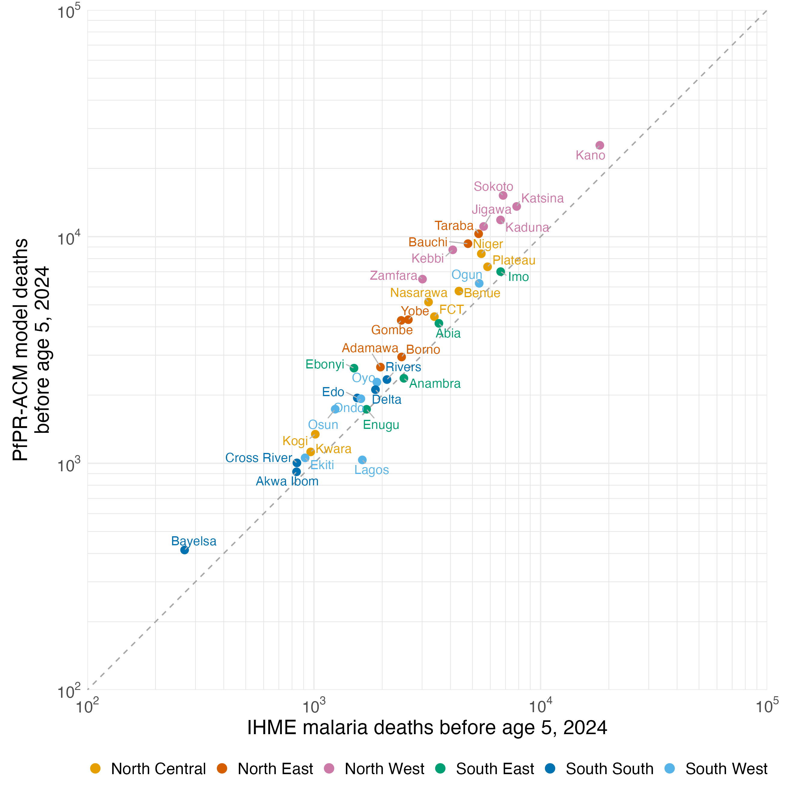

# Figure 6: Nigerian states versus IHME, 2024

Secondary subnational extrapolation of the primary MAP gamma=2 model to the 37 Nigerian states, using the same convention as the national burden: IHME all-cause deaths by age band multiplied by the age-specific attributable fraction at the state's MAP prevalence. Calculation code is [R_cbh/burden/05_nigeria_state_burden.R](../../../../R_cbh/burden/05_nigeria_state_burden.R); this figure and table are produced by [R_cbh/reporting/08_nigeria_state_comparison.R](../../../../R_cbh/reporting/08_nigeria_state_comparison.R).

## Input audit

- Primary model: seven verified saved MAP gamma=2 fits; no refitting.
- IHME all-cause by state and GBD age group, 2024: the seven constructed bands reproduce every state's under-5 total, and their sum over states reproduces the national 2024 age-band inputs used by `primary/02_effects.R` to within 1e-6, confirming the same export vintage.
- IHME malaria by state, 2024: under-5 death rate per 100,000, applied to all-cause implied person-years.
- MAP PfPR[2–10] by state, 2024: `data/pfpr_admin1_ng_cd_2024.csv`, an inherited extraction (MAP admin-1 boundaries, GPW 2020 density weights without cell area). All 37 states lie inside the central 95% of fitted prevalence; none requires extrapolation beyond observed support.
- Source metadata and hashes: [ihme_source.json](ihme_source.json), [input_provenance.csv](input_provenance.csv).

## Reconciliation with the national estimate

State sum 200,479 attributable deaths versus the national estimate 200,988 evaluated at the national mean PfPR of 24.70% (state person-year-weighted mean 25.21%): difference -0.25%. The national and state exposure extractions use different boundary sources and population weights (see the note in [national_reconciliation_2024.csv](national_reconciliation_2024.csv)). IHME state malaria deaths sum to 132,138, so the model attributes 1.52 times as many under-5 deaths to malaria as IHME's cause-specific estimate.

## Pattern of the discrepancy

The model exceeds IHME in 35 of 37 states. The ratio of model to IHME deaths has median 1.63 in the three northern zones and 1.16 in the three southern zones; its Spearman correlation with state PfPR is 0.12. IHME's malaria share of all-cause under-5 deaths ranges from 13.5% to 29.9% and is highest in the southeast, whereas the model's attributable fraction ranges from 12.2% to 32.2% and rises with prevalence. The two methods therefore disagree on geography more than on the national total.

## State table

Sorted by the ratio of model-attributable to IHME malaria deaths. Deaths are 2024 annual counts before age 5.

| State | Zone | PfPR (%) | IHME all-cause | PfPR-ACM model | Attributable fraction | IHME malaria | IHME malaria share | Model / IHME |
|---|---|---:|---:|---:|---:|---:|---:|---:|
| Sokoto | North West | 24.3 | 50,749 | 15,197 | 29.9% | 6,831 | 13.5% | 2.22 |
| Zamfara | North West | 34.7 | 20,179 | 6,494 | 32.2% | 3,012 | 14.9% | 2.16 |
| Kebbi | North West | 29.9 | 27,830 | 8,748 | 31.4% | 4,097 | 14.7% | 2.14 |
| Jigawa | North West | 23.3 | 37,811 | 11,087 | 29.3% | 5,606 | 14.8% | 1.98 |
| Bauchi | North East | 24.5 | 33,384 | 9,310 | 27.9% | 4,781 | 14.3% | 1.95 |
| Taraba | North East | 28.5 | 36,844 | 10,296 | 27.9% | 5,328 | 14.5% | 1.93 |
| Kaduna | North West | 25.5 | 41,097 | 11,850 | 28.8% | 6,656 | 16.2% | 1.78 |
| Gombe | North East | 23.3 | 15,302 | 4,269 | 27.9% | 2,427 | 15.9% | 1.76 |
| Ebonyi | South East | 26.0 | 9,228 | 2,629 | 28.5% | 1,502 | 16.3% | 1.75 |
| Katsina | North West | 25.7 | 44,458 | 13,591 | 30.6% | 7,840 | 17.6% | 1.73 |
| Yobe | North East | 26.5 | 16,062 | 4,302 | 26.8% | 2,610 | 16.2% | 1.65 |
| Nasarawa | North Central | 28.8 | 19,142 | 5,146 | 26.9% | 3,203 | 16.7% | 1.61 |
| Bayelsa | South South | 26.1 | 1,598 | 415 | 25.9% | 269 | 16.8% | 1.54 |
| Niger | North Central | 30.1 | 30,818 | 8,406 | 27.3% | 5,475 | 17.8% | 1.54 |
| Osun | South West | 26.7 | 6,792 | 1,733 | 25.5% | 1,241 | 18.3% | 1.40 |
| Kano | North West | 19.8 | 91,761 | 25,294 | 27.6% | 18,251 | 19.9% | 1.39 |
| Adamawa | North East | 24.3 | 10,734 | 2,657 | 24.7% | 1,965 | 18.3% | 1.35 |
| Kogi | North Central | 25.3 | 5,277 | 1,344 | 25.5% | 1,014 | 19.2% | 1.33 |
| Benue | North Central | 29.6 | 23,741 | 5,752 | 24.2% | 4,362 | 18.4% | 1.32 |
| FCT (Abuja) | North Central | 25.3 | 17,161 | 4,436 | 25.8% | 3,399 | 19.8% | 1.31 |
| Plateau | North Central | 19.8 | 34,127 | 7,363 | 21.6% | 5,833 | 17.1% | 1.26 |
| Edo | South South | 28.1 | 7,317 | 1,942 | 26.5% | 1,553 | 21.2% | 1.25 |
| Borno | North East | 18.9 | 13,264 | 2,945 | 22.2% | 2,437 | 18.4% | 1.21 |
| Oyo | South West | 26.4 | 8,565 | 2,281 | 26.6% | 1,895 | 22.1% | 1.20 |
| Ondo | South West | 32.0 | 6,212 | 1,927 | 31.0% | 1,611 | 25.9% | 1.20 |
| Cross River | South South | 31.1 | 3,634 | 1,004 | 27.6% | 841 | 23.1% | 1.19 |
| Abia | South East | 29.3 | 13,063 | 4,143 | 31.7% | 3,558 | 27.2% | 1.16 |
| Ogun | South West | 23.1 | 29,614 | 6,223 | 21.0% | 5,359 | 18.1% | 1.16 |
| Kwara | North Central | 24.0 | 4,644 | 1,123 | 24.2% | 967 | 20.8% | 1.16 |
| Ekiti | South West | 29.2 | 3,691 | 1,057 | 28.6% | 914 | 24.8% | 1.16 |
| Delta | South South | 20.0 | 9,654 | 2,113 | 21.9% | 1,868 | 19.3% | 1.13 |
| Rivers | South South | 26.6 | 8,576 | 2,341 | 27.3% | 2,099 | 24.5% | 1.12 |
| Akwa Ibom | South South | 31.3 | 3,523 | 917 | 26.0% | 838 | 23.8% | 1.09 |
| Imo | South East | 30.1 | 22,305 | 7,008 | 31.4% | 6,664 | 29.9% | 1.05 |
| Enugu | South East | 20.6 | 6,832 | 1,731 | 25.3% | 1,707 | 25.0% | 1.01 |
| Anambra | South East | 21.7 | 9,549 | 2,371 | 24.8% | 2,494 | 26.1% | 0.95 |
| Lagos | South West | 10.6 | 8,501 | 1,035 | 12.2% | 1,635 | 19.2% | 0.63 |

[State totals](state_totals_2024.csv) · [State-by-age estimates](state_age_estimates_2024.csv) · [Reconciliation](national_reconciliation_2024.csv) · [Model specification](model_specification.txt)

PfPR-ACM model malaria-attributable deaths before age 5 versus IHME cause-specific malaria deaths, by Nigerian state (36 states and the Federal Capital Territory) in 2024. Both axes use a base-10 logarithmic scale with identical limits; the dashed line denotes equality. Colours group states into Nigeria's six geopolitical zones for orientation; all estimates are made state by state. Model-attributable deaths equal IHME state all-cause deaths in each of seven age bands multiplied by 1 − exp[f_g(0) − f_g(P_state)], summed over bands, where P_state is population-weighted MAP PfPR[2–10] for 2024 and f_g are the seven separate primary MAP gamma=2 age-band effects. IHME early and late neonatal deaths share the <1-month effect; the IHME 2–4 year group shares one rate and divides deaths and person-time equally across the 24–35, 36–47 and 48–59 month bands. IHME malaria deaths are the state malaria death rate applied to the under-5 person-years implied by the all-cause count and rate. Summed over states the model gives 200,479 deaths against 132,138 IHME malaria deaths (ratio 1.52); the state sum differs from the national estimate evaluated at national mean prevalence by -0.3%, because the age-band curves are nonlinear. State totals are point estimates; conditional age-band intervals are retained in the source table and are not summed. Model-attributable all-cause reductions and IHME cause-specific malaria deaths are different estimands, and the model shares IHME all-cause inputs, so agreement or disagreement is not independent validation. Zero prevalence lies below observed exposure support.
