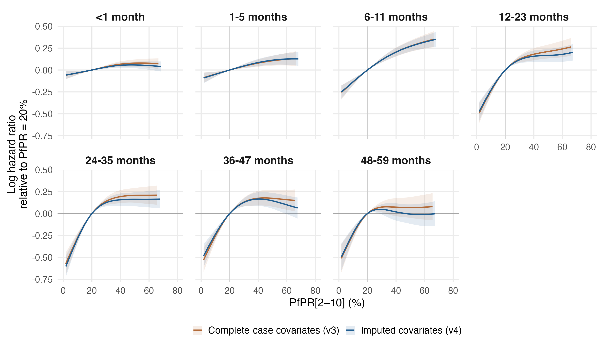
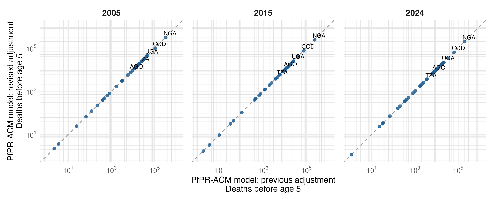

# PfPR-ACM model: imputed-covariate sensitivity

Seven separate MAP age-band models, gamma=2, with the same 17-variable specification as the current primary (`primary_map_regional17_gamma2_v3`), fitted after imputing every remaining covariate gap so that all 6,357,802 MAP-eligible child-band records are retained. All seven converged, have finite covariance and full rank, and pass the positive smoothing-Hessian and exact fitted-input checks.

## What changed

The complete-case primary excludes records whose survey-region or country-year covariates are unavailable after the UNICEF vaccination and within-survey region-mean fallbacks. Here those gaps are imputed instead (plan section 2.4): whole-survey gaps in wasting, stunting, facility delivery, electricity and the wealth score by chained-equation multiple imputation at the survey-region level (predictive mean matching, 10 imputations, point value = their mean); the missing 2001 WGI political-stability round by interpolation; health expenditure for Zimbabwe 2000–2009 and every country's 2024 from a GAM on the observed panel; and child HIV incidence for Liberia and São Tomé and Príncipe from the extended incidence model with a latent adolescent series. In this sample 558,906 records carry at least one model-imputed regional covariate, 179,937 an interpolated political-stability value, 63,255 a modelled health-expenditure value and 142,323 an HIV incidence imputed without an adolescent series.

MAP band-entry exposure, age bands, full-band offset, unweighted binomial/cloglog likelihood, reference spline knots, cr basis dimensions and gamma=2 are held fixed. Confounders are re-scaled on the enlarged sample. Each age has its own time spline, covariate coefficients and random effects. Imputation uncertainty is not reflected in these intervals; the separate multiple-imputation check propagates it.

| Sample | Complete case | Imputed | Change |
|---|---:|---:|---:|
| Child-band records | 5,465,305 | 6,357,802 | 892,497 |
| Children | 1,686,004 | 1,932,325 | 246,321 |
| Deaths | 75,726 | 90,938 | 15,212 |
| Survey-regions | 916 | 1,113 | 197 |
| Surveys | 95 | 120 | 25 |
| Countries | 34 | 36 | 2 |

The imputed sample contains the complete-case sample entirely, plus the previously excluded records, 25 of them whole surveys including all five MIS surveys. Differences combine the added records and the imputed covariate values; they are not a test of either alone.

## PfPR effects

Curves are log hazard ratios relative to PfPR=20%; each is displayed over its own central 95% exposure range. Shading is a conditional 95% interval. The full 0–100% curves and support flags remain in comparison_pfpr_curves.csv. Intervals condition on smoothing parameters, exposure, one HIV imputation and other filled covariates. Overlapping-sample estimates are dependent; no formal test or interval for the difference between iterations is implied.

For PfPR 40% to 20%, the largest absolute change in the point-estimate HR is 0.052, at 48-59 months (0.929 previously; 0.981 revised).

For PfPR 20% to zero, the predicted mortality reductions at 12-23, 24-35, 36-47 months change from 42.2%, 47.1%, 44.5% to 41.0%, 49.1%, 41.6%, respectively.

### PfPR 40% to 20%

| Age (months) | Previous HR (95% interval) | Revised HR (95% interval) |
|---|---:|---:|
| <1 | 0.936 (0.906–0.966) | 0.947 (0.920–0.976) |
| 1-5 | 0.924 (0.886–0.963) | 0.918 (0.882–0.956) |
| 6-11 | 0.814 (0.773–0.857) | 0.815 (0.777–0.855) |
| 12-23 | 0.835 (0.780–0.895) | 0.854 (0.801–0.912) |
| 24-35 | 0.824 (0.765–0.887) | 0.854 (0.795–0.918) |
| 36-47 | 0.839 (0.773–0.912) | 0.847 (0.783–0.916) |
| 48-59 | 0.929 (0.838–1.030) | 0.981 (0.890–1.083) |

### PfPR 20% to 0%

| Age (months) | Previous HR (95% interval) | Revised HR (95% interval) |
|---|---:|---:|
| <1 | 0.938 (0.889–0.990) | 0.939 (0.893–0.987) |
| 1-5 | 0.908 (0.851–0.970) | 0.905 (0.846–0.969) |
| 6-11 | 0.755 (0.689–0.826) | 0.758 (0.696–0.825) |
| 12-23 | 0.578 (0.507–0.659) | 0.590 (0.521–0.667) |
| 24-35 | 0.529 (0.458–0.610) | 0.509 (0.443–0.584) |
| 36-47 | 0.555 (0.475–0.648) | 0.584 (0.503–0.678) |
| 48-59 | 0.564 (0.470–0.676) | 0.572 (0.480–0.682) |

Zero PfPR is just below observed support in every band; the 20% to 0% contrasts involve extrapolation. HR below one indicates lower mortality at the lower prevalence. Conditional intervals are calculated from the joint covariance of both evaluation points.

## National attributable mortality

The same population-weighted national MAP values and IHME all-cause baselines are used in both iterations, for the same 42 estimable countries. These are predicted all-cause reductions under zero PfPR. Country-age contributions remain signed, with missing countries retained in source tables; marginal age-specific intervals are not summed into total intervals.

| Year | Previous deaths | Revised deaths | Change |
|---|---:|---:|---:|
| 2005 | 973,935 | 936,871 | -3.8% |
| 2015 | 665,559 | 653,313 | -1.8% |
| 2024 | 565,616 | 556,345 | -1.6% |

Country and age-specific changes are in burden/comparison_country_totals.csv and burden/comparison_deaths_by_age.csv. Identical national PfPR and IHME baselines were verified. The existing equal-person-time assumption for the IHME 2–4-year group is retained.

## Reproduction and output scope

Run `Rscript R_cbh/primary/run_regional.R` for fresh fits, `--resume` to reuse only verified fit caches, or `--report-only` to recalculate effects, diagnostics and comparisons from the saved fits. No raw-source extraction, HIV refitting, supplementary fitting, manuscript editing or TeX generation is performed.

The comparator is the current complete-case primary in results/cbh/primary_map_regional17_gamma2_v3, which remains the primary analysis. This imputed-covariate version is a sensitivity analysis; it does not feed the paper figures, tables or burden estimates.

Numerical checks and provenance: fit_diagnostics.csv, fit_manifest.csv, fit_input_provenance.csv, fitted_outcome_checks.csv, comparison_edf.csv, and comparison_provenance.csv. In-sample outcome checks are not external validation or survey influence analyses.
