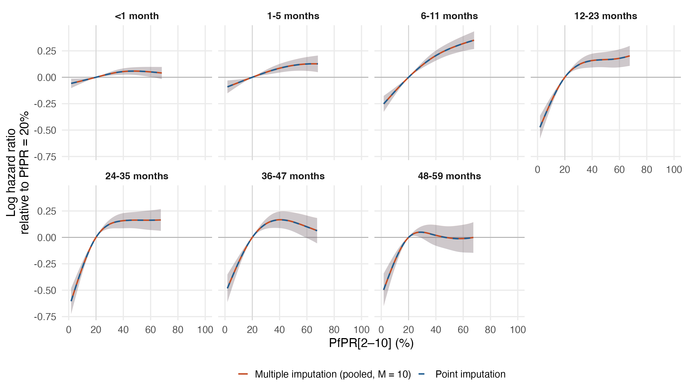

# Multiple-imputation check: imputed-covariate sensitivity

The point fit in `primary_map_regional17_imputed_gamma2_v4` uses one imputed dataset (mean of the mice imputations, GAM fitted means and posterior-median HIV incidence). This check refits all seven age-band models in each of 10 imputed datasets with the smoothing parameters fixed at the point fit, and pools the PfPR log hazard ratios with Rubin's rules (within-imputation variance from the conditional covariance, between-imputation variance across the 10 fits; Barnard–Rubin degrees of freedom).

Varied components per imputation: the mice imputations of the regional covariates, the health-expenditure GAM draws, and one posterior draw of the child HIV incidence series for every country-year whose value is imputed or censored (Liberia and Sao Tome and Principe among them). Observed values never change. Records affected:

- regional covariates (any): 558,906 records
- health expenditure:  63,255 records
- child HIV incidence (imputed or censored series): 905,671 records

### PfPR 40% to 20%

| Age (months) | Point imputation HR (95% interval) | Pooled MI HR (95% interval) | Between-imputation share of variance |
|---|---:|---:|---:|
| <1 | 0.95 (0.92–0.98) | 0.95 (0.92–0.98) | 0.5% |
| 1-5 | 0.92 (0.88–0.96) | 0.92 (0.88–0.96) | 1.8% |
| 6-11 | 0.81 (0.78–0.85) | 0.81 (0.78–0.85) | 0.5% |
| 12-23 | 0.85 (0.80–0.91) | 0.85 (0.80–0.91) | 0.6% |
| 24-35 | 0.85 (0.79–0.92) | 0.85 (0.79–0.92) | 0.1% |
| 36-47 | 0.85 (0.78–0.92) | 0.85 (0.78–0.92) | 0.2% |
| 48-59 | 0.98 (0.89–1.08) | 0.98 (0.89–1.08) | 0.4% |

### PfPR 20% to 0%

| Age (months) | Point imputation HR (95% interval) | Pooled MI HR (95% interval) | Between-imputation share of variance |
|---|---:|---:|---:|
| <1 | 0.94 (0.89–0.99) | 0.94 (0.89–0.99) | 0.6% |
| 1-5 | 0.90 (0.85–0.97) | 0.90 (0.84–0.97) | 1.4% |
| 6-11 | 0.76 (0.70–0.82) | 0.76 (0.70–0.82) | 0.8% |
| 12-23 | 0.59 (0.52–0.67) | 0.59 (0.52–0.67) | 0.9% |
| 24-35 | 0.51 (0.44–0.58) | 0.51 (0.44–0.59) | 0.8% |
| 36-47 | 0.58 (0.50–0.68) | 0.58 (0.50–0.68) | 0.3% |
| 48-59 | 0.57 (0.48–0.68) | 0.57 (0.48–0.68) | 0.4% |

The between-imputation share is (1 + 1/M) B / T. A small share means the covariate imputation adds little to the sampling uncertainty already in the point fit. Smoothing parameters are fixed, so smoothing uncertainty is not part of either interval. Survey design and exposure uncertainty remain unpropagated.

Reproduce: `Rscript R_cbh/sensitivity/imputation/01_propagate.R` after `Rscript R_cbh/primary/run_regional.R --imputed`.
