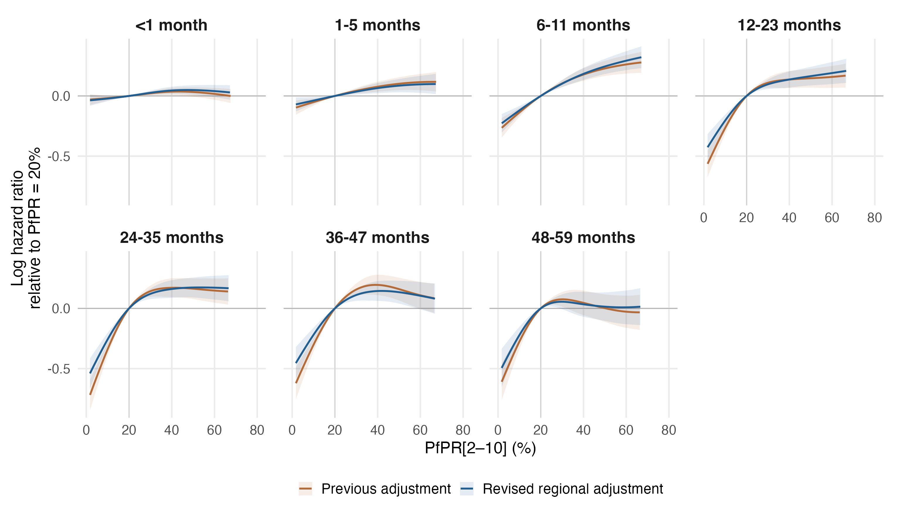
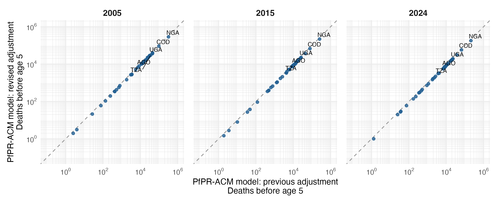

# Primary PfPR-ACM model: revised regional adjustment

Seven separate MAP age-band models, gamma=2, fitted with the revised 18-variable specification. All seven converged, have finite covariance and full rank, and pass the positive smoothing-Hessian and exact fitted-input checks. The saved PfPR components reproduce full model prediction contrasts and variances.

## What changed

The previous fitted benchmark used 11 individual/country-level covariates. The new model uses 14 survey-region summaries and four national annual covariates. Urban percentage, DTP3/measles coverage, facility delivery, short birth interval, water, sanitation and electricity are included. Hib3, PCV, rotavirus and exclusive breastfeeding are excluded. Regional gaps use the declared UNICEF and within-survey available-region fallback; whole-survey gaps remain excluded.

MAP band-entry exposure, fixed median child HIV incidence imputation, age bands, full-band offset, unweighted binomial/cloglog likelihood, reference spline knots, cr basis dimensions and gamma=2 are held fixed. Confounders are scaled on the new selected sample. Each age has its own time spline, covariate coefficients and random effects.

| Sample | Previous | Revised | Change |
|---|---:|---:|---:|
| Child-band records | 5,885,022 | 5,680,117 | -204,905 |
| Children | 1,817,912 | 1,755,838 | -62,074 |
| Deaths | 82,415 | 78,634 | -3,781 |
| Survey-regions | 1,015 | 973 | -42 |
| Surveys | 105 | 100 | -5 |
| Countries | 34 | 34 | 0 |

The samples share 5,617,520 child-band records. The revision loses 267,502 previous records and recovers 62,597 records that were excluded under individual-level requirements. Differences therefore combine changes in adjustment definitions, added covariates, imputation and sample selection. They do not isolate any one of these changes; that would require additional fits on a common sample.

## PfPR effects

Curves are log hazard ratios relative to PfPR=20%; each is displayed over its own central 95% exposure range. Shading is a conditional 95% interval. The full 0–100% curves and support flags remain in comparison_pfpr_curves.csv. Intervals condition on smoothing parameters, exposure, one HIV imputation and other filled covariates. Overlapping-sample estimates are dependent; no formal test or interval for the difference between iterations is implied.

For PfPR 40% to 20%, the largest absolute change in the point-estimate HR is 0.043, at 36-47 months (0.823 previously; 0.866 revised).

For PfPR 20% to zero, the predicted mortality reductions at 12-23, 24-35, 36-47 months change from 46.8%, 55.2%, 49.9% to 37.9%, 45.2%, 39.7%, respectively.

### PfPR 40% to 20%

| Age (months) | Previous HR (95% interval) | Revised HR (95% interval) |
|---|---:|---:|
| <1 | 0.965 (0.936–0.995) | 0.956 (0.926–0.986) |
| 1-5 | 0.926 (0.889–0.965) | 0.937 (0.899–0.977) |
| 6-11 | 0.837 (0.795–0.882) | 0.833 (0.792–0.875) |
| 12-23 | 0.872 (0.813–0.936) | 0.872 (0.816–0.933) |
| 24-35 | 0.843 (0.779–0.911) | 0.851 (0.791–0.916) |
| 36-47 | 0.823 (0.756–0.895) | 0.866 (0.798–0.939) |
| 48-59 | 0.955 (0.863–1.058) | 0.967 (0.872–1.072) |

### PfPR 20% to 0%

| Age (months) | Previous HR (95% interval) | Revised HR (95% interval) |
|---|---:|---:|
| <1 | 0.968 (0.922–1.018) | 0.961 (0.914–1.012) |
| 1-5 | 0.899 (0.841–0.961) | 0.926 (0.868–0.988) |
| 6-11 | 0.746 (0.681–0.818) | 0.779 (0.714–0.849) |
| 12-23 | 0.532 (0.469–0.604) | 0.621 (0.548–0.704) |
| 24-35 | 0.448 (0.388–0.518) | 0.548 (0.476–0.631) |
| 36-47 | 0.501 (0.430–0.583) | 0.603 (0.519–0.701) |
| 48-59 | 0.505 (0.424–0.601) | 0.575 (0.480–0.688) |

Zero PfPR is just below observed support in every band; the 20% to 0% contrasts involve extrapolation. HR below one indicates lower mortality at the lower prevalence. Conditional intervals are calculated from the joint covariance of both evaluation points.

## National attributable mortality

The same population-weighted national MAP values and IHME all-cause baselines are used in both iterations, for the same 42 estimable countries. These are predicted all-cause reductions under zero PfPR. Country-age contributions remain signed, with missing countries retained in source tables; marginal age-specific intervals are not summed into total intervals.

| Year | Previous deaths | Revised deaths | Change |
|---|---:|---:|---:|
| 2005 | 973,148 | 854,154 | -12.2% |
| 2015 | 694,534 | 589,807 | -15.1% |
| 2024 | 592,353 | 501,065 | -15.4% |

Country and age-specific changes are in burden/comparison_country_totals.csv and burden/comparison_deaths_by_age.csv. Identical national PfPR and IHME baselines were verified. The existing equal-person-time assumption for the IHME 2–4-year group is retained.

## Reproduction and output scope

Run `Rscript R_cbh/primary/run_regional.R` for fresh fits, `--resume` to reuse only verified fit caches, or `--report-only` to recalculate effects, diagnostics and comparisons from the saved fits. No raw-source extraction, HIV refitting, supplementary fitting, manuscript editing or TeX generation is performed.

The older fits are preserved in primary_map_gamma2_v1. Current primary reporting, including annual 2004–2024 comparisons and Nigerian state estimates, is indexed in RESULTS.md and paper_figures/CAPTIONS.md. Subgroup and exposure sensitivity fits remain historical until separately refitted; they are outside this reporting refresh.

Numerical checks and provenance: fit_diagnostics.csv, fit_manifest.csv, fit_input_provenance.csv, fitted_outcome_checks.csv, comparison_edf.csv, and comparison_provenance.csv. In-sample outcome checks are not external validation or survey influence analyses.
