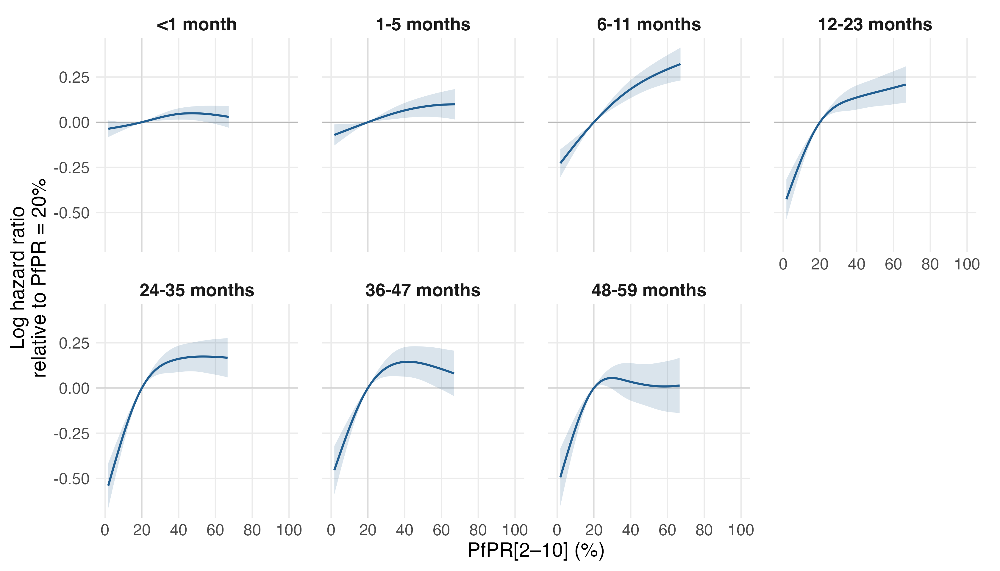
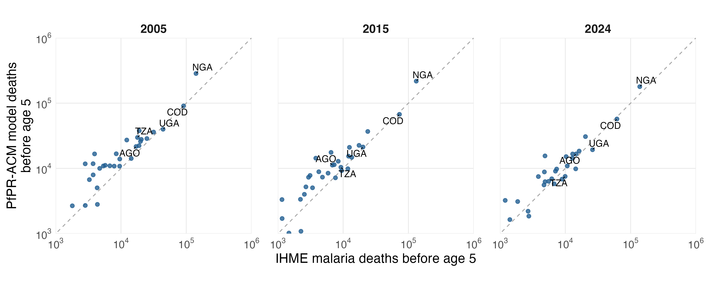

# Current primary figures and tables

The revised 18-variable PfPR-ACM model uses 1,755,838 children, 5,680,117 child-band records and 78,634 deaths in 100 surveys and 34 countries.

Seven separate MAP gamma=2 age-band fits, including survey-region urban percentage, with fixed PfPR/time knots and the declared HIV, UNICEF and available-region substitutions. The raw-source data and HIV imputation were not refitted. All seven models passed the fitted-input and numerical checks.

| Completed months | Records | Deaths (% of U5 deaths) | PfPR EDF | HR: 40% to 20% (95% interval) | HR: 20% to 0% (95% interval) |
|---|---:|---:|---:|---:|---:|
| <1 | 1,004,586 | 28,811 (36.6%) | 2.22 | 0.956 (0.926–0.986) | 0.961 (0.914–1.012) |
| 1-5 | 902,005 | 11,591 (14.7%) | 1.77 | 0.937 (0.899–0.977) | 0.926 (0.868–0.988) |
| 6-11 | 863,826 | 10,734 (13.7%) | 2.24 | 0.833 (0.792–0.875) | 0.779 (0.714–0.849) |
| 12-23 | 745,491 | 10,565 (13.4%) | 3.27 | 0.872 (0.816–0.933) | 0.621 (0.548–0.704) |
| 24-35 | 741,565 | 8,705 (11.1%) | 3.39 | 0.851 (0.791–0.916) | 0.548 (0.476–0.631) |
| 36-47 | 720,126 | 5,184 (6.6%) | 3.12 | 0.866 (0.798–0.939) | 0.603 (0.519–0.701) |
| 48-59 | 702,518 | 3,044 (3.9%) | 3.22 | 0.967 (0.872–1.072) | 0.575 (0.480–0.688) |
| **Total** | **5,680,117** | **78,634 (100.0%)** | — | — | — |

Deaths are observed deaths in the primary analysis sample; percentages use all 78,634 under-five deaths as the denominator. Displayed percentages use largest-remainder rounding to one decimal place and sum to 100.0%. Records are child–age-band observations, so a child can contribute multiple records. EDF: effective degrees of freedom of the PfPR spline. Both contrast columns are adjusted mortality hazard ratios for reducing PfPR from the first value to the second. Intervals are conditional on fitted smoothing parameters, exposure, the fixed HIV imputation and filled regional covariates; zero PfPR is below observed exposure support in every band.

[Table CSV](tables/age_band_results.csv) · [LaTeX source as plain text](tables/age_band_results.latex.txt)

[40% to 20% contrast figure](pfpr_40_to_20.png) · [Full contrasts and comparison with the previous adjustment](REPORT.md)

Country/IHME axes use identical base-10 scales starting at 1,000 deaths. All country estimates, signed age contributions and missing/support flags remain in the CSVs. Age intervals are conditional on smoothing parameters, exposure and filled covariates; marginal intervals are not summed into total intervals.

[Country totals](burden/country_totals.csv) · [Country-age estimates](burden/country_age_estimates.csv) · [Annual comparison](annual_comparison/README.md) · [Nigeria states](nigeria_states/README.md)

[Age contributions](burden/deaths_by_age.png) · [DRC synthetic-cohort survival](burden/drc_survival.png) · [Aggregate outcome check](outcome_residuals_by_pfpr.png)

[Paper figure manifest/captions](paper_figures/CAPTIONS.md) · [Study flow](study_flow/CAPTION.md) · [Fit diagnostics](fit_diagnostics.csv)

These are primary results. Snow, Sahel, geographic, period and other sensitivity analyses are separate; they are not refitted by reporting. No TeX files are written. Reproduce with `Rscript R_cbh/primary/run_regional.R --report-only`.
