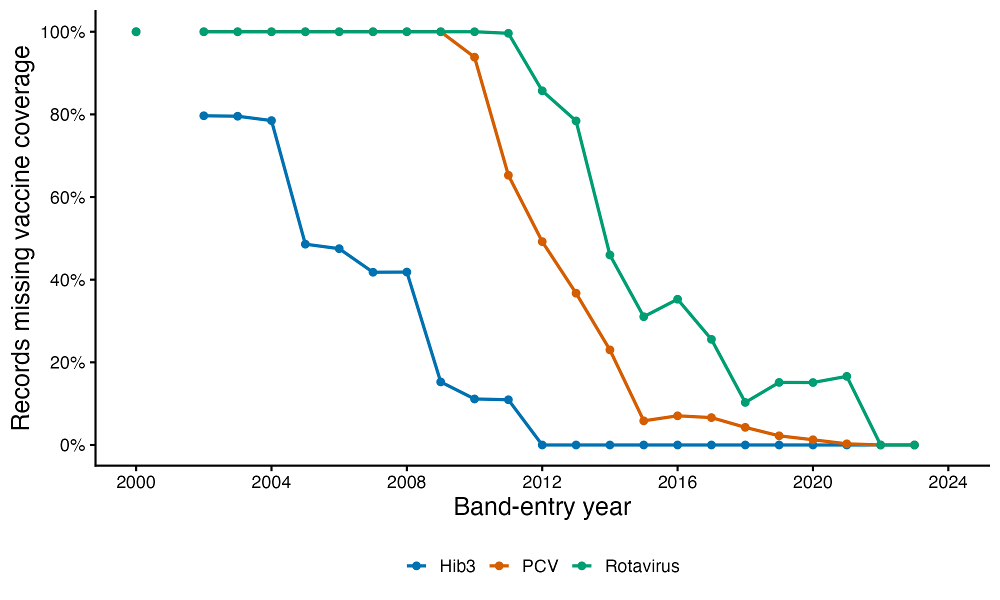

# Vaccine missingness over time

Missingness among the 5,885,022 records in the previously fitted primary sample, grouped by **band-entry year**, not survey year. These are unweighted record percentages; each period pools its numerator and denominator rather than averaging yearly percentages. Country/survey composition changes over time.

| Entry period | Records | Hib3 missing | PCV missing | Rotavirus missing |
|---|---:|---:|---:|---:|
| 2000–2004 | 782,851 | 82.5% | 100.0% | 100.0% |
| 2005–2009 | 1,526,224 | 37.0% | 100.0% | 100.0% |
| 2010–2014 | 1,614,251 | 5.1% | 56.7% | 84.0% |
| 2015–2019 | 1,225,515 | 0.0% | 5.1% | 23.5% |
| 2020–2023 | 736,181 | 0.0% | 0.6% | 10.7% |

Hib3 has no missing assigned values from 2012 onward in this sample. PCV is missing for 5.8% of 2015 records and 0.3% of 2021 records. Rotavirus is missing for 31.0% in 2015 and 16.6% in 2021. All three have 0% missingness among the represented 2022–2023 records. There are no 2001 or 2024 band-entry records in this previously fitted sample, so missingness for those years is undefined, not zero.

The national source contains no PCV/rotavirus series for Comoros, Gabon and Guinea. Their lack of later records in this sample must not be mistaken for resolution of their source gaps. Other missing values are pre-series placeholders labelled assumed not introduced; the pipeline currently rejects them as unverified zeros. Confirming genuine pre-introduction zero coverage could substantially reduce historical missingness.

[Annual counts and source-gap breakdown](vaccine_missingness_by_entry_year.csv) · [Period summary](vaccine_missingness_by_period.csv) · [Country/year counts](vaccine_missingness_by_country_year.csv). The annual CSV includes the number of represented countries and surveys. Missing records equal pre-series plus no-series records, and totals were checked against the preceding overall audit.

Reproduce with `Rscript R_cbh/covariates/06_vaccine_missingness_time.R`. No datasets, fits, paper figures or TeX files are changed.
