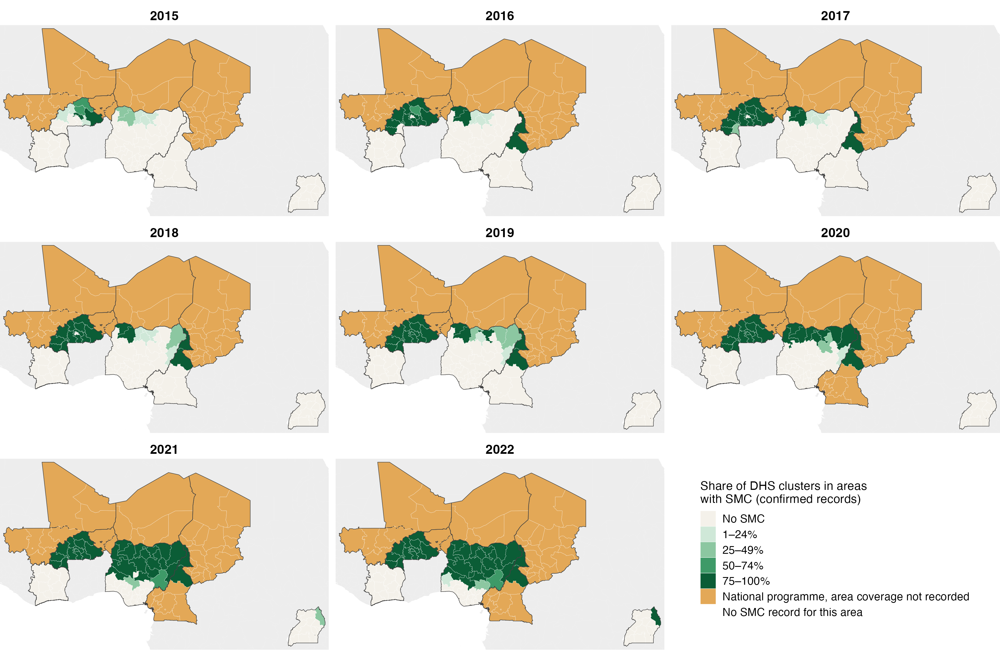
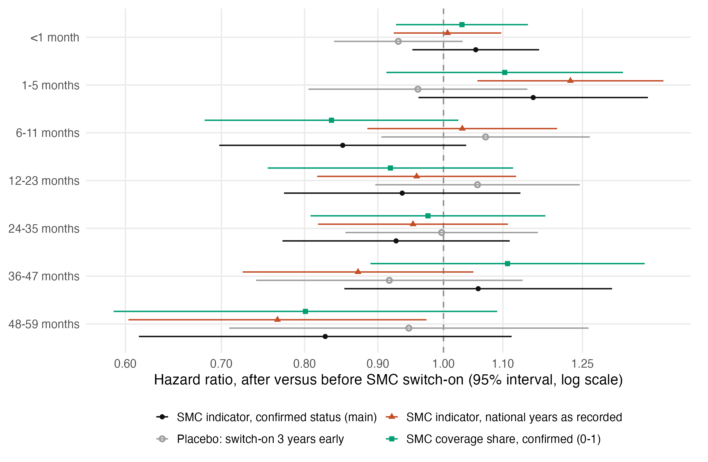
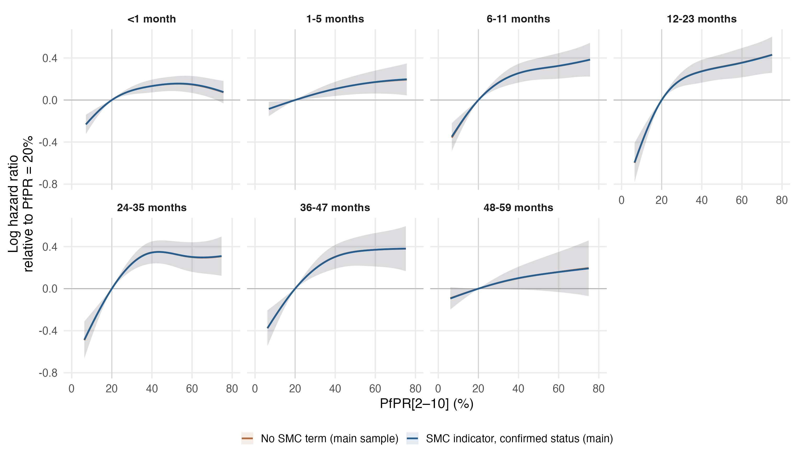

# SMC introduction and all-cause mortality by age (DHS and MICS)

The seven primary age-band models (`primary_map_regional17_dhsmics_gamma2_v5`: 17 covariates with the full-sample scaling, PfPR and calendar-year splines with the primary reference knots, survey, country and survey-region random intercepts, gamma = 2) refitted in the countries that have introduced seasonal malaria chemoprevention according to `data/SMC_rollout/smc_by_dhs_cluster.csv`, with one extra term: an admin-1 indicator equal to 1 when the band entry year is at or after the unit's SMC switch-on year. Everything else is the primary model. SMC countries in the file: BFA CIV CMR MLI NER NGA TCD UGA; CIV, NER, UGA have no bands entered after their switch-on (no v5 survey postdates it), so they inform only the covariates, splines and random effects. DRC and Zambia are in the file with no SMC (true zeros) and are excluded.

**Main analysis (decided 23 September 2026): confirmed status only.** The codebook records each switch-on year at the finest scope available and warns that national-scope years are not a treatment flag. The main analysis therefore uses only district- or region-confirmed switch-ons (Nigeria, Burkina Faso, Uganda, Cameroon North and Far North); records of units whose switch-on is known only from national-scope records (Mali, Niger, Chad, Côte d'Ivoire, the rest of Cameroon) are kept while no campaign had been recorded in the unit (a known zero) and dropped from the first recorded campaign year onward (for Mali's Kayes, 2013, from district-confirmed clusters). Treating national-scope years as switch-ons is a sensitivity analysis.

## Admin-1 switch-on years

Admin-1 units are the analysis regions, except in Nigeria, whose analysis regions are the six zones; there the unit is the state, taken from each record's survey cluster (state variable in the DHS recodes; HH7 in MICS 2016). The zone remains the unit of PfPR, covariates and the survey-region random intercept. A unit's switch-on year is the first year by which at least half of its DHS/MIS clusters, pooled over survey rounds, lay in areas with SMC; unmatched (no-GPS) clusters are dropped and clusters in areas never covered count as never treated. DHS rounds and MICS surveys absent from the file take their unit's year by name. See [admin1_smc_years.csv](admin1_smc_years.csv), [admin1_smc_coverage.csv](admin1_smc_coverage.csv), [survey_admin1_assignment.csv](survey_admin1_assignment.csv) and the [coverage maps](smc_coverage_maps_2015_2022.png).

**Countries not covered.** The file covers ten countries. Other v5 countries with SMC programmes are not in it and are not analysed: BEN, GHA, GIN, GMB, GNB, MOZ, MRT, SEN, TGO (1,779,094 records and 20,931 deaths in the v5 sample). The codebook states that Mozambique has district-level SMC records for 2020–2025 that were not merged; the others are to be confirmed with the data provider.

## Sample

| Variant | Records | Deaths | Post-SMC records | Post-SMC deaths | Surveys | Countries | Admin-1 units (survey-specific) | Units switching within a survey |
|---|---:|---:|---:|---:|---:|---:|---:|---:|
| SMC indicator, confirmed status (main) | 2,019,244 | 36,140 | 158,235 | 2,246 | 27 | 8 | 400 | 24 (BFA 2, CMR 2, NGA 20) |
| Placebo: switch-on 3 years early | 1,861,009 | 33,894 | 85,839 | 1,713 | 27 | 8 | 386 | 22 (CMR 2, NGA 20) |
| SMC indicator, national years as recorded | 2,287,670 | 39,988 | 417,303 | 5,966 | 28 | 8 | 410 | 75 (BFA 2, CMR 2, MLI 17, NGA 20, TCD 34) |
| SMC coverage share, confirmed (0-1) | 2,019,244 | 36,140 | 232,328 | 4,139 | 27 | 8 | 400 | 29 (BFA 2, CMR 2, NGA 25) |

Placebo: post means after the fake switch-on 3 years early, within the pre-switch-on records. Coverage: post means any coverage.

| Country | Records | Deaths | Records in main sample | Post-SMC records, main | Post-SMC records, national years | Admin-1 units | Band entry years |
|---|---:|---:|---:|---:|---:|---:|---|
| BFA | 186,763 | 2,882 | 186,763 | 68,815 | 68,815 | 39 | 2000-2021 |
| CIV | 153,794 | 2,308 | 153,794 | 0 | 0 | 35 | 2007-2021 |
| CMR | 181,804 | 3,028 | 181,804 | 6,981 | 6,981 | 46 | 2000-2018 |
| MLI | 374,353 | 6,243 | 231,816 | 0 | 133,179 | 41 | 2002-2023 |
| NER | 116,308 | 2,300 | 116,308 | 0 | 0 | 16 | 2002-2012 |
| NGA | 872,061 | 17,013 | 872,061 | 82,439 | 82,439 | 160 | 2000-2023 |
| TCD | 241,126 | 4,074 | 115,237 | 0 | 125,889 | 41 | 2009-2019 |
| UGA | 161,461 | 2,140 | 161,461 | 0 | 0 | 32 | 2002-2016 |

## SMC hazard ratios by age band

Hazard ratio for bands entered after versus before the unit's SMC switch-on (coverage: full versus none), with Wald 95% intervals conditional on the smoothing parameters. The models adjust for PfPR at band entry, so the estimate is the association of SMC with all-cause mortality beyond any change it brings about in MAP prevalence.

| Age | SMC indicator, confirmed status (main) | Placebo: switch-on 3 years early | SMC indicator, national years as recorded | SMC coverage share, confirmed (0-1) |
|---|---:|---:|---:|---:|
| <1 month | 1.05 (0.95–1.17) | 0.93 (0.84–1.03) | 1.01 (0.92–1.10) | 1.03 (0.93–1.15) |
| 1-5 months | 1.15 (0.96–1.39) | 0.96 (0.81–1.14) | 1.23 (1.06–1.42) | 1.10 (0.91–1.33) |
| 6-11 months | 0.85 (0.70–1.04) | 1.07 (0.91–1.26) | 1.03 (0.88–1.20) | 0.84 (0.68–1.02) |
| 12-23 months | 0.94 (0.77–1.13) | 1.06 (0.90–1.24) | 0.96 (0.82–1.12) | 0.92 (0.75–1.12) |
| 24-35 months | 0.93 (0.77–1.11) | 1.00 (0.85–1.16) | 0.95 (0.82–1.11) | 0.98 (0.81–1.18) |
| 36-47 months | 1.06 (0.85–1.31) | 0.92 (0.74–1.14) | 0.87 (0.72–1.05) | 1.11 (0.89–1.38) |
| 48-59 months | 0.83 (0.61–1.12) | 0.95 (0.71–1.26) | 0.77 (0.60–0.97) | 0.80 (0.59–1.09) |

## PfPR curves with and without the SMC term (main sample)

## Interpretation limits

- **Identifying variation.** Admin-1 units switching within a survey, by age band (main): <1 month 24, 1-5 months 24, 6-11 months 24, 12-23 months 23, 24-35 months 23, 36-47 months 24, 48-59 months 23. Survey-region random intercepts are estimated near zero in some bands (standard deviation by band: 0.055, 0.003, 0.001, 0.116, 0.092, 0.056, 0.001), so comparisons between units and between surveys also inform the SMC term, not only within-survey switches; survey-level differences can therefore be confounded with SMC timing.
- **Falsification.** SMC eligibility starts at 3 months, so an effect in the <1 and 1–5 month bands would point to confounding rather than chemoprevention. The placebo (fake switch-on 3 years early, pre-switch-on records only) should show hazard ratios near 1; departures of the size of the main estimates indicate that the design cannot separate SMC from other changes over time.
- **National-scope years (sensitivity).** In the national-years sensitivity, units whose switch-on is known only from national-scope records supply 62% of post-SMC records; in those countries every unit switches in the same year, so the contrast is a national before/after comparison against a calendar trend shared across countries.
- **Timing.** A band is post-SMC if entered in or after the switch-on year. In the main sample 3,738 post-SMC records (122 deaths) end before 1 July of the switch-on year and so precede the first campaign season (by band: <1 month 2,584, 1-5 months 727, 6-11 months 427, 12-23 months 0, 24-35 months 0, 36-47 months 0, 48-59 months 0).
- **Exposure misclassification.** A unit-level switch-on dates the start of campaigns in at least half of the unit's clusters; it does not measure coverage, cycles or eligible ages. The coverage sensitivity uses the share of confirmed clusters covered instead.
- **Confounding.** SMC roll-out coincided with other interventions and with changes in survey programmes; the calendar-year spline is shared across the SMC countries and cannot absorb country-specific trends. The results are descriptive associations, not causal effects.

All 35 fits converged with full rank and positive smoothing-Hessian eigenvalues; 4 took the tighter-tolerance restart (subgroup-refit acceptance rule: converged, full rank, positive Hessian, fREML no more than 0.001 worse; restarts.csv records the smoothing gradients and fREML values). Reproduce: `Rscript R_cbh/sensitivity/smc/01_assign_smc.R`, `02_fit.R`, `03_report.R`, `04_maps.R`. Cluster-level SMC data and the Nigerian cluster-to-state crosswalk stay in the ignored data folder; only admin-1 aggregates are published.
