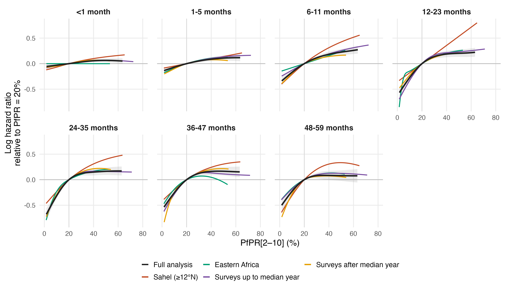
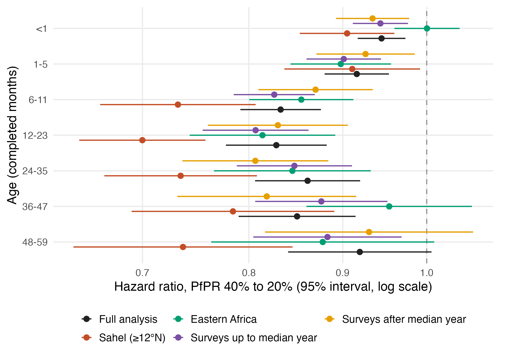

# Subgroup sensitivity of the primary PfPR models

Seven separate MAP gamma=2 age-band models refitted in four subsets of the fitted 17-variable sample (`primary_map_regional17_dhsmics_gamma2_v7`). Reference: the full primary fits in `results/cbh/primary_map_regional17_dhsmics_gamma2_v7`.

## Subsets

- Sahel (≥12°N): 468,275 children, 1,538,691 records, 18,919 deaths, 239 survey-regions, 31 surveys, 8 countries
- Eastern Africa: 828,170 children, 2,680,402 records, 31,589 deaths, 447 survey-regions, 51 surveys, 12 countries
- Surveys up to median year: 1,099,661 children, 3,475,691 records, 57,005 deaths, 560 survey-regions, 72 surveys, 34 countries
- Surveys after median year: 1,225,469 children, 4,131,431 records, 46,982 deaths, 667 survey-regions, 63 surveys, 35 countries

Definitions: early_definition,survey_year <= 2014; late_definition,survey_year > 2014; sahel_definition,centroid latitude >= 12 and longitude < 36 and country not in ETH/ERI/SOM/DJI; east_africa_definition,UN M49 Eastern Africa: BDI COM DJI ERI ETH KEN MDG MOZ MWI RWA SOM SSD TZA UGA ZMB ZWE. Survey regions enter whole; centroids are survey-specific boundary centroids (DHS: the cached shapefile summary; MICS: the analysis-region polygons, `R_mics/11_region_centroids.R`). The period split counts each survey once.

## Figures

Sensitivity of the fitted PfPR–mortality relationship to the analysis subset. Log mortality hazard ratios relative to PfPR[2–10] = 20% by completed-month age band, from the PfPR-ACM model fitted to the full primary sample (black, with its pointwise 95% conditional interval shaded) and refitted separately in four subsets: survey regions with boundary centroids at or north of 12°N and west of 36°E, excluding the Horn of Africa (Sahel); UN M49 Eastern Africa countries; surveys conducted up to the median survey year (2014); and surveys conducted after it. Each subset refit uses the same seven separate age-band models, 17 standardised covariates with the full-sample scaling, fixed HIV incidence imputation, gamma = 2 and basis dimensions as the primary analysis, with knots placed at quantiles of the subset's own predictor values. Each curve is drawn over the central 95% of its own exposure distribution. Subset sizes. Sahel (≥12°N): 468,275 children, 1,538,691 records, 18,919 deaths, 239 survey-regions, 31 surveys, 8 countries; Eastern Africa: 828,170 children, 2,680,402 records, 31,589 deaths, 447 survey-regions, 51 surveys, 12 countries; Surveys up to median year: 1,099,661 children, 3,475,691 records, 57,005 deaths, 560 survey-regions, 72 surveys, 34 countries; Surveys after median year: 1,225,469 children, 4,131,431 records, 46,982 deaths, 667 survey-regions, 63 surveys, 35 countries. The subsets overlap the full sample and one another, so the curves are not independent and their differences are descriptive; the comparison does not constitute a test of effect modification. Subset intervals are omitted for legibility and are available in the saved curve table.

## Hazard ratios, PfPR 40% to 20%

Values below one indicate lower mortality at 20% than at 40%. Intervals are pointwise conditional 95% intervals; the samples are nested, so compare descriptively.

| Age (months) | Full analysis | Sahel (≥12°N) | Eastern Africa | Surveys up to median year | Surveys after median year |
|---|---:|---:|---:|---:|---:|
| <1 | 0.94 (0.92–0.97) | 0.90 (0.85–0.96) | 1.00 (0.96–1.04) | 0.94 (0.91–0.98) | 0.93 (0.89–0.98) |
| 1-5 | 0.92 (0.88–0.95) | 0.91 (0.84–0.99) | 0.90 (0.84–0.96) | 0.90 (0.86–0.94) | 0.93 (0.87–0.99) |
| 6-11 | 0.83 (0.79–0.88) | 0.73 (0.66–0.81) | 0.85 (0.80–0.91) | 0.83 (0.78–0.87) | 0.87 (0.81–0.93) |
| 12-23 | 0.83 (0.78–0.88) | 0.70 (0.65–0.76) | 0.81 (0.74–0.89) | 0.81 (0.75–0.86) | 0.83 (0.76–0.91) |
| 24-35 | 0.86 (0.81–0.92) | 0.73 (0.67–0.81) | 0.84 (0.77–0.93) | 0.85 (0.79–0.91) | 0.81 (0.74–0.88) |
| 36-47 | 0.85 (0.79–0.91) | 0.78 (0.69–0.89) | 0.95 (0.86–1.06) | 0.88 (0.81–0.95) | 0.82 (0.73–0.92) |
| 48-59 | 0.92 (0.84–1.01) | 0.74 (0.64–0.85) | 0.88 (0.76–1.01) | 0.88 (0.80–0.97) | 0.93 (0.82–1.06) |

## Validation

All 28 subgroup fits converged with full rank, finite coefficients and covariances and positive smoothing-Hessian eigenvalues; 2 needed the tighter-tolerance restart (see restarts.csv where present). Fitted model columns were checked against the selected input rows; curves are anchored at zero at 20% PfPR. Total pure fitting time 604 seconds.

Reproduce: `Rscript R_cbh/sensitivity/subgroups/01_fit.R` then `Rscript R_cbh/sensitivity/subgroups/02_report.R`. Only aggregate tables and figures are published; fitted objects stay under the ignored data directory. Primary fits, burden estimates and manuscript files are unchanged.
