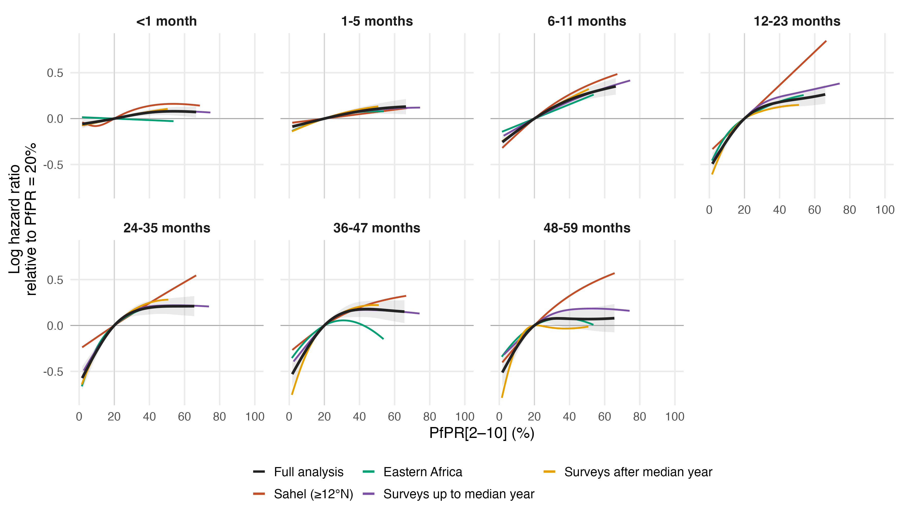
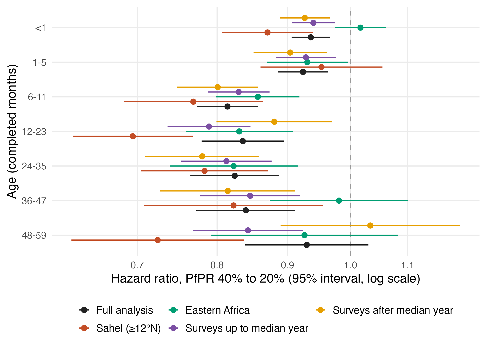

# Subgroup sensitivity of the primary PfPR models

Seven separate MAP gamma=2 age-band models refitted in four subsets of the fitted 17-variable sample (`primary_map_regional17_gamma2_v3`). Reference: the full primary fits in `results/cbh/primary_map_regional17_gamma2_v3`.

## Subsets

- Sahel (≥12°N): 349,764 children, 1,136,321 records, 14,545 deaths, 182 survey-regions, 23 surveys, 7 countries
- Eastern Africa: 641,126 children, 2,063,089 records, 23,583 deaths, 372 survey-regions, 38 surveys, 12 countries
- Surveys up to median year: 782,384 children, 2,427,154 records, 42,210 deaths, 411 survey-regions, 50 surveys, 29 countries
- Surveys after median year: 903,620 children, 3,038,151 records, 33,516 deaths, 505 survey-regions, 45 surveys, 28 countries

Definitions: early_definition,survey_year <= 2013; late_definition,survey_year > 2013; sahel_definition,centroid latitude >= 12 and longitude < 36 and country not in ETH/ERI/SOM/DJI; east_africa_definition,UN M49 Eastern Africa: BDI COM DJI ERI ETH KEN MDG MOZ MWI RWA SOM SSD TZA UGA ZMB ZWE. Survey regions enter whole; centroids are survey-specific boundary centroids from the cached shapefile summary. The period split counts each survey once.

## Figures

Sensitivity of the fitted PfPR–mortality relationship to the analysis subset. Log mortality hazard ratios relative to PfPR[2–10] = 20% by completed-month age band, from the PfPR-ACM model fitted to the full primary sample (black, with its pointwise 95% conditional interval shaded) and refitted separately in four subsets: survey regions with boundary centroids at or north of 12°N and west of 36°E, excluding the Horn of Africa (Sahel); UN M49 Eastern Africa countries; surveys conducted up to the median survey year (2013); and surveys conducted after it. Each subset refit uses the same seven separate age-band models, 17 standardised covariates with the full-sample scaling, fixed HIV incidence imputation, gamma = 2 and basis dimensions as the primary analysis, with knots placed at quantiles of the subset's own predictor values. Each curve is drawn over the central 95% of its own exposure distribution. Subset sizes. Sahel (≥12°N): 349,764 children, 1,136,321 records, 14,545 deaths, 182 survey-regions, 23 surveys, 7 countries; Eastern Africa: 641,126 children, 2,063,089 records, 23,583 deaths, 372 survey-regions, 38 surveys, 12 countries; Surveys up to median year: 782,384 children, 2,427,154 records, 42,210 deaths, 411 survey-regions, 50 surveys, 29 countries; Surveys after median year: 903,620 children, 3,038,151 records, 33,516 deaths, 505 survey-regions, 45 surveys, 28 countries. The subsets overlap the full sample and one another, so the curves are not independent and their differences are descriptive; the comparison does not constitute a test of effect modification. Subset intervals are omitted for legibility and are available in the saved curve table.

## Hazard ratios, PfPR 40% to 20%

Values below one indicate lower mortality at 20% than at 40%. Intervals are pointwise conditional 95% intervals; the samples are nested, so compare descriptively.

| Age (months) | Full analysis | Sahel (≥12°N) | Eastern Africa | Surveys up to median year | Surveys after median year |
|---|---:|---:|---:|---:|---:|
| <1 | 0.94 (0.91–0.97) | 0.87 (0.81–0.94) | 1.02 (0.97–1.06) | 0.94 (0.91–0.97) | 0.93 (0.89–0.97) |
| 1-5 | 0.92 (0.89–0.96) | 0.95 (0.86–1.05) | 0.93 (0.87–1.00) | 0.93 (0.88–0.98) | 0.90 (0.85–0.96) |
| 6-11 | 0.81 (0.77–0.86) | 0.77 (0.68–0.86) | 0.86 (0.80–0.92) | 0.83 (0.79–0.87) | 0.80 (0.75–0.86) |
| 12-23 | 0.84 (0.78–0.89) | 0.69 (0.63–0.77) | 0.83 (0.76–0.91) | 0.79 (0.74–0.85) | 0.88 (0.80–0.97) |
| 24-35 | 0.82 (0.76–0.89) | 0.78 (0.70–0.87) | 0.82 (0.74–0.92) | 0.81 (0.75–0.88) | 0.78 (0.71–0.86) |
| 36-47 | 0.84 (0.77–0.91) | 0.82 (0.71–0.95) | 0.98 (0.87–1.10) | 0.85 (0.78–0.92) | 0.81 (0.73–0.91) |
| 48-59 | 0.93 (0.84–1.03) | 0.72 (0.63–0.84) | 0.93 (0.79–1.08) | 0.84 (0.77–0.92) | 1.03 (0.89–1.20) |

## Validation

All 28 subgroup fits converged with full rank, finite coefficients and covariances and positive smoothing-Hessian eigenvalues; 4 needed the tighter-tolerance restart (see restarts.csv where present). Fitted model columns were checked against the selected input rows; curves are anchored at zero at 20% PfPR. Total pure fitting time 321 seconds.

Reproduce: `Rscript R_cbh/sensitivity/subgroups/01_fit.R` then `Rscript R_cbh/sensitivity/subgroups/02_report.R`. Only aggregate tables and figures are published; fitted objects stay under the ignored data directory. Primary fits, burden estimates and manuscript files are unchanged.
