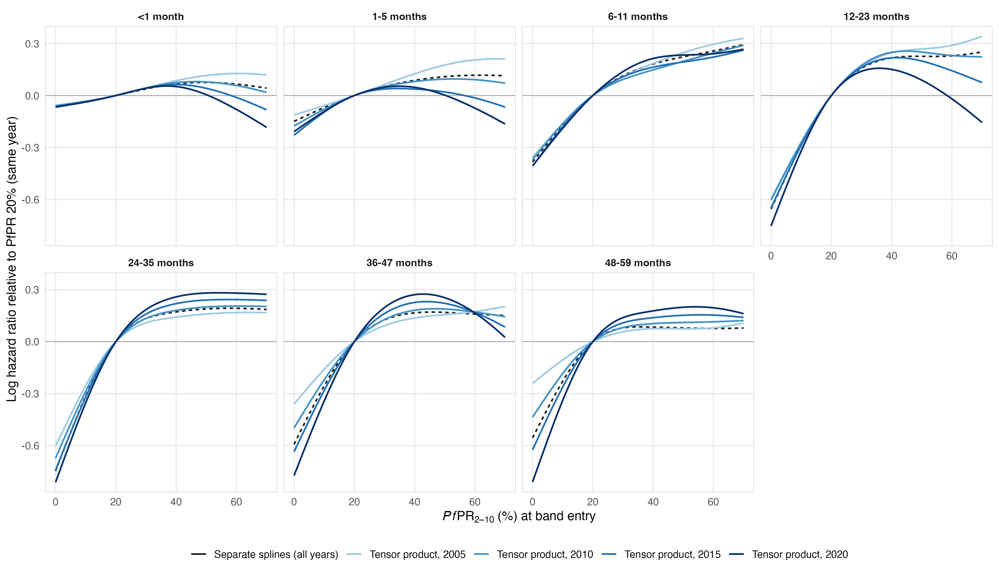
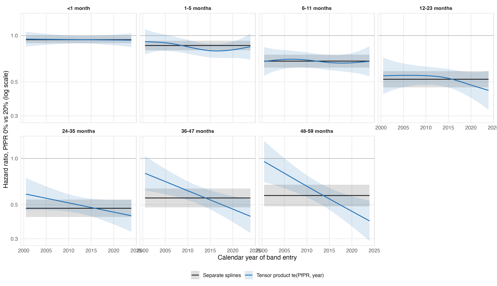

# Tensor product of PfPR and calendar time (no region random intercept)

Seven age-band models without the survey-region random intercept, fitted with bam (fREML, no discretisation) to the collapsed survey-region × entry-month cells (binomial deaths out of children entering the band; the same likelihood as the child-level model). Three specifications per band, otherwise identical (17 covariates, survey and country random intercepts, band-width offset, primary reference knots, gamma = 2):

- **Separate splines:** `s(pfpr_pct, cr, k=5) + s(calendar_year, cr, k=6)` (as the primary).
- **Tensor product:** `te(pfpr_pct, calendar_year, bs = c("cr","cr"), k = c(5, 6))`, which lets the PfPR curve change with calendar time.
- **Interaction test:** separate splines plus `ti(pfpr_pct, calendar_year)`, the pure interaction. The function space contains the separate-spline model, but the penalised fits are not nested: smoothing parameters, including the survey random-effect variance, are re-estimated.

All 21 fits converged with positive-definite smoothing Hessians; none needed a restart.

## Conclusion

Keep the separate-spline (time-constant) PfPR curves as the primary specification and report the tensor product as an exploratory sensitivity. Allowing the PfPR effect to change with calendar time improves AIC in the full-period fits only at <1 and 1–5 months, where the curves barely change. At 24–59 months the fitted low-PfPR gradient steepens over time, and the binned data show the same direction, but the evidence is mixed: in the full-period fits AIC does not favour the interaction and the log-likelihood does not improve, because the interaction takes over between-survey heterogeneity (the survey random-effect EDF falls); it is favoured when the random-effect variances are held at the separate-spline values and at 36–47 months within 2005–2019; it disappears when identified within surveys (survey fixed effects); and it rests on a few dozen deaths in PfPR <5% areas at each end of the period. It therefore cannot be separated from between-survey (country-period) differences. If the steepening were real it would raise the 2024 attributable deaths and shrink the post-2015 decline (below).

## Model fit

| Age (months) | ΔAIC tensor − separate | ΔAIC ti − separate | ti EDF | ti p-value | survey RE EDF: separate / tensor / ti | EDF of PfPR/time terms: separate, tensor |
|---|---:|---:|---:|---:|---:|---:|
| <1 | -14.6 | -17.1 | 4.61 | 0.01188 | 63.9 / 64.4 / 64.0 | 4.0, 6.1 |
| 1-5 | -6.5 | -5.6 | 2.37 | 0.01805 | 26.0 / 25.8 / 25.5 | 5.3, 9.5 |
| 6-11 | -0.6 | 3.2 | 2.62 | 0.29258 | 39.8 / 39.5 / 39.2 | 5.3, 9.1 |
| 12-23 | 4.4 | 1.3 | 1.60 | 0.14672 | 52.1 / 52.5 / 51.8 | 6.5, 9.7 |
| 24-35 | 6.6 | 6.3 | 1.00 | 0.01927 | 32.9 / 31.4 / 31.5 | 4.6, 7.3 |
| 36-47 | 0.5 | 1.2 | 2.29 | 0.00094 | 6.6 / 1.3 / 1.8 | 4.3, 6.7 |
| 48-59 | 0.4 | 1.1 | 2.07 | 0.00479 | 12.2 / 8.4 / 8.6 | 4.2, 6.5 |

AIC is mgcv's (binomial likelihood with the smoothing-corrected degrees of freedom, `aic_df` in [fit_diagnostics.csv](fit_diagnostics.csv); the `loglik` column there is the kernel log-likelihood without the binomial coefficient). Negative ΔAIC favours the more flexible model; |ΔAIC| below about 3 (6–11, 36–47 and 48–59 months) is no discernible difference, and its sign depends on the degrees-of-freedom definition. The ti p-value is mgcv's approximate test conditional on the estimated smoothing parameters; in the older bands it coexists with no gain in log-likelihood because the survey random effect is shrunk when the interaction enters, so it should not be read as stand-alone evidence of effect modification.

## Hazard ratio for PfPR 20% → 0% by calendar year of band entry (evaluated at mid-year)

| Age (months) | Separate (all years) | Tensor mid-2005 | mid-2010 | mid-2015 | mid-2020 |
|---|---:|---:|---:|---:|---:|
| <1 | 0.94 | 0.95 | 0.94 | 0.94 | 0.94 |
| 1-5 | 0.86 | 0.89 | 0.84 | 0.80 | 0.81 |
| 6-11 | 0.68 | 0.70 | 0.69 | 0.67 | 0.67 |
| 12-23 | 0.52 | 0.55 | 0.55 | 0.52 | 0.47 |
| 24-35 | 0.47 | 0.55 | 0.51 | 0.48 | 0.44 |
| 36-47 | 0.55 | 0.70 | 0.61 | 0.53 | 0.46 |
| 48-59 | 0.57 | 0.79 | 0.65 | 0.54 | 0.44 |

## Hazard ratio for PfPR 40% → 20% by calendar year (mid-year)

| Age (months) | Separate (all years) | Tensor mid-2005 | mid-2010 | mid-2015 | mid-2020 |
|---|---:|---:|---:|---:|---:|
| <1 | 0.94 | 0.92 | 0.93 | 0.94 | 0.95 |
| 1-5 | 0.92 | 0.88 | 0.92 | 0.96 | 0.95 |
| 6-11 | 0.83 | 0.83 | 0.86 | 0.85 | 0.81 |
| 12-23 | 0.80 | 0.78 | 0.78 | 0.80 | 0.86 |
| 24-35 | 0.84 | 0.87 | 0.83 | 0.80 | 0.77 |
| 36-47 | 0.85 | 0.87 | 0.83 | 0.80 | 0.76 |
| 48-59 | 0.92 | 0.93 | 0.90 | 0.87 | 0.84 |

## Support and identification checks (24–59 months; [03_checks.R](../../../R_cbh/sensitivity/tensor_pfpr_year/03_checks.R))

Deaths in cells with PfPR below 5%, by period of band entry:

| Age (months) | 2000-04 | 2005-09 | 2010-14 | 2015-19 | 2020-23 |
|---|---:|---:|---:|---:|---:|
| 24-35 | 68 | 139 | 294 | 161 | 50 |
| 36-47 | 44 | 104 | 184 | 108 | 40 |
| 48-59 | 36 |  67 | 147 |  73 | 25 |

Binned adjusted log hazard ratio for PfPR <5% versus 20–40% by period (survey and country random intercepts, calendar spline, 17 covariates), with the deaths in the <5% class:

| Age (months) | 2000-05 | 2006-10 | 2011-15 | 2016-23 |
|---|---:|---:|---:|---:|
| 24-35 | -0.48 (77) | -0.78 (192) | -0.80 (262) | -0.84 (181) |
| 36-47 | -0.35 (48) | -0.66 (133) | -0.77 (167) | -0.77 (132) |
| 48-59 | 0.01 (42) | -0.58 (87) | -0.53 (135) | -0.87 (84) |

Interaction tests (ΔAIC against the matching model without the interaction; HR for PfPR 0% vs 20% at mid-2005 and mid-2020):

| Age (months) | Check | ΔAIC | ti EDF | ti p | survey RE EDF | HR 2005 | HR 2020 |
|---|---|---:|---:|---:|---:|---:|---:|
| 24-35 | ti, free (as in 01_fit.R) | 6.3 | 1.00 | 0.01927 | 31.5 | 0.50 | 0.45 |
| 24-35 | ti, survey and country RE variances fixed at separate fit | -2.1 | 1.00 | 0.02120 | 32.7 | 0.50 | 0.45 |
| 24-35 | ti, survey fixed effects (versus separate with survey fixed effects) | 0.2 | 1.00 | 0.23174 | (fixed effects) | 0.52 | 0.48 |
| 24-35 | tensor, entries 2005-2019 (versus separate, same window) | 2.5 | – | – | 20.6 | 0.55 | 0.41 |
| 24-35 | ti, entries 2005-2019 (versus separate, same window) | -0.4 | 1.00 | 0.05408 | 20.9 | 0.49 | 0.43 |
| 36-47 | ti, free (as in 01_fit.R) | 1.2 | 2.29 | 0.00094 | 1.8 | 0.67 | 0.46 |
| 36-47 | ti, survey and country RE variances fixed at separate fit | -17.4 | 2.25 | 0.00169 | 6.5 | 0.66 | 0.47 |
| 36-47 | ti, survey fixed effects (versus separate with survey fixed effects) | 1.6 | 1.31 | 0.56363 | (fixed effects) | 0.62 | 0.56 |
| 36-47 | tensor, entries 2005-2019 (versus separate, same window) | -6.0 | – | – | 0.5 | 0.61 | 0.48 |
| 36-47 | ti, entries 2005-2019 (versus separate, same window) | -7.4 | 1.00 | 0.03945 | 0.8 | 0.57 | 0.48 |
| 48-59 | ti, free (as in 01_fit.R) | 1.1 | 2.07 | 0.00479 | 8.6 | 0.73 | 0.46 |
| 48-59 | ti, survey and country RE variances fixed at separate fit | -13.7 | 2.05 | 0.00648 | 12.0 | 0.72 | 0.47 |
| 48-59 | ti, survey fixed effects (versus separate with survey fixed effects) | 2.0 | 1.00 | 0.90963 | (fixed effects) | 0.67 | 0.67 |
| 48-59 | tensor, entries 2005-2019 (versus separate, same window) | 6.7 | – | – | 12.8 | 0.71 | 0.47 |
| 48-59 | ti, entries 2005-2019 (versus separate, same window) | 4.6 | 1.49 | 0.39320 | 11.3 | 0.56 | 0.44 |

Full tables: [support_pfpr_class_by_period.csv](support_pfpr_class_by_period.csv), [binned_pfpr_by_period.csv](binned_pfpr_by_period.csv), [interaction_checks.csv](interaction_checks.csv).

## Burden across the 42 countries (IHME all-cause inputs, year-specific hazard ratios)

Calendar time is evaluated at mid-year, held at December 2023 (the last observed band entry and last calendar-year knot) for 2024.

| Model | 2000 | 2015 | 2024 | 2024 × IHME | Rate change 2000–2015 | Rate change 2015–2024 |
|---|---:|---:|---:|---:|---:|---:|
| Primary v7 (with region RE, child-level) | 1,170,371 | 725,613 | 620,072 | 1.45 | -57.1% | -23.6% |
| Separate splines | 1,193,324 | 737,107 | 629,075 | 1.47 | -57.2% | -23.7% |
| Tensor product | 1,050,346 | 782,131 | 736,149 | 1.72 | -48.4% | -15.9% |
| Separate + ti (see note) | 1,198,222 | 774,021 | 760,978 | 1.78 | -55.3% | -12.2% |

2024 under other evaluation times: tensor 738,623 at mid-2024 (extrapolated) and 710,958 with the mid-2019 hazard ratios; ti 774,868 and 671,786.

2024 attributable deaths by age band:

| Age (months) | Separate | Tensor | ti |
|---|---:|---:|---:|
| <1 | 52,615 | 57,729 | 93,903 |
| 1-5 | 54,250 | 59,701 | 73,428 |
| 6-11 | 106,476 | 109,653 | 115,394 |
| 12-23 | 147,851 | 169,951 | 149,247 |
| 24-35 | 100,640 | 111,131 | 107,278 |
| 36-47 | 86,215 | 112,080 | 110,654 |
| 48-59 | 81,028 | 115,905 | 111,075 |

Note: the ti model's neonatal interaction (about 4.6 EDF) oscillates over time around a hazard ratio close to 1; applied to the large neonatal all-cause totals this moves tens of thousands of deaths, so the ti burden row is unstable and is shown only for completeness. The tensor product, which spans essentially the same function space, does not show this. The time-varying models' lower 2000 and higher 2024 totals, and hence their smaller declines, follow directly from the assumed steepening of the PfPR effect and are not separate findings.

Files: `model_fit_comparison.csv`, `hazard_ratios_by_year.csv`, `hr_20_to_0_by_year.csv`, `pfpr_curves_by_year.csv`, `pfpr_support_by_period.csv`, `year_totals.csv`, `deaths_by_age_2024.csv`, `burden_2024_alternative_times.csv`, `fit_diagnostics.csv`, `smooth_summaries.csv`, `model_formulas.txt`. Reproduce: `Rscript R_cbh/sensitivity/tensor_pfpr_year/01_fit.R`, then `03_checks.R`, then `02_report.R`.
